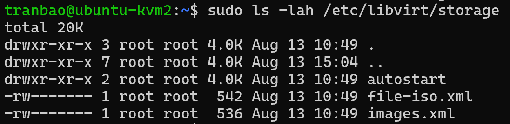
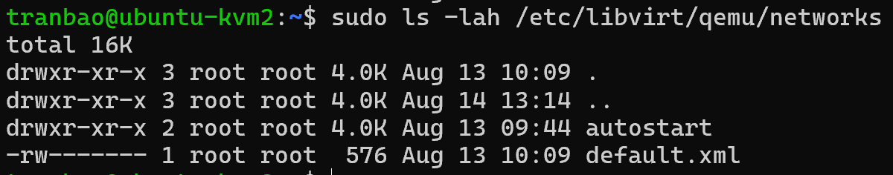
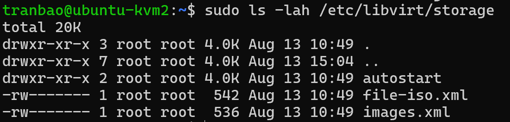
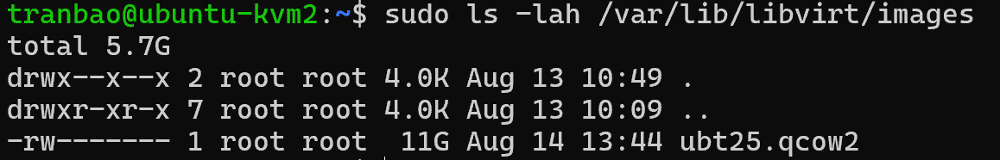
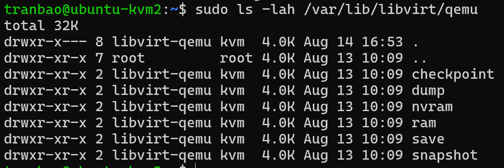

# TÌM HIỂU VỀ FILE SYSTEM TRONG KVM
|            Tiêu chí            |                                         Thư mục /etc/libvirt/qemu                                        |                                                               Thư mục /var/lib/libvirt/qemu                                                              |
|:------------------------------:|:--------------------------------------------------------------------------------------------------------:|:--------------------------------------------------------------------------------------------------------------------------------------------------------:|
| Bản chất lưu trữ               | Chứa các tệp cấu hình dạng văn bản (XML configuration files) của máy ảo và mạng.                         | Chứa các dữ liệu động, trạng thái chạy (runtime data) và ổ đĩa ảo của máy ảo.                                                                            |
| Mục đích sử dụng               | Định nghĩa "bản thiết kế" của máy ảo (tên gì, bao nhiêu CPU, bao nhiêu RAM, cấu hình card mạng nào,...). | Lưu trữ các file dữ liệu phục vụ trực tiếp cho tiến trình QEMU đang chạy (như ổ đĩa ảo .qcow2, file NVRAM của UEFI, socket giám sát, ảnh chụp màn hình). |
| Thời điểm xuất hiện            | Được tạo ra ngay khi bạn dùng lệnh virsh define (khi khai báo máy ảo).                                   | Được tạo ra và sinh ra các file dữ liệu khi máy ảo được khởi động (virsh start).                                                                         |
| Sự thay đổi theo thời gian     | Rất ít khi thay đổi, chỉ cập nhật khi bạn chỉnh sửa cấu hình máy ảo (ví dụ: virsh edit).                 | Thay đổi liên tục theo thời gian thực khi máy ảo hoạt động (dung lượng file đĩa phình to ra, file log ghi liên tục, socket kết nối thay đổi).            |
| Ví dụ về nội dung bên trong    | Tệp <ten_may_ao>.xml                                                                                     | Ổ đĩa ảo (disk.qcow2), thư mục chứa socket giám sát (QEMU guest agent, monitor socket), file cấu hình trạng thái runtime (.xml tự sinh).                 |
| Có nên sao lưu (Backup) không? | Rất nên sao lưu để giữ lại bản thiết kế cấu hình máy ảo.                                                 | Thường không sao lưu nguyên cục (trừ file đĩa .qcow2), vì phần lớn dữ liệu bên trong là trạng thái tạm thời và sẽ tự sinh lại khi máy ảo chạy.           |

## Thư mục chứa cấu hình máy ảo (XML Configurations)
- Đường dẫn: `/etc/libvirt/`
- Chi tiết:
+ `/etc/libvirt/qemu/`: Nơi lưu toàn bộ các tệp cấu hình XML của từng máy ảo đang có trên hệ thống (ví dụ: /etc/libvirt/qemu/ubuntu24-vm.xml). Mỗi máy ảo tương ứng với một file XML định nghĩa cấu hình CPU, RAM, ổ đĩa, card mạng.

+ `/etc/libvirt/qemu/networks/`: Nếu bạn cấu hình cho máy ảo tự khởi động cùng hệ điều hành host (virsh autostart <ten_may_ao>), một symbolic link trỏ về file XML của máy ảo đó sẽ được đặt vào đây.

+ `/etc/libvirt/storage/`: Nơi lưu file XML định nghĩa các Storage Pools (vùng chứa đĩa ảo).

## Thư mục chứa đĩa ảo và dữ liệu (Storage Pools & Images)
- Đường dẫn mặc định: `/var/lib/libvirt/`
- Chi tiết:
+ `/var/lib/libvirt/images/`: Đây là thư mục mặc định (Storage Pool có tên là default) chuyên chứa các file ảnh đĩa cứng ảo định dạng .qcow2 hoặc .raw của máy ảo.

+ Lưu ý: Bạn hoàn toàn không bị giới hạn ở thư mục này. Bạn có thể tạo các Storage Pool mới trỏ đến bất kỳ thư mục nào khác trên ổ cứng hoặc phân vùng khác (ví dụ: /data/vms/, /mnt/disks/) bằng lệnh virsh pool-define-as.
+ `/var/lib/libvirt/boot/`: Thường chứa các file kernel/initrd trích xuất tạm thời khi cài đặt máy ảo qua mạng (PXE / URL).

## Thư mục chứa nhật ký hoạt động (Logs)
- Đường dẫn: `/var/log/libvirt/`
- Chi tiết:
    + `/var/log/libvirt/qemu/`: Mỗi máy ảo khi chạy sẽ có một file log riêng nằm ở đây (ví dụ: /var/log/libvirt/qemu/ubuntu24-vm.log).
    + Đây là nơi ghi lại toàn bộ các thông báo lỗi khi khởi động máy ảo, lỗi tương thích phần cứng, hoặc thông lượng hoạt động của QEMU. Rất hữu ích khi cần gỡ lỗi (troubleshooting).

## Thư mục chứa giao tiếp hệ thống (Run State & Sockets)
- Đường dẫn: `/run/libvirt/` (hoặc /var/run/libvirt/)
- Chi tiết:
    + Chứa các file Unix Domain Socket (như libvirt-sock, qemu/) để các công cụ quản lý như virsh, virt-manager hoặc libvirtd giao tiếp nội bộ với nhau.
    + Chứa file PID (Process ID) của các tiến trình máy ảo đang chạy để hệ thống kiểm soát trạng thái bật/tắt.

## Thư mục chứa cấu hình mạng ảo (Network Configurations)
- Đường dẫn: `/etc/libvirt/qemu/networks/`
- Chi tiết:
    + Chứa các file XML định nghĩa cấu hình mạng ảo (ví dụ mạng default.xml chuyên dùng cho chế độ NAT bridge virbr0).
    + Thư mục autostart bên trong đây quyết định các mạng ảo nào sẽ tự khởi động cùng hệ thống.