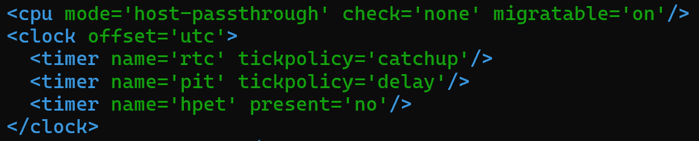

# TÌM HIỂU VỀ FILE XML CỦA MÁY ẢO
## XML LÀ GÌ 
- XML (Extensible Markup Language - Ngôn ngữ đánh dấu mở rộng) là một ngôn ngữ đánh dấu dạng văn bản thuần túy (plain text), được thiết kế để lưu trữ và truyền tải dữ liệu theo một cấu trúc mà cả con người và máy tính đều có thể dễ dàng đọc và hiểu được.
- XML được W3C (World Wide Web Consortium) đề xuất từ năm 1998 và nhanh chóng trở thành tiêu chuẩn vàng trong việc trao đổi dữ liệu giữa các hệ thống phần mềm khác nhau.

## ĐẶC ĐIỂM CỐT LÕI CỦA XML
- "Extensible" (Mở rộng được): XML không có các thẻ (tags) định sẵn như HTML (như <h1>, 
, 
). Bạn được tự do đặt tên thẻ theo đúng ngữ nghĩa dữ liệu của bạn (ví dụ: <student>, <price>, <vm_name>).
- Tập trung vào Dữ liệu (Data-centric): XML được sinh ra để chứa và vận chuyển dữ liệu, không phải để hiển thị dữ liệu (khác với HTML dùng để trình bày giao diện web).
- Cấu trúc Cây (Tree Structure): Dữ liệu trong XML luôn bắt đầu từ một thẻ gốc (Root Element) duy nhất và phân nhánh ra các thẻ con (Child Elements).

## CÁC THÀNH PHẦN CÓ TRONG FILE XML
<domain type='kvm'>
  <name>ubt24</name>
  <uuid>8f0454eb-d797-4d1a-94d1-6dcf5d27ca0e</uuid>
  <metadata>
    <libosinfo:libosinfo xmlns:libosinfo="http://libosinfo.org/xmlns/libvirt/domain/1.0">
      <libosinfo:os id="http://ubuntu.com/ubuntu/24.04"/>
    </libosinfo:libosinfo>
  </metadata>
  <memory unit='KiB'>2097152</memory>
  <currentMemory unit='KiB'>2097152</currentMemory>
  <vcpu placement='static'>2</vcpu>
  <os>
    <type arch='x86_64' machine='pc-q35-10.2'>hvm</type>
    <boot dev='hd'/>
  </os>
  <features>
    <acpi/>
    <apic/>
  </features>
  <cpu mode='host-passthrough' check='none' migratable='on'/>
  <clock offset='utc'>
    <timer name='rtc' tickpolicy='catchup'/>
    <timer name='pit' tickpolicy='delay'/>
    <timer name='hpet' present='no'/>
  </clock>
  <on_poweroff>destroy</on_poweroff>
  <on_reboot>restart</on_reboot>
  <on_crash>destroy</on_crash>
  <pm>
    <suspend-to-mem enabled='no'/>
    <suspend-to-disk enabled='no'/>
  </pm>
  <devices>
    <emulator>/usr/bin/qemu-system-x86_64</emulator>
    <disk type='file' device='disk'>
      <driver name='qemu' type='qcow2' discard='unmap'/>
      <source file='/var/lib/libvirt/images/ubt24.qcow2'/>
      <target dev='vda' bus='virtio'/>
  <address type='pci' domain='0x0000' bus='0x04' slot='0x00' function='0x0'/>
    </disk>
    <disk type='file' device='cdrom'>
      <driver name='qemu' type='raw'/>
      <target dev='sda' bus='sata'/>
      <readonly/>
      <address type='drive' controller='0' bus='0' target='0' unit='0'/>
    </disk>
    <controller type='usb' index='0' model='qemu-xhci' ports='15'>
      <address type='pci' domain='0x0000' bus='0x02' slot='0x00' function='0x0'/>
    </controller>
    <controller type='pci' index='0' model='pcie-root'/>
    <controller type='pci' index='1' model='pcie-root-port'>
      <model name='pcie-root-port'/>
      <target chassis='1' port='0x10'/>
      <address type='pci' domain='0x0000' bus='0x00' slot='0x02' function='0x0' multifunction='on'/>
    </controller>
    <controller type='pci' index='2' model='pcie-root-port'>
      <model name='pcie-root-port'/>
      <target chassis='2' port='0x11'/>
      <address type='pci' domain='0x0000' bus='0x00' slot='0x02' function='0x1'/>
    </controller>
    <controller type='pci' index='3' model='pcie-root-port'>
      <model name='pcie-root-port'/>
      <target chassis='3' port='0x12'/>
      <address type='pci' domain='0x0000' bus='0x00' slot='0x02' function='0x2'/>
    </controller>
    <controller type='pci' index='4' model='pcie-root-port'>
      <model name='pcie-root-port'/>
      <target chassis='4' port='0x13'/>
      <address type='pci' domain='0x0000' bus='0x00' slot='0x02' function='0x3'/>
    </controller>
    <controller type='pci' index='5' model='pcie-root-port'>
      <model name='pcie-root-port'/>
      <target chassis='5' port='0x14'/>
      <address type='pci' domain='0x0000' bus='0x00' slot='0x02' function='0x4'/>
    </controller>
 <controller type='pci' index='6' model='pcie-root-port'>
      <model name='pcie-root-port'/>
      <target chassis='6' port='0x15'/>
      <address type='pci' domain='0x0000' bus='0x00' slot='0x02' function='0x5'/>
    </controller>
    <controller type='pci' index='7' model='pcie-root-port'>
      <model name='pcie-root-port'/>
      <target chassis='7' port='0x16'/>
      <address type='pci' domain='0x0000' bus='0x00' slot='0x02' function='0x6'/>
    </controller>
    <controller type='pci' index='8' model='pcie-root-port'>
      <model name='pcie-root-port'/>
      <target chassis='8' port='0x17'/>
      <address type='pci' domain='0x0000' bus='0x00' slot='0x02' function='0x7'/>
    </controller>
    <controller type='pci' index='9' model='pcie-root-port'>
      <model name='pcie-root-port'/>
      <target chassis='9' port='0x18'/>
      <address type='pci' domain='0x0000' bus='0x00' slot='0x03' function='0x0' multifunction='on'/>
    </controller>
    <controller type='pci' index='10' model='pcie-root-port'>
      <model name='pcie-root-port'/>
      <target chassis='10' port='0x19'/>
      <address type='pci' domain='0x0000' bus='0x00' slot='0x03' function='0x1'/>
    </controller>
    <controller type='pci' index='11' model='pcie-root-port'>
      <model name='pcie-root-port'/>
      <target chassis='11' port='0x1a'/>
      <address type='pci' domain='0x0000' bus='0x00' slot='0x03' function='0x2'/>
    </controller>
    <controller type='pci' index='12' model='pcie-root-port'>
      <model name='pcie-root-port'/>
      <target chassis='12' port='0x1b'/>
      <address type='pci' domain='0x0000' bus='0x00' slot='0x03' function='0x3'/>
    </controller>
    <controller type='pci' index='13' model='pcie-root-port'>
      <model name='pcie-root-port'/>
 <target chassis='13' port='0x1c'/>
      <address type='pci' domain='0x0000' bus='0x00' slot='0x03' function='0x4'/>
    </controller>
    <controller type='pci' index='14' model='pcie-root-port'>
      <model name='pcie-root-port'/>
      <target chassis='14' port='0x1d'/>
      <address type='pci' domain='0x0000' bus='0x00' slot='0x03' function='0x5'/>
    </controller>
    <controller type='sata' index='0'>
      <address type='pci' domain='0x0000' bus='0x00' slot='0x1f' function='0x2'/>
    </controller>
    <controller type='virtio-serial' index='0'>
      <address type='pci' domain='0x0000' bus='0x03' slot='0x00' function='0x0'/>
    </controller>
    <interface type='network'>
      <mac address='52:54:00:39:6f:ac'/>
      <source network='default'/>
      <model type='virtio'/>
      <address type='pci' domain='0x0000' bus='0x01' slot='0x00' function='0x0'/>
    </interface>
    <serial type='pty'>
      <target type='isa-serial' port='0'>
        <model name='isa-serial'/>
      </target>
    </serial>
    <console type='pty'>
      <target type='serial' port='0'/>
    </console>
    <channel type='unix'>
      <target type='virtio' name='org.qemu.guest_agent.0'/>
      <address type='virtio-serial' controller='0' bus='0' port='1'/>
    </channel>
    <input type='tablet' bus='usb'>
      <address type='usb' bus='0' port='1'/>
    </input>
    <input type='mouse' bus='ps2'/>
 <input type='keyboard' bus='ps2'/>
    <graphics type='vnc' port='-1' autoport='yes'>
      <listen type='address'/>
    </graphics>
    <audio id='1' type='none'/>
    <video>
      <model type='virtio' heads='1' primary='yes'/>
      <address type='pci' domain='0x0000' bus='0x00' slot='0x01' function='0x0'/>
    </video>
    <watchdog model='itco' action='reset'/>
    <memballoon model='virtio'>
      <address type='pci' domain='0x0000' bus='0x05' slot='0x00' function='0x0'/>
    </memballoon>
    <rng model='virtio'>
      <backend model='random'>/dev/urandom</backend>
      <address type='pci' domain='0x0000' bus='0x06' slot='0x00' function='0x0'/>
    </rng>
  </devices>
</domain>

### Thông tin chung (Metadata & OS)
- <name> & <uuid>: Tên máy ảo (ubt24) và mã định danh duy nhất.
- <memory> & <currentMemory>: Máy ảo được cấp 2GB RAM (2097152 KiB).
- <vcpu>: Máy ảo sử dụng 2 nhân CPU.
- <os>: Máy ảo sử dụng kiến trúc x86_64, máy ảo kiểu pc-q35 (một dòng chipset hiện đại, ổn định hơn dòng i440fx cũ). Cấu hình boot là hd (tức là sau khi cài xong, nó sẽ ưu tiên boot từ ổ cứng).
- <cpu mode='host-passthrough'/>: Cực kỳ quan trọng, nó cho phép máy ảo "nhìn thấy" trực tiếp các tập lệnh của CPU vật lý trên máy host (hỗ trợ tốt nhất cho hiệu năng và các tính năng ảo hóa lồng nhau - nested virtualization).

- Ngoài mode `host-passthrough`, libvirt còn hỗ trợ một số mode cấu hình CPU phổ biến khác để phục vụ cho các mục đích sử dụng khác nhau:
**Mode custom (Mặc định)**
+ Cách hoạt động: QEMU sẽ giả lập một dòng CPU tiêu chuẩn (ví dụ: qemu64, Haswell, Skylake-Client) thay vì dùng y hệt CPU của máy Host.
+ Ưu điểm: Khả năng tương thích cực kỳ cao. Bạn có thể dễ dàng di chuyển (Live Migration) máy ảo sang bất kỳ máy chủ vật lý nào khác (thậm chí cấu hình phần cứng khác đời một chút) mà không sợ bị lỗi tính năng CPU.
+ Nhược điểm: Hiệu năng có thể không tối ưu bằng host-passthrough vì máy ảo không tận dụng được các tập lệnh độc quyền mới nhất của chip vật lý.

**Mode host-model (Mô phỏng tối ưu)**
+ Cách hoạt động: Libvirt sẽ tự động đọc dòng CPU của máy Host, sau đó "sao chép" một mô hình CPU gần nhất có trong danh sách hỗ trợ của QEMU để gán cho máy ảo (nhưng ẩn bớt một số cờ tính năng quá lạ).
+ Ưu điểm: Là sự cân bằng hoàn hảo giữa hiệu năng cao và tính cơ động (dễ Live Migration). Máy ảo vừa chạy nhanh hơn chế độ custom, vừa không bị ràng buộc quá khắt khe về phần cứng giống như host-passthrough.

**Mode maximum (Tối đa hóa tập lệnh)**
+ Cách hoạt động: Bật tất cả các tính năng và tập lệnh CPU mà cả QEMU lẫn phần cứng Host đều có khả năng hỗ trợ.
+ Ưu điểm: Khai thác triệt để sức mạnh phần cứng mới nhất của chip.
+ Lưu ý: Thường ít được dùng hơn host-passthrough trừ khi bạn cần ép tối đa các tính năng tập lệnh phần cứng đặc thù cho các ứng dụng tính toán hiệu năng cao (HPC).

### Các thiết bị lưu trữ (<devices> -> <disk>)
- File này định nghĩa 2 ổ đĩa:
    + Ổ cứng chính (vda): Sử dụng file /var/lib/libvirt/images/ubt24.qcow2, định dạng qcow2, kết nối qua bus virtio (cho hiệu năng cao nhất).
    + Ổ CDROM (sda): Sử dụng thiết bị cdrom dùng để mount file ISO cài đặt.

### Mạng (<interface>)
- Máy ảo sử dụng loại mạng network='default', kết nối qua bridge virbr0 (NAT).
- Được gán một địa chỉ MAC cố định: 52:54:00:39:6f:ac.
- Card mạng sử dụng kiểu virtio để đạt tốc độ truyền tải tối ưu trong KVM.

### Giao tiếp và Điều khiển (<console>, <serial>, <channel>)
- <serial> & <console>: Cấu hình cổng nối tiếp ảo (Serial Port). Đây là lý do tại sao bạn có thể dùng lệnh virsh console để vào máy ảo.
- <channel type='unix'>: Cấu hình org.qemu.guest_agent.0. Đây là Guest Agent — thành phần cực kỳ quan trọng giúp máy host có thể "giao tiếp" với máy ảo để thực hiện các thao tác như tắt máy sạch sẽ, đồng bộ thời gian hoặc lấy thông tin IP của máy ảo.

### Đồ họa (<graphics>)
- <graphics type='vnc' port='-1' autoport='yes'/>: Máy ảo mở một cổng VNC (cổng tự động cấp bởi hệ thống, bắt đầu từ 5900 trở đi) để bạn kết nối và xem giao diện màn hình.

### Các thành phần bổ trợ (<devices> khác)
- <input type='tablet'/>: Giúp con trỏ chuột trong máy ảo hoạt động mượt mà và chính xác khi bạn điều khiển từ xa qua VNC.
- <watchdog model='itco' action='reset'/>: Một thiết bị giám sát phần cứng, nếu hệ điều hành máy ảo bị "treo cứng", nó sẽ tự động khởi động lại máy ảo.
- <rng model='virtio'/>: Cung cấp nguồn số ngẫu nhiên (Entropy) từ /dev/urandom của host cho máy ảo, giúp hệ điều hành guest khởi tạo các tác vụ bảo mật (như sinh mã hóa) nhanh hơn.