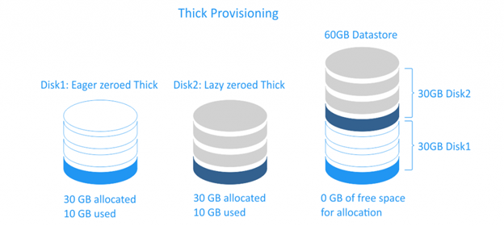

# TÌM HIỂU VỀ CƠ CHẾ LƯU TRỮ THIN - THICK PROVISIONING
## THIN PROVISIONING (Cấp phát cố định)

**Cơ chế hoạt động**
Khi bạn tạo một đĩa ảo có dung lượng 100 GB bằng Thick Provisioning, hệ thống sẽ ngay lập tức chiếm đúng 100 GB dung lượng thật trên đĩa cứng vật lý, bất kể máy ảo đó mới chỉ cài hệ điều hành và dùng thực tế 10 GB.

**Phân loại Thick Provisioning (Ví dụ trong VMware vSphere)**
- **Thick Provision Lazy Zeroed:**
+  Cấp phát và xí phần đủ 100 GB ngay lập tức.
+ Dữ liệu cũ còn tồn tại trên ổ đĩa vật lý chỉ được xóa (zeroed out) dần dần khi máy ảo bắt đầu ghi dữ liệu mới vào từng vùng nhớ đó.
+ Đặc điểm: Tạo ổ đĩa ảo rất nhanh, hiệu năng ghi lần đầu hơi chậm nhẹ.

- **Thick Provision Eager Zeroed:**
+ Cấp phát đủ 100 GB và ngay lập tức dọn dẹp/xóa sạch toàn bộ dữ liệu cũ (fill toàn số 0) trên 100 GB đĩa vật lý đó ngay từ lúc khởi tạo.
+ Đặc điểm: Thời gian khởi tạo đĩa ảo lâu nhất, nhưng mang lại hiệu năng I/O tối đa và an toàn nhất do dữ liệu đã được chuẩn bị sẵn sàng.

**Ưu điểm**
+ Hiệu năng cao và ổn định: Không tốn tài nguyên xử lý việc mở rộng ổ đĩa trong quá trình vận hành.
+ An toàn tuyệt đối: Tránh hoàn toàn rủi ro bị đầy ổ đĩa vật lý đột ngột (Out of Space).
**Nhược điểm**
+ Lãng phí tài nguyên: Dung lượng chưa dùng đến vẫn bị khóa chặt, các máy ảo khác không thể sử dụng.

## THICK PROVISIONING (Cấp phát tĩnh)

**Cơ chế hoạt động**
- Khi bạn tạo một đĩa ảo 100 GB bằng Thin Provisioning, hệ thống chỉ gán một "con số ảo" 100 GB cho máy ảo thấy. Trên đĩa
cứng vật lý, nó chỉ chiếm đúng dung lượng thực tế mà máy ảo đang dùng (ví dụ: máy ảo cài OS xong hết 10 GB thì đĩa vật lý
chỉ tốn 10 GB). Khi máy ảo ghi thêm dữ liệu, đĩa ảo trên máy thật sẽ tự động phình to ra cho đến khi đạt ngưỡng tối đa 100
GB.

**Kỹ thuật Overcommit (Cấp phát vượt ngưỡng)**
- Thin Provisioning cho phép quản trị viên áp dụng kỹ thuật Overcommit: Bạn có một ổ cứng vật lý 1 TB (1000 GB), nhưng bạn
có thể tạo ra 20 máy ảo, mỗi máy ảo cấp 100 GB (tổng cộng 2000 GB ảo). Nhờ Thin Provisioning, miễn là tổng dung lượng thực
tế 20 máy ảo đó dùng chưa vượt quá 1 TB vật lý, hệ thống vẫn hoạt động bình thường.

**Ưu điểm**
+ Tối ưu chi phí & dung lượng: Tiết kiệm tối đa dung lượng đĩa cứng vật lý, tránh lãng phí bộ nhớ nhàn rỗi.
+ Khởi tạo siêu nhanh: Việc tạo ổ đĩa ảo diễn ra gần như tức thì.
+ Linh hoạt: Dễ dàng mở rộng hoặc thu gom tài nguyên.

**Nhược điểm**
+ Hiệu năng I/O thấp hơn: Mỗi khi máy ảo ghi dữ liệu vào vùng nhớ mới, hệ thống phải tốn thời gian cấp phát thêm block đĩa vật lý.
+ Rủi ro rớt hệ thống (Downtime): Nếu tổng dữ liệu thực tế của các máy ảo phình ra vượt quá dung lượng ổ đĩa vật lý thật (hết sạch dung lượng lưu trữ), tất cả máy ảo trong cụm sẽ bị dừng (freeze/crash) đồng loạt.

## BẢNG SO SÁNH
|            Tiêu chí           |        Thin Provisioning       |     Thick Provisioning (Lazy)     |     Thick Provisioning (Eager)    |
|:-----------------------------:|:------------------------------:|:---------------------------------:|:---------------------------------:|
| Chiếm dung lượng thật khi tạo | Chỉ chiếm dung lượng thực dùng | Chiếm toàn bộ dung lượng khai báo | Chiếm toàn bộ dung lượng khai báo |
| Thời gian khởi tạo đĩa        | Tức thì (Vài giây)             | Nhanh                             | Lâu nhất (do phải format/zeroed)  |
| Hiệu năng I/O                 | Trung bình                     | Tốt                               | Tối đa (Best Performance)         |
| Khả năng lãng phí bộ nhớ      | Rất thấp                       | Cao                               | Cao                               |
| Rủi ro hết đĩa vật lý         | Có (Cần theo dõi sát sao)      | Không                             | Không                             |
| Tính năng cao cấp hỗ trợ      | Cần thiết cho Snapshot/CoW     | Bình thường                       | Bắt buộc cho Fault Tolerance (FT) |

## KHI NÀO NÊN SỬ DỤNG THIN/THICK
- Nên chọn Thin Provisioning khi:
    + Môi trường Lab, Development, Testing hoặc các ứng dụng không yêu cầu tốc độ đĩa cực cao.
    + Hạ tầng có ngân sách lưu trữ hạn chế, cần tối ưu từng GB đĩa cứng.
    + Bạn có hệ thống giám sát (Monitoring/Alert) đủ tốt để cảnh báo khi đĩa cứng vật lý sắp đầy.

- Nên chọn Thick Provisioning khi:
    + Chạy các ứng dụng Core/Production quan trọng đòi hỏi hiệu năng I/O cực cao và độ trễ thấp (ví dụ: Cơ sở dữ liệu lớn như Oracle, Microsoft SQL Server, PostgreSQL).
    + Muốn đảm bảo an toàn tuyệt đối, loại bỏ rủi ro sập hệ thống do hết dung lượng đĩa cứng vật lý.