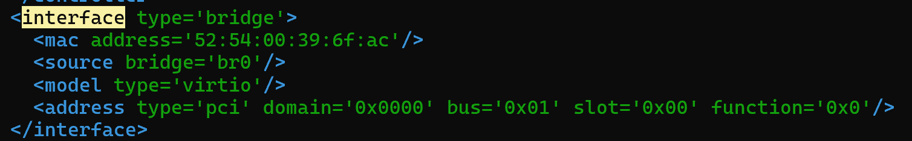
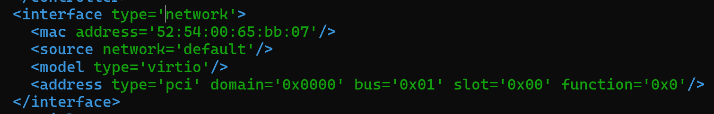

# KVM NETWORK
## Mô tả
- 2 VM nằm trên 2 KVM Host khác nhau có thể ping thấy nhau
VM1 (192.168.122.x) nằm trên Host 1 (192.168.100.50), VM2 nằm trên Host 2 (192.168.100.60)

- Sơ đồ và thông số mạng
[ Mạng LAN Vật Lý: 192.168.100.0/24 ]
                  [ Gateway: 192.168.100.2 / DNS: 8.8.8.8 ]
                                     │
           ┌─────────────────────────┴─────────────────────────┐
           │                                                   │
  ┌────────▼────────────────┐                         ┌────────▼────────────────┐
  │      KVM HOST 1         │                         │      KVM HOST 2         │
  │ IP: 192.168.100.50/24   │                         │ IP: 192.168.100.60/24   │
  │ Card vật lý: ens33      │                         │ Card vật lý: ens33      │
  │ Switch ảo: br0          │                         │ Switch ảo: br0          │
  └────────┬────────────────┘                         └────────┬────────────────┘
           │ (TAP: vnetX)                                      │ (TAP: vnetX)
  ┌────────▼────────────────┐                         ┌────────▼────────────────┐
  │       VM 1 (ubt24)      │                         │       VM 2              │
  │ IP: 192.168.100.150/24  │ ══════[ PING / SSH ]═══>│ IP: 192.168.100.160/24  │
  │ GW: 192.168.100.2       │                         │ GW: 192.168.100.2       │
  └─────────────────────────┘                         └─────────────────────────┘
  
## THỰC HÀNH
- Đầu tiên ta sẽ cần tạo 1 Bridge trên cả 2 Host, tiến hành mở file cấu hình và sửa file
`sudo nano /etc/netplan/01-network-manager-all.yaml`
- Sau đó sửa theo nội dung như sau:

```bash
network:
  version: 2
  renderer: networkd
  ethernets:
    ens33:
      dhcp4: false
      dhcp6: false
  bridges:
    br0:
      interfaces:
        - ens33
      addresses:
        - 192.168.100.50/24
      routes:
        - to: default
          via: 192.168.100.2
      nameservers:
        addresses:
          - 8.8.8.8
          - 1.1.1.1
      parameters:
        stp: false
        forward-delay: 0
```

- Sau đó sử dụng câu lệnh `sudo netplan apply` để áp dụng cấu hình mới
- Tiến hành sửa đổi cấu hình mạng của 2 máy ảo trên 2 Host, sử dụng câu lệnh `virsh edit tên_máy_ảo`
- Sau đó tìm đến phần `interface` và sửa đổi cấu hình như sau rồi lưu lại


- Tiến hành boot máy ảo và cấu hình IP của từng máy ảo
- Truy cập vào file cấu hình netplan và cấu hình IP tĩnh cho từng máy
`sudo nano /etc/netplan/50-cloud-init.yaml`

- Chỉnh sửa nội dung trong file cấu hình như sau:
```bash
network:
  version: 2
  renderer: networkd
  ethernets:
    ens33: # thay đổi tên card dựa vào tên card trên máy ảo
      addresses:
        - 192.168.100.160/24
      routes:
        - to: default
          via: 192.168.100.2
      nameservers:
        addresses:
          - 8.8.8.8
```
- Lưu lại file cấu hình và áp dụng thay đổi
`sudo netplan apply`

- Sau đó tiến hành ping từ máy VM1 (.150) sang máy VM2 (.160) và ngược lại

-> Như vậy ta đã cấu hình thành công Bridge Network và nhận ra sự khác biệt giữa mô hình NAT và Bridge


```bash
# Cấu hình ban đầu của 2 hosts
network:
  version: 2
  renderer: networkd
  ethernets:
    ens33:
      addresses:
        - 192.168.100.60/24
      routes:
        - to: default
          via: 192.168.100.2
      nameservers:
        addresses:
          - 8.8.8.8
          - 1.1.1.1
```

- Cấu hình mạng của máy ảo lúc ban đầu
