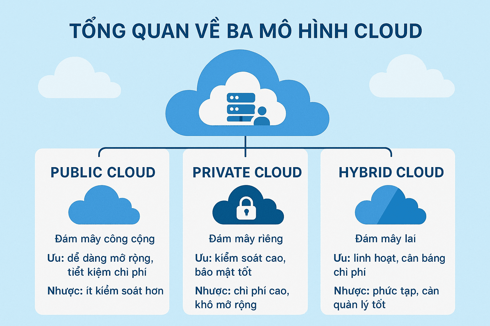
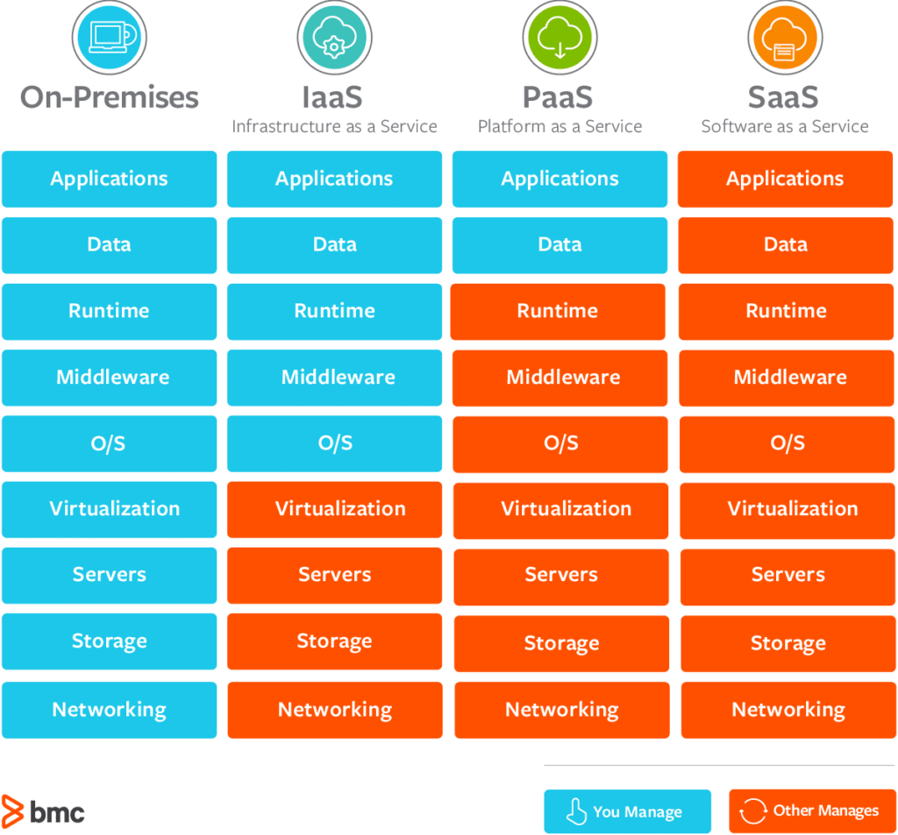

# TÌM HIỂU VỀ CLOUD COMPUTING (ĐIỆN TOÁN ĐÁM MÂY)
## KHÁI NIỆM
- Cloud Computing (điện toán đám mây) là mô hình cung cấp tài nguyên công nghệ thông tin qua Internet theo nhu cầu sử dụng. Thay vì phải đầu tư hạ tầng vật lý, người dùng có thể truy cập và sử dụng các tài nguyên như máy chủ, hệ thống mạng, lưu trữ dữ liệu hoặc năng lực xử lý từ xa một cách linh hoạt.
- Về mặt kiến trúc, Cloud Computing được xây dựng trên một số thành phần cốt lõi sau:

### Trung tâm dữ liệu (Data Center)
- Đây là “trái tim” của hệ thống cloud. Toàn bộ máy chủ, thiết bị mạng và hệ thống lưu trữ đều được đặt tại đây. Trung tâm dữ liệu đảm nhiệm việc xử lý, lưu trữ và bảo mật dữ liệu cho người dùng. Hạ tầng này do nhà cung cấp dịch vụ quản lý và vận hành hoàn toàn từ xa.

### Hệ thống kết nối mạng
- Cloud hoạt động nhờ hệ thống mạng mạnh và ổn định. Các công nghệ như WAN, CDN, SDN và cân bằng tải được tích hợp để kết nối giữa người dùng (front-end) và hệ thống xử lý (back-end). Nhờ đó, dữ liệu được truyền tải nhanh, giảm độ trễ và đảm bảo trải nghiệm mượt mà.

### Công nghệ ảo hóa (Virtualization)
- Đây là nền tảng cốt lõi của cloud. Thay vì sử dụng trực tiếp phần cứng vật lý, hệ thống sẽ tạo ra các máy chủ ảo thông qua phần mềm. Điều này giúp:
    + Tăng khả năng tận dụng tài nguyên
    + Đảm bảo hệ thống vẫn hoạt động khi có sự cố phần cứng
    + Dễ dàng mở rộng hoặc thu hẹp theo nhu cầu

## ĐẶC ĐIỂM CỦA ĐIỆN TOÁN ĐÁM MÂY
**Tự phục vụ theo yêu cầu (On-demand self-service)**
- Đặc điểm đầu tiên của điện toán đám mây là tự phục vụ theo yêu cầu. Có nghĩa là các dịch vụ điện toán đám mây cung cấp đầy đủ tất cả các tính năng cần thiết cho doanh nghiệp khi sử dụng dữ liệu số, bao gồm mạng (Network), môi trường lưu trữ (Storage), máy chủ (Server), dịch vụ và ứng dụng. Do đó, doanh nghiệp có thể tự do cấu hình, sử dụng hoặc ngưng sử dụng các dịch vụ một cách nhanh chóng tùy theo nhu cầu của mình ở từng thời điểm, mà không cần phải chịu sự can thiệp của các nhà cung cấp dịch vụ.

**Truy cập mạng rộng (Broad network access)**
- Đặc điểm tiếp theo là mạng truy cập rộng rãi. Điều kiện duy nhất để truy cập vào các dịch vụ điện toán đám mây là doanh nghiệp chỉ cần có kết nối Internet. Dù nhân viên làm việc tại bất kỳ đâu, bất kỳ thời gian nào thì cũng có thể kết nối, truy cập để làm việc mà không cần bắt buộc phải tới công ty, phải sử dụng hệ thống máy tính của doanh nghiệp khi làm việc.

**Tập hợp tài nguyên (Resource pooling)**
- Hồ chứa tài nguyên là các trung tâm dữ liệu (Data Center) chính là đặc điểm tiếp theo của điện toán đám mây. Các nhà cung cấp dịch vụ điện toán đám mây có các trung tâm dữ liệu nhằm lưu trữ dữ liệu một cách tập trung. Các cơ sở hạ tầng hiện đại này có đầy đủ chức năng và các hệ thống dự phòng đa dạng, hỗ trợ lưu trữ và xử lý khối lượng dữ liệu khổng lồ cho các doanh nghiệp. Cùng với sự phát triển của doanh nghiệp, theo thời gian, các hệ thống cơ sở hạ tầng này cũng càng ngày càng tối ưu, cả từ phần cứng lẫn phần mềm để đáp ứng nhu cầu sử dụng tài nguyên của nhiều doanh nghiệp.

**Dịch vụ đo lường (Measured service)**
- Đặc điểm nổi bật của điện toán đám mây là có hệ thống đo lường, thống kê lại mức lưu lượng mà doanh nghiệp đã sử dụng, từ đó quy đổi ra chi phí cần trả. Qua đó, doanh nghiệp có thể biết được mình đã sử dụng bao nhiêu, để có thể cân đối ngân sách phù hợp, tối ưu hóa chi phí hoạt động hiệu quả tùy thuộc vào nhu cầu sử dụng.
Dịch vụ này không chỉ hữu ích cho doanh nghiệp sử dụng dịch vụ, mà còn mang lại nhiều lợi ích cho các nhà cung cấp điện toán đám mây. Các đơn vị cung cấp có thể theo dõi tình trạng sử dụng tài nguyên và dịch vụ của khách hàng, chẳng hạn như về máy ảo, lưu trữ, băng thông,... Qua đó, nhà cung cấp hiểu rõ hơn về cách khách hàng sử dụng tài nguyên để có thể cải thiện cơ sở hạ tầng, dịch vụ điện toán đám mây của mình.

**Mở rộng linh hoạt (Rapid elasticity)**
- Công nghệ điện toán đám mây với đặc điểm là tính linh hoạt cao, có thể mở rộng hoặc thu hẹp tùy thích dựa trên nhu cầu sử dụng của doanh nghiệp. Doanh nghiệp có thể chủ động nâng cấp hoặc giảm bớt số lượng tài nguyên cần dùng dựa trên nhu cầu và tình hình thực tế của mình một cách nhanh chóng.

- Ngoài 5 đặc điểm của điện toán đám mây, công nghệ này còn có một số đặc điểm phụ khác, bao gồm:
+ _Khả năng phục hồi dữ liệu_: Không như các phương pháp truyền thống, điện toán đám mây hỗ trợ sao lưu và phục hồi dữ liệu tự động thường xuyên, giảm tình trạng thất thoát hoặc đánh mất dữ liệu.
+ _Bảo mật_: Các nhà cung cấp điện toán đám mây đã áp dụng nhiều công nghệ ảo hóa bảo mật hiện đại, cũng như có sự hỗ trợ của đội ngũ chuyên gia giàu kinh nghiệm hàng đầu, giúp xử lý và phòng tránh các rủi ro về bảo mật rất tốt cho doanh nghiệp.
+ _Tự động hóa_: Các ứng dụng, dịch vụ trên điện toán đám mây sẽ tự động cập nhật và làm mới, không cần nhân viên phải thực hành thủ công. Điều này giúp giảm bớt chi phí cho nhân viên CNTT của doanh nghiệp
+ _Tính bền vững_: Lưu trữ dữ liệu trên điện toán đám mây ít sử dụng carbon hơn so với các biện pháp lưu trữ truyền thống, thân thiện với môi trường

## CÁC LOẠI MÔ HÌNH TRIỂN KHAI CLOUD COMPUTING

### Public Cloud
- Public Cloud là mô hình mà các dịch vụ CNTT được nhà cung cấp bên thứ ba (như Amazon Web Services, Google Cloud, Microsoft Azure) phân phối qua mạng Internet công cộng.
- Đặc trưng cốt lõi của Public Cloud là dùng chung hạ tầng (multi-tenant). Hãy tưởng tượng nó giống như việc bạn thuê một căn hộ trong một tòa chung cư lớn: bạn có không gian riêng, nhưng vẫn chia sẻ các hệ thống chung (điện, nước, thang máy) với những người khác.
- Tại sao Public Cloud lại được ưa chuộng?
    + Chi phí cực kỳ tối ưu: Bạn không cần bỏ ra một khoản tiền khổng lồ ban đầu để mua sắm phần cứng (Capex). Thay vào đó, bạn chỉ trả tiền cho những gì mình thực sự sử dụng (Pay-as-you-go).
    + Khả năng mở rộng không giới hạn: Khi lượng truy cập tăng đột biến, hệ thống có thể tự động mở rộng tài nguyên (RAM, CPU) chỉ trong vài phút.
    + Không phải bảo trì: Đội ngũ kỹ sư của nhà cung cấp sẽ lo toàn bộ việc bảo trì, cập nhật hệ thống và phần cứng.
- Khuyến nghị: Đây là lựa chọn hoàn hảo cho các Startup, doanh nghiệp vừa và nhỏ (SMEs), hoặc các dự án có lưu lượng truy cập biến động (như trang web thương mại điện tử vào các dịp flash sale). Tuy nhiên, nếu doanh nghiệp của bạn có những dữ liệu nhạy cảm cần tuân thủ các quy định khắt khe về quyền riêng tư, đây có thể chưa phải là bến đỗ an toàn nhất.

### Private Cloud
- Ngược lại với sự chia sẻ của Public Cloud, Private Cloud là một môi trường điện toán đám mây được xây dựng để dành riêng cho một tổ chức duy nhất (single-tenant). Hạ tầng này có thể được đặt tại trung tâm dữ liệu (data center) nội bộ của doanh nghiệp, hoặc được lưu trữ bởi một nhà cung cấp dịch vụ bên thứ ba nhưng tài nguyên được cô lập hoàn toàn.
- Điểm sáng giá nhất của Private Cloud:
    + Bảo mật và quyền kiểm soát tuyệt đối: Dữ liệu của bạn không nằm chung server với bất kỳ ai. Doanh nghiệp nắm toàn quyền thiết lập các bức tường lửa và giao thức bảo mật khắt khe nhất.
    + Hiệu suất ổn định: Do không phải chia sẻ băng thông hay tài nguyên với các “hàng xóm” khác, hệ thống luôn đảm bảo hiệu suất xử lý cao và liên tục.
    + Tuân thủ pháp lý: Đáp ứng dễ dàng các tiêu chuẩn nghiêm ngặt về quản lý dữ liệu quốc gia hay ngành nghề.
- Khuyến nghị: Private Cloud là “chiếc áo may đo” hoàn hảo cho các tổ chức tài chính, ngân hàng, cơ quan chính phủ, hoặc các bệnh viện lưu trữ hồ sơ y tế. Đổi lại, doanh nghiệp phải chấp nhận mức chi phí đầu tư ban đầu cao và cần có đội ngũ IT in-house chuyên môn sâu để vận hành.

### MultiCloud
- Nếu Hybrid Cloud là sự kết hợp giữa “Công” và “Tư”, thì Multi-cloud là chiến lược sử dụng dịch vụ từ nhiều nhà cung cấp Public Cloud khác nhau cùng một lúc (ví dụ: dùng AWS để lưu trữ dữ liệu, dùng Google Cloud để phân tích AI, và dùng Azure để quản lý danh tính).
- Đây được xem là xu hướng mới nhất và đang định hình lại cách các doanh nghiệp công nghệ lớn vận hành, bởi nó giải quyết được những nỗi đau lớn nhất của việc phụ thuộc công nghệ.
- Tại sao Multi-cloud lại trở thành xu hướng?
    + Tránh “Vendor Lock-in” (Khóa chặt vào một nhà cung cấp): Doanh nghiệp không bị phụ thuộc vào mức giá, chính sách hay rủi ro ngừng hoạt động của một nhà cung cấp duy nhất.
    + Lựa chọn “Best-of-breed” (Dịch vụ tốt nhất): Mỗi nhà cung cấp có một thế mạnh riêng. Bạn có thể chắt lọc những dịch vụ tinh túy nhất của từng bên để xây dựng một siêu hệ thống cho mình.
    + Tối đa hóa tính dự phòng (Disaster Recovery): Nếu một nền tảng đám mây gặp sự cố sập nguồn mạng diện rộng, hệ thống của bạn vẫn có thể tiếp tục chạy trên nền tảng của nhà cung cấp khác.
- Khuyến nghị: Multi-cloud là sân chơi của những doanh nghiệp có độ trưởng thành cao về công nghệ. Nó mang lại sức mạnh vô song nhưng cũng đòi hỏi một công cụ quản lý tập trung và đội ngũ kỹ sư có khả năng làm chủ nhiều nền tảng đám mây khác nhau.

### Hybrid Cloud
- Thực tế kinh doanh hiếm khi chỉ có trắng hoặc đen. Rất nhiều doanh nghiệp nhận ra rằng họ vừa muốn có sự linh hoạt, giá rẻ của Public Cloud, lại vừa khao khát tính bảo mật của Private Cloud. Giải pháp ở đây chính là Hybrid Cloud.
- Mô hình này tạo ra một cầu nối đồng bộ, cho phép dữ liệu và ứng dụng di chuyển linh hoạt giữa hai môi trường Public và Private.
- Chiến lược ứng dụng Hybrid Cloud thực tế:
    + Tối ưu hóa nguồn lực: Doanh nghiệp có thể sử dụng Private Cloud để lưu trữ cơ sở dữ liệu khách hàng cực kỳ nhạy cảm, đồng thời chạy các ứng dụng web front-end (giao diện người dùng) trên Public Cloud để tiếp cận khách hàng với chi phí rẻ.
    + Xử lý quá tải (Cloud Bursting): Khi hệ thống nội bộ (Private) đạt đến ngưỡng giới hạn năng lực vào những mùa cao điểm, Hybrid Cloud cho phép “tràn” bớt lưu lượng xử lý sang Public Cloud một cách mượt mà mà không làm gián đoạn dịch vụ.
- Khuyến nghị: Đây là mô hình mang tính chiến lược dài hạn, đặc biệt phù hợp với các tập đoàn lớn đang trong quá trình chuyển đổi số, muốn từng bước đưa hệ thống lên mây mà không làm gián đoạn quy trình vận hành cốt lõi hiện tại.

## PHÂN LOẠI MÔ HÌNH DỊCH VỤ TRONG CLOUD COMPUTING

### IaaS
IaaS (Infrastructure as a Service - Cơ sở hạ tầng như một dịch vụ): Cho phép business triển khai và sử dụng các tài nguyên cloud infrastructure như virtual machines, storage và network. Người dùng có quyền quản lý hệ điều hành (Windows, Linux), ứng dụng và dữ liệu, trong khi nhà cung cấp chịu trách nhiệm vận hành trung tâm dữ liệu và phần cứng. Ví dụ: Amazon Web Services (AWS EC2), Google Compute Engine.

### PaaS
PaaS (Platform as a Service - Nền tảng như một dịch vụ): Cung cấp nền tảng phát triển ứng dụng trên đám mây, bao gồm runtime environment, middleware và managed database. Nhà phát triển chỉ cần tập trung xây dựng và triển khai web application hoặc mobile backend mà không phải quản lý hạ tầng máy chủ. Ví dụ: Google App Engine, Microsoft Azure SQL Database.

### SaaS
SaaS (Software as a Service - Phần mềm như một dịch vụ): Phân phối ứng dụng phần mềm hoàn chỉnh thông qua internet, trong đó toàn bộ hạ tầng và nền tảng được quản lý bởi nhà cung cấp dịch vụ điện toán đám mây. Người dùng truy cập trực tiếp thông qua trình duyệt web hoặc ứng dụng trực tuyến mà không cần cài đặt hay quản trị hệ thống. Ví dụ: Google Workspace, Microsoft 365, Salesforce.

## LỢI ÍCH CỦA ĐIỆN TOÁN ĐÁM MÂY
- *Tối ưu chi phí (Không cần đầu tư phần cứng ban đầu)*: Đây là bài toán tài chính hấp dẫn nhất. Thay vì phải bỏ ra một nguồn vốn khổng lồ (CapEx) để mua sắm máy chủ, xây dựng phòng lạnh, và thuê đội ngũ bảo trì, doanh nghiệp chuyển sang mô hình chi phí hoạt động (OpEx). Bạn chỉ trả tiền cho những tài nguyên thực sự sử dụng (Pay-as-you-go), giúp giải phóng dòng tiền để tập trung vào các hoạt động kinh doanh cốt lõi.
- *Tính linh hoạt và khả năng mở rộng (Scale up/down dễ dàng)*: Với hạ tầng vật lý truyền thống, việc nâng cấp server có thể mất hàng tuần để đặt mua và lắp đặt. Trên Cloud, bạn có thể nhân đôi dung lượng RAM hoặc CPU chỉ bằng vài cú click chuột để đón đầu đợt tăng truy cập (như dịp Black Friday), và ngay lập tức thu hẹp lại (scale down) khi hết chiến dịch để tránh lãng phí.
- *Tốc độ và hiệu suất cao*: Các nhà cung cấp dịch vụ đám mây lớn sở hữu mạng lưới trung tâm dữ liệu (Data Center) khổng lồ trải dài trên toàn cầu, được trang bị những phần cứng tối tân nhất. Điều này cho phép doanh nghiệp triển khai ứng dụng trên toàn thế giới chỉ trong vài phút với độ trễ (latency) cực thấp, mang lại trải nghiệm mượt mà nhất cho người dùng cuối.
- *Bảo mật dữ liệu và khắc phục sự cố (Disaster recovery)*: Nhiều người lầm tưởng để dữ liệu nội bộ sẽ an toàn hơn, nhưng thực tế, các gã khổng lồ như AWS hay Google Cloud chi hàng tỷ USD mỗi năm chỉ cho an ninh mạng. Hơn thế nữa, tính năng sao lưu tự động và phân tán dữ liệu ở nhiều khu vực địa lý giúp doanh nghiệp khôi phục hệ thống nhanh chóng (Disaster recovery) nếu có thảm họa thiên nhiên, cháy nổ hay tấn công mạng xảy ra.
- *Làm việc mọi lúc, mọi nơi*: Đám mây phá bỏ hoàn toàn rào cản về không gian vật lý. Chỉ cần một thiết bị có kết nối Internet, nhân viên của bạn có thể truy cập vào hệ thống làm việc từ bất kỳ đâu. Điều này đặc biệt quan trọng trong kỷ nguyên làm việc từ xa (Remote/Hybrid work), giúp duy trì hiệu suất lao động xuyên suốt.

## HẠN CHẾ
- Bên cạnh những lợi ích to lớn, việc phụ thuộc vào nền tảng của bên thứ ba cũng đặt ra những bài toán mà doanh nghiệp bắt buộc phải đối mặt và có phương án dự phòng:
    + *Yêu cầu kết nối Internet liên tục*: Đây là “gót chân Achilles” của Điện toán đám mây. Toàn bộ sức mạnh của Cloud sẽ trở nên vô nghĩa nếu hệ thống mạng của bạn bị ngắt. Sự phụ thuộc 100% vào đường truyền Internet đồng nghĩa với việc doanh nghiệp phải đầu tư các đường truyền dự phòng (Backup Line) chất lượng cao để đảm bảo công việc không bị đình trệ khi đứt cáp quang.
    + *Quyền kiểm soát dữ liệu (khi đặt trên server của bên thứ 3)*: Khi đưa dữ liệu lên Public Cloud, bạn đang giao phó “tài sản số” của mình cho người khác giữ. Điều này dẫn đến những lo ngại về tính bảo mật nội bộ, quyền riêng tư và khả năng rò rỉ thông tin. Ngoài ra, nếu nhà cung cấp bất ngờ thay đổi chính sách giá, gặp sự cố sập server toàn cầu hoặc doanh nghiệp muốn chuyển đổi sang nền tảng khác, bạn có thể gặp rắc rối với hiệu ứng “khóa chặt” (Vendor lock-in).

## ỨNG DỤNG CỦA ĐIỆN TOÁN ĐÁM MÂY
- *Lưu trữ, sao lưu và khôi phục dữ liệu*: Thời đại khư khư giữ những chiếc ổ cứng vật lý đắt đỏ và dễ hỏng hóc đã qua. Đám mây cung cấp một không gian lưu trữ gần như vô tận, an toàn và dễ dàng truy cập từ bất kỳ đâu. Các dịch vụ như Google Drive, Apple iCloud hay Dropbox chính là ví dụ điển hình nhất. Hơn thế nữa, đối với doanh nghiệp, Cloud tự động hóa toàn bộ quá trình sao lưu dữ liệu chéo qua nhiều khu vực địa lý, đảm bảo hệ thống có thể khôi phục tức thời (Disaster Recovery) ngay cả khi trung tâm dữ liệu chính gặp thảm họa.
- *Phân tích dữ liệu lớn (Big Data)*: Để trích xuất được những “mỏ vàng” insight từ hàng Terabyte dữ liệu khách hàng, doanh nghiệp cần một sức mạnh tính toán khổng lồ. Thay vì phải xây dựng một siêu máy tính nội bộ với chi phí ngất ngưởng, các tổ chức có thể tận dụng sức mạnh xử lý của Cloud để chạy các mô hình Machine Learning và AI phức tạp. Điều này giúp họ dự đoán xu hướng thị trường, tối ưu hóa chuỗi cung ứng và cá nhân hóa trải nghiệm người dùng theo thời gian thực.
- *Phát trực tuyến âm thanh và video (Streaming)*: Bạn có bao giờ thắc mắc tại sao hàng triệu người có thể cùng lúc xem một bộ phim 4K trên Netflix hay nghe nhạc trên Spotify mà không hề bị giật lag? Bí mật nằm ở hạ tầng đám mây kết hợp với Mạng phân phối nội dung (CDN). Đám mây cho phép lưu trữ khối lượng nội dung giải trí khổng lồ và phân phối chúng với băng thông siêu lớn đến các máy chủ cục bộ gần với người dùng nhất, mang lại trải nghiệm mượt mà không độ trễ.
- *Xây dựng và kiểm thử ứng dụng (Test & Build)*: Trong quá khứ, các lập trình viên thường phải chờ đợi hàng tuần để bộ phận IT cấp phát máy chủ cho việc thử nghiệm phần mềm. Với môi trường đám mây (đặc biệt là mô hình PaaS), đội ngũ phát triển có thể tự động khởi tạo vô số môi trường dev/test chỉ trong vài phút. Ngay sau khi kiểm thử xong, họ có thể gỡ bỏ môi trường đó ngay lập tức để tiết kiệm chi phí. Điều này giúp rút ngắn tối đa vòng đời phát triển phần mềm (CI/CD) và đẩy nhanh tốc độ đưa sản phẩm ra thị trường (Time-to-market).

## CƠ CHẾ HOẠT ĐỘNG CỦA ĐIỆN TOÁN ĐÁM MÂY
- Cơ chế hoạt động của Điện toán đám mây (Cloud Compute) dựa trên mô hình client–server kết hợp với kiến trúc distributed system, trong đó các tài nguyên công nghệ thông tin được cung cấp từ các hệ thống máy chủ tập trung thông qua Internet. Trong mô hình này, người dùng gửi yêu cầu từ thiết bị của mình đến nền tảng đám mây, nơi các hệ thống máy chủ và dịch vụ backend xử lý, phân bổ và cung cấp tài nguyên theo thời gian thực.
- Về mặt kiến trúc, một nền tảng cloud hiện đại được xây dựng trên hạ tầng đám mây phân tán, bao gồm nhiều availability zones và data center để đảm bảo khả năng mở rộng và độ tin cậy cao. Khi users truy cập một dịch vụ cho thuê Cloud Server, yêu cầu sẽ được truyền qua cloud network và được xử lý bởi các hệ thống load balancer để phân phối lưu lượng truy cập đến các máy chủ phù hợp.
- Công nghệ ảo hóa đóng vai trò cốt lõi trong quá trình này. Thông qua lớp phần mềm hypervisor, các máy chủ vật lý trong cloud data center có thể được chia thành nhiều máy chủ ảo (VMs) hoặc container instances chạy độc lập. Điều này giúp tối ưu hóa việc sử dụng tài nguyên như CPU, RAM và dung lượng lưu trữ, đồng thời cho phép nhiều người dùng chia sẻ cùng một hạ tầng theo mô hình multi-tenant architecture, trong đó nhiều tenants hoặc tổ chức có thể sử dụng chung hạ tầng vật lý nhưng vẫn được cách ly về dữ liệu và quyền truy cập.
- Ngoài ra, nhiều nền tảng cloud hiện đại còn sử dụng containerization và hệ thống điều phối như Kubernetes để quản lý các ứng dụng chạy trên nhiều máy chủ khác nhau. Các hệ thống container runtime và orchestration engine này giúp tự động triển khai, mở rộng và quản lý các dịch vụ trong môi trường đám mây.

### Các thành phần chính trong cơ chế hoạt động
- *Front-end (Giao diện người dùng)*: Front-end là lớp giao diện mà người dùng cuối sử dụng để truy cập và tương tác với hệ thống đám mây ảo. Thành phần này bao gồm: trình duyệt web (web browser), ứng dụng di động (mobile applications), dashboard quản lý cloud và command-line interface (CLI). Thông qua các giao diện này, người dùng có thể gửi yêu cầu đến hệ thống cloud thông qua Cloud API hoặc các giao thức mạng tiêu chuẩn như HTTP/HTTPS.
- *Back-end (Hạ tầng đám mây)*: Back-end là phần hạ tầng cốt lõi của hệ thống cloud, được vận hành trong các trung tâm dữ liệu quy mô lớn của nhà cung cấp dịch vụ. Hạ tầng này bao gồm: server vật lý (physical servers), máy ảo (virtual machines), container runtime, hệ thống lưu trữ như object storage và block storage, hệ thống mạng nội bộ và tường lửa. Các nhà cung cấp như Amazon Web Services, Microsoft Azure hoặc Google Cloud Platform, FPT Smart Cloud chịu trách nhiệm vận hành và bảo trì toàn bộ hệ thống backend này.
- *Network Layer (Internet và Cloud Network)*: Network layer đóng vai trò kết nối giữa front-end và back-end. Các yêu cầu từ người dùng sẽ được truyền qua Internet đến hệ thống cloud thông qua các cloud gateway và load balancer. Hạ tầng mạng của cloud thường bao gồm: Virtual Private Cloud (VPC), hệ thống subnet edge nodes và content delivery network (CDN). Những thành phần này giúp tối ưu hóa tốc độ truyền dữ liệu, giảm độ trễ và đảm bảo khả năng truy cập ổn định từ nhiều khu vực địa lý.
- *Virtualization Layer (Ảo hóa)*: Virtualization là lớp công nghệ giúp trừu tượng hóa tài nguyên phần cứng trong hệ thống cloud. Thông qua hypervisor, một máy chủ vật lý có thể chạy nhiều máy ảo độc lập. Ngoài VM, nhiều nền tảng cloud hiện đại còn hỗ trợ container-based workloads, trong đó các ứng dụng được đóng gói trong container images và chạy trên các container orchestration platforms như K8s. Nhờ lớp ảo hóa này, cloud có thể cung cấp tài nguyên linh hoạt, cho phép người dùng triển khai hệ thống mà không cần quản lý trực tiếp phần cứng.

### Nguyên lí hoạt động chi tiết
- *Yêu cầu và Kết nối (Request & Access)*: Quá trình bắt đầu khi người dùng gửi yêu cầu thông qua web interface, mobile application hoặc cloud API (cloud application programming interface). Ví dụ: tạo virtual machine instance, tải tệp tin lên cloud storage, triển khai web/application.
- *Quản lý và Phân phối (Resource Orchestration)*: Sau khi nhận yêu cầu từ phía client, hệ thống backend sử dụng các thành phần như middleware, cloud scheduler, resource provisioning engine và cloud orchestration systems để xác định tài nguyên phù hợp và phân bổ máy chủ, bộ nhớ và dung lượng lưu trữ cho users. Trong nhiều nền tảng đám mây, các container hoặc VMs sẽ được triển khai tự động trên các máy chủ khác nhau trong cùng availability zone nhằm đảm bảo hiệu suất và khả năng mở rộng.
- *Thanh toán và Sử dụng (Usage & Billing)*: Sau khi tài nguyên được cấp phát, người dùng có thể vận hành ứng dụng hoặc lưu trữ dữ liệu trên nền tảng cloud. System sẽ theo dõi mức sử dụng tài nguyên bao gồm: vCPU Usage, RAM Allocation, Storage Consumption, Network Bandwidth. Dựa trên dữ liệu này, nhà cung cấp áp dụng mô hình pay-as-you-go, trong đó khách hàng chỉ trả chi phí cho lượng tài nguyên thực tế sử dụng.