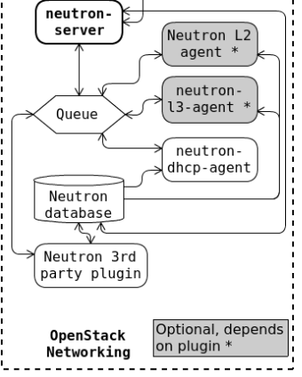
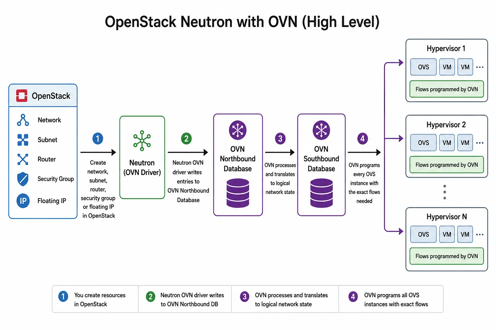

# TÌM HIỂU VỀ OVN NETWORK
## OVN LÀ GÌ ?
- Bản chất: OVN là một hệ thống mạng ảo phân tán (Distributed Virtual Network) được phát triển để nằm phía trên Open vSwitch (OVS). Nếu OVS là "công nhân" vận chuyển gói tin, thì OVN chính là "bộ quản lý" thông minh giúp tự động hóa toàn bộ mô hình mạng logic (như switch ảo, router ảo, tường lửa, ACLs).
- Vai trò trong OpenStack: Trong các phiên bản OpenStack hiện đại, OVN đã trở thành thành phần cốt lõi thay thế cho các cơ chế Neutron agent cũ, giúp hệ thống mạng hoạt động ổn định, mượt mà và dễ mở rộng hơn ở quy mô lớn.

## CƠ CHẾ NETWORK GIỮA CÁC MÁY ẢO NHƯ THẾ NÀO
Khi hai máy ảo (VMs) trao đổi dữ liệu với nhau, cơ chế mạng của OVN sẽ được chia thành hai trường hợp chính dựa trên vị trí của chúng:
> **Trường hợp 1: Hai máy ảo nằm trên cùng một máy chủ vật lý (Same Compute Node)**
- Khi hai máy ảo cùng một tenant (hoặc được cấu hình cho phép) nằm chung trên một hypervisor:
+ Rời khỏi máy ảo: Gói tin phát ra từ máy ảo nguồn đi qua cổng ảo (tap interface) và bước thẳng vào cầu nối tích hợp chính trên Open vSwitch cục bộ có tên là br-int (Integration Bridge).
+ Xử lý luật dòng chảy (Flows): Dựa vào các luật OpenFlow do ovn-controller lập trình sẵn từ trước, OVS sẽ kiểm tra xem gói tin có vi phạm chính sách bảo mật (Security Groups / ACLs) hay không.
+ Chuyển tiếp trực tiếp: Nếu hợp lệ, OVS sẽ chuyển trực tiếp gói tin đó sang cổng kết nối của máy ảo đích ngay trên cùng một máy chủ mà không cần đi qua mạng vật lý bên ngoài. Quá trình này diễn ra cực kỳ nhanh chóng.

> **Trường hợp 2: Hai máy ảo nằm trên hai máy chủ vật lý khác nhau (Cross-Host / Overlay Network)**
- Khi hai máy ảo nằm ở hai compute node khác nhau nhưng cùng thuộc một hệ thống mạng ảo:
+ Bước vào Bridge (br-int): Gói tin từ máy ảo nguồn đi vào cầu nối br-int trên máy chủ thứ nhất.
+ Đóng gói đường hầm (Tunnel Encapsulation):
    * ovn-controller trên máy chủ đó nhận diện rằng máy ảo đích nằm ở một máy chủ vật lý khác.
    * OVN sẽ thực hiện đóng gói gói tin (gói nguyên bản bên trong một lớp vỏ giao thức đường hầm như Geneve hoặc VXLAN).
+ Truyền qua mạng vật lý: Gói tin đã được đóng gói sẽ đi qua cầu nối tunnel (br-tun) và truyền qua mạng cáp vật lý của trung tâm dữ liệu từ máy chủ này sang máy chủ kia.
+ Mở gói và giao hàng (Decapsulation):
    * Khi đến máy chủ vật lý thứ hai, cầu nối br-tun nhận được gói tin, tiến hành mở lớp vỏ bọc (tháo bỏ Geneve/VXLAN header) để trả lại nguyên vẹn gói tin ban đầu.
    * Gói tin được đẩy qua br-int của máy chủ thứ hai và chuyển thẳng vào máy ảo đích.

## Chức năng chính của OVN
- *Định tuyến phân tán (Distributed Routing)*: Mọi tác vụ định tuyến (routing) và NAT đều được phân phối trực tiếp xuống từng Compute Node, loại bỏ hoàn toàn nút mạng trung tâm (Network Node) độc lập, giúp tối ưu hóa đường đi của gói tin.
- *Tường lửa trạng thái (Stateful ACLs & Security Groups)*: Hỗ trợ lọc gói tin dựa trên trạng thái kết nối (stateful firewall) trực tiếp ở cấp độ cổng mạng ảo (logical port).
- *Cung cấp dịch vụ gốc (Native Services)*: Tích hợp sẵn các dịch vụ DHCP, DNS và Load Balancer ngay bên trong kiến trúc mạng ảo mà không cần dựng các namespace phức tạp như trước.
- *Chuyển đổi lưu lượng tự động*: Tự động tạo các đường hầm (tunneling như Geneve hoặc VXLAN) giữa các hypervisor để đóng gói và vận chuyển gói tin qua mạng vật lý.

## Ưu, nhược điểm của cơ chế mạng OVN
### Ưu điểm
- *Định tuyến phân tán (Distributed Routing)*: Thay vì bắt mọi lưu lượng định tuyến phải đi vòng qua một Network Node trung tâm gây nghẽn cổ chai, OVN cho phép định tuyến East-West (giữa các máy ảo nội bộ) được xử lý ngay tại các compute node cục bộ.
- *Tự động hóa thông qua Database*: Mọi thay đổi về cấu hình mạng (như tạo port, đổi security group) đều được OVN cập nhật tự động từ Southbound Database xuống tận các OVS trên từng máy chủ mà không cần con người phải đi cấu hình thủ công từng thiết bị switch.
- *Hiệu năng cực cao và giảm độ trễ*: Nhờ kiến trúc phân tán, các máy ảo giao tiếp với nhau hoặc đi ra ngoài mạng vật lý theo đường ngắn nhất mà không bị nghẽn cổ chai qua Network Node.
- *Kiến trúc gọn nhẹ, ít thành phần trung gian*: Giảm thiểu đáng kể số lượng tiến trình agent phức tạp trên hệ thống so với mô hình Neutron ML2/OVS cũ.
- *Khả năng mở rộng (Scalability) tốt*: Quản lý tốt các cụm đám mây quy mô lớn nhờ cơ chế lưu trữ cơ sở dữ liệu phân tán của OVN (OVN DBs).

## Nhược điểm
- *Độ phức tạp khi xử lý sự cố (Troubleshooting)*: Do logic mạng được dịch sang các bảng dòng logic (logical flows) và phân tán trên nhiều node, việc tra cứu nguyên nhân lỗi mạng đòi hỏi chuyên môn sâu.
- *Yêu cầu cao về tính ổn định của OVN DB*: Cụm cơ sở dữ liệu OVN (Northbound và Southbound DB) đóng vai trò sống còn, nếu không cấu hình High Availability (HA) tốt cho DB này thì toàn bộ hệ thống mạng có thể gặp rủi ro.

## Tìm hiểu Neutron
### Data plane của Neutron là gì ?
- Trong OpenStack Neutron, Data Plane (Mặt phẳng dữ liệu) là nơi thực tế vận chuyển, xử lý và định tuyến các gói tin mạng (packets) giữa các máy ảo (instances) với nhau hoặc ra ngoài internet.
- Khác với Control Plane (gồm neutron-server, Database, Message Queue) chỉ làm nhiệm vụ tiếp nhận yêu cầu, xử lý logic và lưu cấu hình, Data Plane chịu trách nhiệm "đẩy" luồng dữ liệu mạng thực tế thông qua các cầu nối ảo (bridges), router ảo, và các cơ chế đóng gói đường hầm (tunneling như VXLAN/Geneve) trên các node.
### Sự khác biệt giữa Neutron sử dụng OVS và Neutron sử dụng OVN



- Nhìn vào sơ đồ kiến trúc của Neutron, mô hình truyền thống sử dụng Open vSwitch (OVS) kết hợp với hàng loạt agents. Khi chuyển sang sử dụng OVN (Open Virtual Network), kiến trúc Data Plane thay đổi hoàn toàn.

#### Neutron dùng thuần OVS
- Kiến trúc Agent: Phải duy trì rất nhiều tiến trình agent chạy độc lập trên các node như:
    + neutron-l2-agent (Open vSwitch Agent): Quản lý các cầu nối Layer 2 (br-int, br-tun).
    + neutron-l3-agent: Quản lý các bộ định tuyến ảo (L3 Routers) thông qua các Network Namespace của Linux.
    + neutron-dhcp-agent: Cung cấp dịch vụ cấp IP tự động (DHCP) cũng thông qua các Network Namespace riêng biệt.
- Cách hoạt động: Khi có thay đổi về mạng, neutron-server đẩy thông điệp qua Queue, các agent ở từng node nhận được lệnh, sau đó thực thi việc cấu hình lại bảng OpenFlow của OVS hoặc thiết lập lại các namespace cục bộ.
- Nhược điểm:
    + Cồng kềnh, nhiều tầng trung gian, dễ gặp lỗi đồng bộ trạng thái khi hệ thống có quy mô lớn.
    + Việc định tuyến L3 phụ thuộc vào các Network Namespace, gây tốn tài nguyên và khó scale nếu không cấu hình các tính năng phức tạp (như DVR - Distributed Virtual Router).

#### Neutron tích hợp OVN

- Bản chất của OVN: OVN là một hệ thống ảo hóa mạng được phát triển chính bởi đội ngũ tạo ra Open vSwitch, nhằm giải quyết triệt để sự cồng kềnh của mô hình agent truyền thống.
- Kiến trúc tinh gọn:
    + Loại bỏ hoàn toàn các agent rườm rà như l3-agent, dhcp-agent hay metadata-agent.
    + Thay vào đó, OVN sử dụng hai cơ sở dữ liệu chuyên biệt là NB (Northbound) và SB (Southbound Database) cùng một tiến trình duy nhất chạy trên mỗi compute node là ovn-controller.
- Cách hoạt động: Mọi logic về mạng (từ L2, L3 routing, DHCP, cho đến Security Groups) đều được dịch thẳng thành các dòng lệnh logic (Logical Flows) lưu trữ ở Database, sau đó ovn-controller sẽ đồng bộ trực tiếp chúng xuống các bảng OpenFlow của OVS cục bộ một cách cực kỳ tốc độ.

### Các thành phần chính của Neutron sử dùng OVS
- Khi sử dụng thuần Open vSwitch (OVS), mô hình mạng dựa trên kiến trúc phân tán agent. Các thành phần chính bao gồm:
    + neutron-server: Đóng vai trò là trung tâm tiếp nhận API, xử lý logic mạng và lưu trữ cấu hình vào database.
    + neutron-L2-agent (openvswitch-agent): Chạy trên các Compute Node và Network Node để quản lý các cầu nối OVS (br-int, br-tun, br-ex), cấu hình port và kết nối các máy ảo vào mạng ảo.
    + neutron-l3-agent: Chịu trách nhiệm quản lý các bộ định tuyến ảo (Virtual Routers), thực hiện định tuyến giữa các subnet, NAT, và cung cấp Floating IP.
    + neutron-dhcp-agent: Cung cấp dịch vụ cấp phát địa chỉ IP động (DHCP) cho các máy ảo trong mạng.
    + neutron-metadata-agent: Hỗ trợ máy ảo lấy các thông tin siêu dữ liệu (metadata như SSH keys, user-data) từ dịch vụ metadata.

### Chức năng chi tiết của L2 Agent và L3 Agent
- neutron-L2-agent làm gì?
    + Theo dõi các thay đổi về cổng mạng (port) của máy ảo trên Hypervisor.
    + Tự động điều chỉnh các dòng lệnh OpenFlow và cấu hình các cầu nối OVS cục bộ để đảm bảo máy ảo có thể gửi/nhận gói tin L2 ra ngoài mạng ảo hoặc sang các node khác (thông qua giao thức đường hầm như VXLAN/GRE).
    + Cách kiểm tra thành công: Kiểm tra trạng thái kết nối port qua lệnh ovs-vsctl show thấy các interface ảo (tap... hoặc qvo...) được gắn chính xác vào cầu nối tích hợp (br-int).

- neutron-l3-agent làm gì?
    + Tạo và quản lý các Linux Network Namespace (không gian tên mạng cô lập) cho từng Virtual Router.
    + Thực hiện việc định tuyến (routing) gói tin giữa các mạng riêng khác nhau.
    + Xử lý cơ chế SNAT/DNAT để máy ảo có thể đi ra Internet hoặc kết nối qua Floating IP.
    + Cách kiểm tra thành công: Chạy lệnh ip netns để nhìn thấy các namespace của router (qrouter-...) và kiểm tra bảng định tuyến bên trong namespace đó bằng ip route.

### Khi sử dụng OVN có cần L2/L3 Agent không ?
- Không. Khi chuyển sang sử dụng OVN (Open Virtual Network), hệ thống hoàn toàn không cần các agent truyền thống như neutron-l2-agent, neutron-l3-agent, hay neutron-dhcp-agent nữa.
- OVN ra đời để thay thế cách quản lý mạng thủ công, nặng nề của các agent cũ bằng một kiến trúc tập trung cơ sở dữ liệu và tối ưu hóa ở tầng kernel/OpenFlow:
    + Thay thế L2/L3 Agent bằng ovn-controller: OVN gom toàn bộ logic điều khiển mạng đẩy vào hai cơ sở dữ liệu chuyên biệt (Northbound và Southbound DB). Trên mỗi compute node, thay vì có hàng loạt agent, chỉ duy nhất một tiến trình gọn nhẹ là ovn-controller chạy để đọc trực tiếp các luồng logic từ cơ sở dữ liệu của OVN và tự động dịch chúng xuống các bảng OpenFlow của OVS.
    + Định tuyến và DHCP phân tán trực tiếp: Trong mô hình cũ, L3 và DHCP bắt buộc phải qua các agent nằm ở Network Node (gây ra nút thắt cổ chai). Với OVN, các chức năng định tuyến (L3), phân giải địa chỉ, và cấp phát DHCP được tích hợp trực tiếp vào trong các pipeline logic của OVN trên từng compute node, loại bỏ hoàn toàn sự phụ thuộc vào các Linux Network Namespace cồng kềnh.

## Cách kiểm tra log của OVN
Khi gặp sự cố về mạng trong OpenStack tích hợp OVN, bạn có thể kiểm tra log ở các vị trí và câu lệnh sau:
- Trên Compute Node (kiểm tra ovn-controller):
Tiến trình này chịu trách nhiệm hiện thực hóa các cấu hình từ cloud xuống OVS cục bộ.
```bash
journalctl -u ovn-controller -f
```
Hoặc xem file log truyền thống
```bash
tail -f /var/log/ovn/ovn-controller.log
```
-  Trên Controller Node (kiểm tra ovn-northd):
Tiến trình dịch các yêu cầu từ Neutron sang các bảng logical flow của OVN.
```bash
journalctl -u ovn-northd -f
```
- Kiểm tra trạng thái các bảng Logical Flows:
Để xem luồng đi của gói tin trong hệ thống OVN, sử dụng công cụ:
```bash
ovn-sbctl lflow-list
```

## Cấu hình Policy trong OVN như thế nào
- Trong OpenStack sử dụng OVN, bạn hiếm khi phải cấu hình trực tiếp các câu lệnh OVN thô (như ovn-nbctl), mà sẽ quản lý thông qua các API tiêu chuẩn của Neutron (như Security Groups hoặc QoS Policies), sau đó Neutron sẽ tự động dịch chúng xuống OVN.

> **Cách 1: Cấu hình thông qua OpenStack Neutron (Khuyên dùng)**
Ví dụ, khi bạn tạo một Security Group để chặn hoặc cho phép traffic qua lại, OpenStack sẽ tự động chuyển đổi nó thành các ACL (Access Control Lists) trong OVN Northbound DB:
- Tạo security group:
```bash
openstack security group create my-sec-group
```
- Thêm luật cho phép (ví dụ mở cổng SSH):
```bash
openstack security group rule create --protocol tcp --dst-port 22:22 --remote-ip 0.0.0.0/0 my-sec-group
```
Hệ thống OVN sẽ tự động nhận diện luật này và áp đặt vào logical switch port tương ứng.

> **Cách 2: Cấu hình trực tiếp bằng ovn-nbctl (Dành cho quản trị nâng cao / Debug)**
- Nếu muốn can thiệp trực tiếp vào OVN Northbound Database để tạo ACL thủ công:
+ Thêm một quy tắc ACL chặn hoặc cho phép trên một logical switch cụ thể:
```bash
ovn-nbctl acl-add <logical-switch> to-lport 100 "ip4.src == 192.168.1.100" drop
```