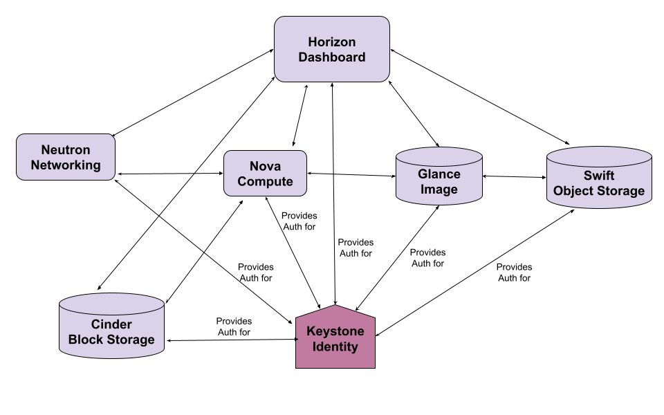
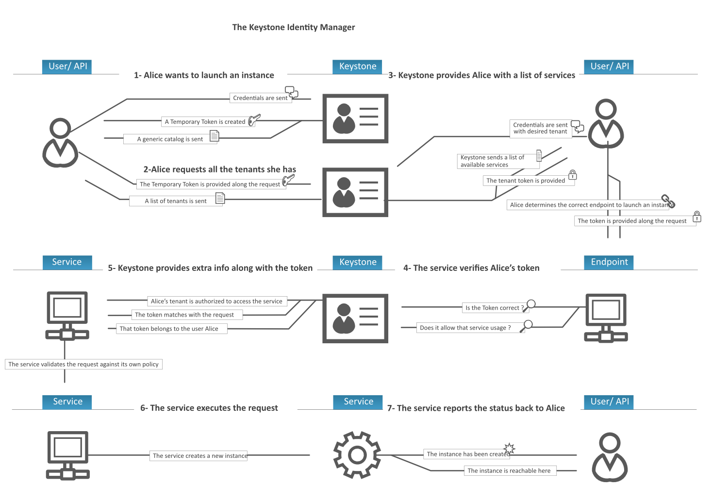

# TÌM HIỂU CHI TIẾT VỀ KEYSTONE TRONG OPENSTACK
## KEYSTONE LÀ GÌ ?
- Keystone là dịch vụ định danh (Identity service) của OpenStack. Nó chịu trách nhiệm chính trong việc xác thực danh tính người 
dùng (authentication), quản lý phân quyền (authorization), và cung cấp danh mục dịch vụ (service catalog) cho toàn bộ nền tảng 
đám mây.

- Vì đóng vai trò nền tảng cốt lõi về bảo mật và kiểm soát truy cập, Keystone luôn là dịch vụ được cài đặt đầu tiên trong mọi 
quá trình triển khai OpenStack.

## CÁC CHỨC NĂNG CHÍNH CỦA KEYSTONE
- *Xác thực (Authentication)*: Kiểm tra và xác minh danh tính của người dùng hoặc các client khi họ gửi yêu cầu thông qua giao 
diện dòng lệnh (CLI), bảng điều khiển Horizon (Dashboard) hoặc các lời gọi API. Keystone hỗ trợ nhiều cơ chế xác thực đa dạng 
như tên đăng nhập/mật khẩu, token, hoặc tích hợp với các nhà cung cấp bên ngoài như LDAP và Active Directory.
- *Phân quyền (Authorization)*: Xác định rõ người dùng có quyền truy cập vào những tài nguyên hoặc dịch vụ nào trong hệ thống 
(ví dụ: người dùng có quyền lấy một image cụ thể từ Glance để tạo máy ảo trên Nova hay không).
- *Cung cấp danh mục dịch vụ (Service Catalog)*: Keystone lưu trữ và cung cấp danh sách các dịch vụ cùng với các địa chỉ điểm 
cuối (Endpoints URLs) tương ứng trong OpenStack, giúp các thành phần và người dùng biết cách kết nối với đúng dịch vụ cần thiết.
- *Quản lý Token*: Sau khi xác thực thành công danh tính, Keystone sẽ cấp phát một chiếc Token (mã thông báo). Trong các request 
tiếp theo gửi đến các dịch vụ khác, người dùng chỉ cần đính kèm Token này thay vì phải gửi lại mật khẩu.

## MÔ HÌNH DỮ LIỆU TRONG KEYSTONE
- Để quản lý quyền hạn, Keystone sử dụng các khái niệm phân cấp cấu trúc sau:
+ *Domain (Miền)*: Là vùng chứa cấp cao nhất, dùng để cô lập các nhóm người dùng, dự án hoặc tổ chức khác nhau (rất hữu ích 
trong mô hình Multi-tenancy - đa khách hàng).
+ *Project / Tenant (Dự án)*: Là đơn vị cơ sở chứa tài nguyên (máy ảo, mạng, ổ cứng). Tất cả tài nguyên được tạo ra đều phải 
thuộc về một Project nhất định.
+ *User (Người dùng)*: Đại diện cho cá nhân hoặc ứng dụng tương tác với API của OpenStack. User thuộc về một Domain cụ thể.
+ *Role (Vai trò)*: Định nghĩa tập hợp các quyền hạn (Ví dụ: admin, member, reader). Vai trò này được gán cho User hoặc Group 
trong phạm vi một Project hoặc một Domain.

## LUỒNG HOẠT ĐỘNG THỰC TẾ (KHI NGƯỜI DÙNG TẠO MÁY ẢO)
- Giao tiếp ban đầu: Người dùng gửi thông tin xác thực thông qua bảng điều khiển (Dashboard) hoặc CLI bằng một lệnh gọi API tới 
Keystone.
- Cấp phát Token tạm thời: Keystone xác thực thông tin, sau đó tạo ra một token tạm thời kèm theo danh sách các dự án (tenants) 
mà người dùng đó có quyền truy cập.
- Chọn dự án và nhận Service Catalog: Người dùng chọn một dự án (tenant) cụ thể từ danh sách. Keystone sẽ trả về một token chính 
thức dành riêng cho dự án đó cùng với danh sách các dịch vụ mà người dùng được phép sử dụng.
- Kết nối đến dịch vụ đích: Người dùng gửi yêu cầu khởi tạo máy ảo kèm theo token này đến dịch vụ tính toán (Nova).
- Xác thực chéo (Cross-verification): Nova nhận yêu cầu sẽ gửi ngược token này về cho Keystone để kiểm tra xem:
    + Token có hợp lệ không?
    + Người dùng có thực sự có quyền truy cập vào dịch vụ Nova và các dịch vụ liên quan khác (như lấy image từ Glance hay tạo 
    mạng từ Neutron) hay không?
- Hoàn tất tác vụ: Sau khi Keystone xác thực và cấp phép thành công, Nova dựa trên các chính sách (policies) riêng của mình để 
tiến hành khởi tạo máy ảo cho người dùng.

## CÁC THÀNH PHẦN CHÍNH TRONG KEYSTONE
- Bên trong dịch vụ Keystone, kiến trúc được chia thành các phân hệ (subsystems) và các trình điều khiển (backends/drivers) chịu 
trách nhiệm xử lý từng nhóm nhiệm vụ riêng biệt:
+ *Identity (Quản lý định danh)*: Quản lý thông tin về người dùng (Users), nhóm người dùng (Groups). Nó có thể lưu trữ trực tiếp 
trong cơ sở dữ liệu SQL hoặc liên kết (integrate) với các hệ thống bên ngoài như LDAP hay Active Directory.
+ *Resource (Quản lý tài nguyên)*: Quản lý cấu trúc phân cấp không gian chứa tài nguyên gồm các Domain (miền) và Project/Tenant 
(dự án).
+ *Assignment (Quản lý phân quyền & gán vai trò)*: Chịu trách nhiệm liên kết xem người dùng nào (hoặc nhóm nào) được gán Role
(vai trò như admin, member) gì bên trong một Project hay Domain cụ thể.
+ *Token (Quản lý mã thông báo)*: Phụ trách việc tạo ra, xác thực và thu hồi các token khi người dùng đăng nhập thành công.
+ *Catalog (Danh mục dịch vụ)*: Lưu trữ danh sách toàn bộ các điểm cuối (Endpoints URLs) của các dịch vụ khác trong OpenStack để
cung cấp cho người dùng khi cần giao tiếp hệ thống.

**CÁC THÀNH PHẦN NÀY GIAO TIẾP VỚI NHAU BẰNG CÁI GÌ**
- *Giao tiếp nội bộ (Internal Communication)*: Các phân hệ bên trong Keystone (Identity, Resource, Assignment, Token, Catalog)
thực chất là các module Python nằm chung trong một tiến trình dịch vụ hoặc chạy dưới dạng WSGI application. Chúng giao tiếp trực
tiếp với nhau thông qua các lời gọi hàm (function calls) và các lớp trừu tượng hóa dữ liệu (drivers/backends) được định nghĩa
trong mã nguồn của Keystone.
- *Giao tiếp lưu trữ dữ liệu (Database/Backends)*: Để lưu trữ thông tin, các thành phần này giao tiếp với Database cơ sở dữ liệu
quan hệ (SQL như MySQL/MariaDB) hoặc các dịch vụ lưu trữ đệm/phân tán (dogpile.cache, Memcached, Redis) thông qua các thư viện
ORM (như SQLAlchemy).
- *Giao tiếp với bên ngoài (External Communication)*: Keystone cung cấp các RESTful API chuẩn hóa (chia làm 2 cổng chính thường
là cổng công khai Public API và cổng quản trị Admin API). Các dịch vụ khác trong OpenStack (như Nova, Neutron) hoặc người dùng
cuối (qua CLI, Horizon Dashboard) sẽ giao tiếp với Keystone thông qua các HTTP/HTTPS API request này.

## TOKEN
### Token là gì ?
- Trong các phiên bản OpenStack hiện đại, Fernet Token là định dạng mặc định.
- Điểm đặc biệt của Fernet token là không cần phải lưu trữ (non-persistent) vào cơ sở dữ liệu của Keystone. Nó thực chất là một 
chuỗi mã hóa an toàn (sử dụng thuật toán mã hóa đối xứng AES-256 và chữ ký số SHA-256 HMAC). Toàn bộ thông tin định danh (ID 
người dùng, project, thời gian hết hạn, các roles được gán) được nén gọn và mã hóa trực tiếp vào bên trong chuỗi token đó. 
Keystone chỉ cần giữ các khóa mã hóa (fernet keys) để tạo và giải mã chúng.

### Quy TRÌNH TẠO RA TOKEN NHƯ THẾ NÀO
Khi bạn thực hiện một lệnh đăng nhập hoặc yêu cầu cấp token (ví dụ: openstack token issue hoặc qua Horizon Dashboard), quy trình diễn ra qua các bước sau:
**Bước 1: Gửi yêu cầu (Request)**
Client gửi một HTTP POST request chứa thông tin xác thực (username, password, domain, hoặc phạm vi dự án muốn truy cập - scope) tới điểm cuối API của Keystone (/v3/auth/tokens).

**Bước 2: Xác thực danh tính (Identity Verification)**
+ Phân hệ Identity của Keystone tiếp nhận yêu cầu, kiểm tra thông tin người dùng trong cơ sở dữ liệu (hoặc qua LDAP).
+ Nếu thông tin sai, Keystone trả về lỗi 401 Unauthorized.

**Bước 3: Kiểm tra phân quyền (Authorization Check)**
+ Nếu thông tin đúng, Keystone chuyển sang phân hệ Assignment và Resource để kiểm tra xem người dùng này có thuộc dự án (Project/Domain) yêu cầu hay không, và họ được gán những Role gì trong phạm vi đó.

**Bước 4: Tổng hợp dữ liệu (Payload Assembly)**
+ Keystone gom tất cả các thông tin đã được phê duyệt bao gồm: ID người dùng, Project ID, danh sách Roles, thời gian phát hành, thời gian hết hạn và Service Catalog (danh sách địa chỉ các dịch vụ khác) lại với nhau thành một cấu trúc dữ liệu.

**Bước 5: Mã hóa tạo Token (Token Generation)**
+ Phân hệ Token sử dụng khóa bí mật (Fernet keys) để mã hóa toàn bộ cấu trúc dữ liệu trên thành một chuỗi ký tự Fernet Token hoàn chỉnh.

**Bước 6: Trả kết quả về cho Client**
+ Keystone trả về HTTP Response. Trong đó, chuỗi Token được đặt trực tiếp trong phần Header của HTTP (ví dụ: X-Subject-Token), đồng thời phần Body của response sẽ chứa cấu trúc chi tiết thông tin token và Service Catalog để client tiện sử dụng cho các lần gọi API tiếp theo.

## Luồng làm việc của Keystone

**Bước 1: Gửi thông tin xác thực ban đầu (Authentication)**
+ Alice gửi thông tin định danh (Credentials) của mình lên Keystone.
+ Keystone xác thực, sau đó cấp lại cho Alice một Temporary Token (Token tạm thời) kèm theo một danh mục dịch vụ chung (generic catalog).

**Bước 2: Yêu cầu danh sách Tenant / Project**
+ Sử dụng Token tạm thời vừa nhận, Alice gửi yêu cầu xem cô ấy có quyền truy cập vào những tenant/project nào.
+ Keystone kiểm tra và trả về danh sách các tenants mà Alice thuộc về.

**Bước 3: Lựa chọn Tenant và nhận danh sách dịch vụ (Service Catalog)**
+ Alice gửi lại thông tin xác thực kèm theo tên tenant cụ thể mà cô ấy muốn làm việc.
+ Keystone xác nhận và gửi lại danh sách các dịch vụ kèm theo đường dẫn endpoint tương ứng với tenant đó.
+ Alice xác định đúng endpoint cần thiết (ví dụ: endpoint của Nova để tạo server) và gửi yêu cầu tạo máy ảo kèm theo token xác thực.

**Bước 4: Dịch vụ kiểm tra Token với Keystone**
+ Khi endpoint (Nova Service) nhận được yêu cầu của Alice kèm theo token, dịch vụ này chưa vội thực thi ngay mà phải hỏi lại Keystone: "Token này có hợp pháp không? Nó có cho phép dùng dịch vụ này không?".
+ Keystone tiếp nhận, kiểm tra tính hợp lệ của token và xác nhận quyền hạn của Alice cho service đó.

**Bước 5: Cung cấp thông tin bổ sung (Extra Info)**
+ Keystone phản hồi lại dịch vụ rằng: tenant của Alice được phép truy cập, token khớp với yêu cầu và token đó thực sự thuộc về người dùng Alice.
+ Dịch vụ nhận thông tin, sau đó tự kiểm tra thêm một lần nữa dựa trên bộ quy tắc chính sách nội bộ (policy) của chính dịch vụ đó.

**Bước 6: Thực thi yêu cầu (Execution)**
+ Sau khi mọi bước xác thực và kiểm tra chính sách hoàn tất, dịch vụ chính thức thực thi yêu cầu (ví dụ: tiến hành ra lệnh cho tầng tính toán tạo ra một máy ảo mới).

**Bước 7: Phản hồi kết quả (Response)**
+ Máy chủ sau khi được khởi tạo thành công sẽ gửi thông báo trạng thái ngược lại cho người dùng Alice rằng máy ảo đã sẵn sàng và có thể truy cập được.