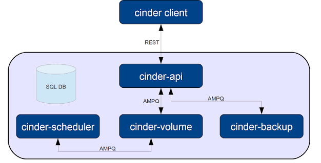
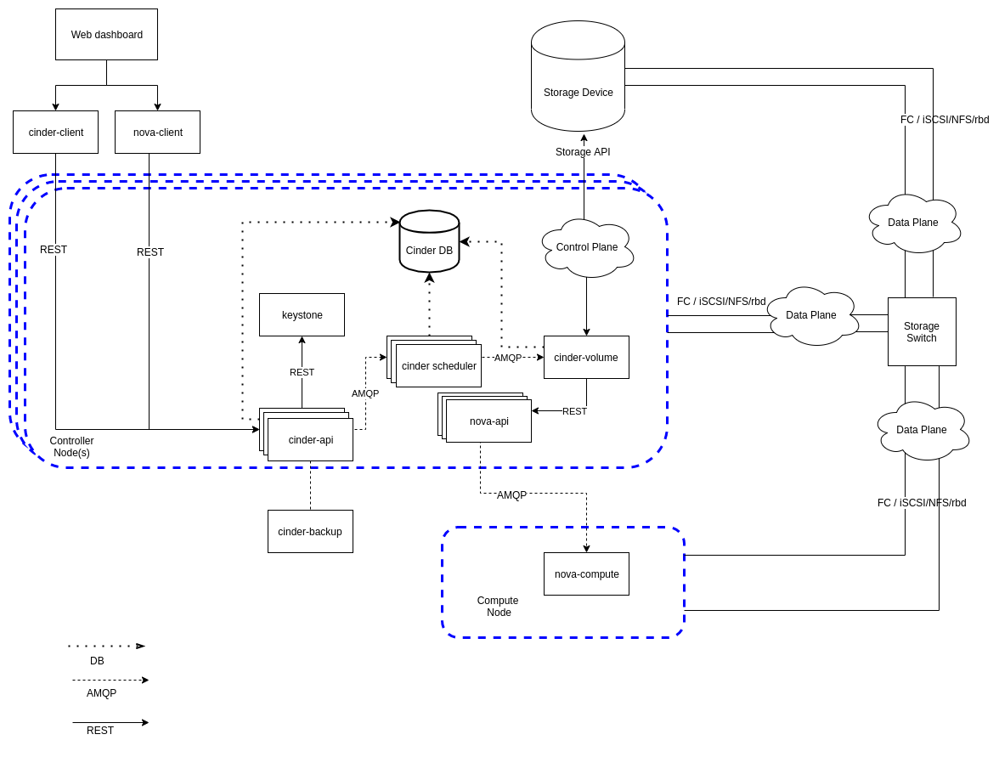

# TÌM HIỂU VỀ SERVICE CINDER TRONG OPENSTACK
## Cinder là gì
- Cinder là Dịch vụ Lưu trữ Khối (Block Storage Service). Nếu Nova cung cấp sức mạnh tính toán (máy ảo) và Glance cung cấp đĩa cài đặt hệ điều hành ban đầu, thì Cinder đóng vai trò là "ổ cứng di động gắn ngoài" (như ổ SSD/HDD rời) với dung lượng linh hoạt, có thể gắn kết (attach) hoặc tháo rời khỏi máy ảo bất cứ lúc nào.

## Chức năng của Cinder
- Cung cấp ổ cứng ảo bền bỉ: Tạo ra các khối lưu trữ dữ liệu (volumes) độc lập có dung lượng từ vài GB đến hàng TB. Khác với bộ nhớ gắn liền (ephemeral disk) của máy ảo (sẽ bị mất khi xóa máy ảo), ổ đĩa Cinder có tính bền bỉ cao (persistent), nghĩa là ngay cả khi bạn xóa máy ảo, dữ liệu trên ổ cứng Cinder vẫn được giữ nguyên và có thể gắn sang một máy ảo khác.
- Hỗ trợ tính năng nâng cao: Cho phép thực hiện các thao tác chuyên nghiệp trên ổ đĩa như Snapshot (chụp nhanh trạng thái dữ liệu để backup), Clone (sao chép ổ đĩa) hoặc Migration (di chuyển ổ đĩa giữa các thiết bị lưu trữ vật lý mà máy ảo không bị gián đoạn).
- Đa dạng hóa backend: Cho phép tích hợp với hàng loạt các thiết bị lưu trữ phần cứng từ các hãng lớn (như Dell, NetApp, Ceph, LVM, NFS, v.v.) thông qua cơ chế driver.

## Các thành phần có trong Cinder

Cinder được thiết kế theo kiến trúc phân tán, gồm các tiến trình chính sau:
- *cinder-api*: Cổng giao tiếp REST API tiếp nhận toàn bộ các yêu cầu từ người dùng, CLI hoặc Horizon (ví dụ: yêu cầu tạo, xóa, gắn ổ đĩa).
- *Queue (Hàng đợi thông điệp - Message Queue)*: Thường sử dụng RabbitMQ, đóng vai trò trung gian nhận và chuyển tiếp các thông điệp bất đồng bộ giữa API, Scheduler và các tiến trình Volume.
- *Cinder database*: Nơi lưu trữ toàn bộ dữ liệu cấu hình, trạng thái, siêu dữ liệu của các volume, snapshot và các back-end đang quản lý.
- *cinder-scheduler*: Bộ lập lịch thông minh, có nhiệm vụ chọn ra node lưu trữ (storage backend) tối ưu nhất để đặt ổ đĩa mới dựa trên dung lượng và các chính sách.
- *cinder-volume*: Tiến trình chủ lực chạy trên các storage node, chịu trách nhiệm quản lý vòng đời của ổ đĩa và tương tác trực tiếp với tầng phần cứng/phần mềm bên dưới.
- *Volume provider*: Tầng lưu trữ thực tế bên dưới (có thể là LVM, Ceph, thiết bị SAN/NAS thương mại hoặc NFS).

## Quy trình hoạt động của Cinder

Để hiểu rõ cách Cinder vận hành thực tế, hãy xem xét quy trình từ lúc người dùng tạo một ổ đĩa mới cho đến khi gắn nó vào máy ảo:
**Bước 1: Yêu cầu tạo Volume (Create Volume)**
+ Người dùng gửi yêu cầu tạo một ổ đĩa (ví dụ: 50GB loại SSD) thông qua lệnh CLI hoặc giao diện.
+ cinder-api tiếp nhận yêu cầu, kiểm tra quyền hạn với Keystone, sau đó ghi trạng thái ban đầu (creating) vào Cinder Database và đẩy tác vụ sang hàng đợi thông điệp (RabbitMQ).

**Bước 2: Lựa chọn hạ tầng lưu trữ (Scheduling)**
+ cinder-scheduler nhận thông điệp, phân tích các tiêu chí kỹ thuật mà người dùng yêu cầu (dung lượng, loại backend).
+ Scheduler chọn ra một storage node phù hợp nhất và chuyển nhiệm vụ cho tiến trình cinder-volume đang chạy trên node đó.

**Bước 3: Khởi tạo ổ đĩa trên tầng lưu trữ (Execution)**
+ Tiến trình cinder-volume nhận lệnh và trực tiếp thực thi thao tác trên phần cứng/phần mềm lưu trữ thực tế (ví dụ: phân bổ 50GB dung lượng trên cụm Ceph hoặc cắt một Logical Volume từ LVM).
+ Sau khi tạo thành công, trạng thái ổ đĩa được cập nhật thành available (sẵn sàng sử dụng) trên Database.

**Bước 4: Gắn ổ đĩa vào Máy ảo (Attach Volume to Instance)**
Khi người dùng muốn gắn ổ đĩa này vào một máy ảo đang chạy:
+ Nova và Cinder phối hợp với nhau: Cinder chuẩn bị đường truyền kết nối (ví dụ: tạo phiên kết nối iSCSI từ storage node tới compute node).
+ Nova Compute trên máy chủ chứa máy ảo sẽ nhận thông tin kết nối và thực hiện gắn ổ đĩa ảo đó vào máy ảo (guest OS).
+ Lúc này, bên trong hệ điều hành của máy ảo, bạn sẽ nhìn thấy một ổ đĩa cứng mới xuất hiện (ví dụ: /dev/vdb hoặc /dev/sdb), bạn chỉ cần định dạng (format) và sử dụng như một ổ cứng bình thường.

## Luồng hoạt động của các thành phần trong Cinder
Khi một người dùng gửi yêu cầu tạo một ổ đĩa khối mới, luồng xử lý diễn ra qua các bước tuần tự sau:
- **Tiếp nhận yêu cầu (cinder-api)**:
    + Người dùng gửi HTTP POST request tới cinder-api.
    + cinder-api thực hiện xác thực token qua Keystone, kiểm tra hạn mức (quota) và tạo một bản ghi ban đầu trong Cinder database với trạng thái creating.

- **Đẩy vào hàng đợi lập lịch**:
    + Sau khi ghi nhận DB, cinder-api không xử lý trực tiếp việc tạo ổ đĩa mà đóng gói yêu cầu thành một thông điệp rồi đẩy vào Queue để gửi tới bộ lập lịch.

- **Lựa chọn Backend (cinder-scheduler)**:
    + cinder-scheduler lấy thông điệp từ Queue, phân tích yêu cầu (dung lượng, loại volume, các filter/weighing), sau đó đối chiếu với Cinder database để tìm ra storage node/backend phù hợp nhất.

- **Ra lệnh thực thi**:
    + cinder-scheduler cập nhật thông tin backend được chọn vào DB và gửi tiếp thông điệp yêu cầu tạo volume vào Queue trỏ đến tiến trình cinder-volume tương ứng.

- **Tạo ổ đĩa thực tế (cinder-volume & Volume provider)**:
    + Tiến trình cinder-volume nhận thông điệp từ Queue, sử dụng các driver thích hợp để giao tiếp trực tiếp với Volume provider (tầng lưu trữ vật lý) nhằm khởi tạo vùng dữ liệu/ổ đĩa thực tế.

- **Hoàn tất**:
    + Khi ổ đĩa đã được tạo thành công ở tầng phần cứng, cinder-volume cập nhật lại trạng thái của volume trong Cinder database thành available (sẵn sàng sử dụng).

## Các thành phần của Cinder sẽ được cài đặt ở Node nào
Trong kiến trúc của OpenStack Cinder, các thành phần được phân bổ cài đặt trên các node khác nhau tùy thuộc vào chức năng điều phối hay quản lý lưu trữ:
- *cinder-api*: Được cài đặt và chạy trên Controller Node để tiếp nhận các yêu cầu HTTP/REST API từ người dùng hoặc các dịch vụ khác.
- *cinder-scheduler*: Được đặt trên Controller Node để làm nhiệm vụ phân tích và lựa chọn node lưu trữ tối ưu.
- *Cinder database và Queue (Message Queue)*: Thường được đặt tập trung trên Controller Node (hoặc các node cơ sở dữ liệu/hàng đợi chuyên dụng trong mô hình lớn) để phục vụ việc lưu trữ trạng thái và truyền tải thông điệp.
- *cinder-volume*: Được cài đặt trực tiếp trên các Storage Nodes (hoặc Controller Node trong môi trường All-in-One), vì đây là tiến trình trực tiếp giao tiếp với tầng phần cứng.