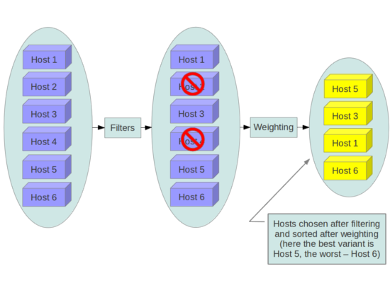
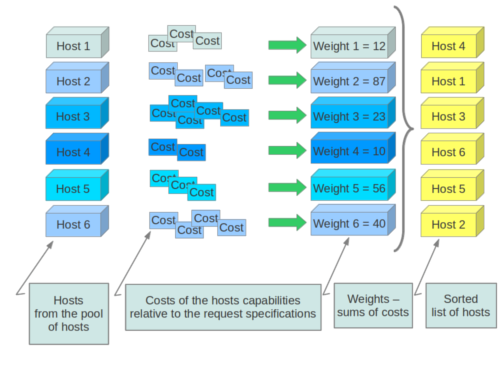

# TÌM HIỂU CHI TIẾT VỀ CÁC THÀNH PHẦN TRONG NOVA
## Nova-api
- Bản chất: Là điểm chạm đầu tiên (Front-end) của toàn bộ dịch vụ Nova, chạy dưới dạng các ứng dụng WSGI nhận các yêu cầu HTTP/REST API.

- Chức năng chi tiết:
+ Tiếp nhận lệnh: Nhận mọi yêu cầu từ người dùng, công cụ dòng lệnh (CLI), giao diện web (Horizon) hoặc từ các service khác trong OpenStack (như Heat hoặc Glance). Các yêu cầu bao gồm: tạo máy ảo, đổi trạng thái, xóa, hoặc cập nhật metadata.
+ Xác thực và Ủy quyền: Ngay khi nhận yêu cầu, nó gọi sang Keystone để xác thực tính hợp lệ của token (X-Auth-Token) và kiểm tra xem người dùng có quyền thực hiện hành động đó hay không.
+ Kiểm tra hạn mức (Quota Check): Đảm bảo rằng việc tạo máy ảo mới không vượt quá giới hạn tài nguyên (vCPU, RAM, số lượng máy ảo) mà project/tenant được cấp phép.
+ Chuyển tiếp thông điệp: Sau khi kiểm tra xong, nova-api ghi nhận thông tin ban đầu vào cơ sở dữ liệu và đẩy yêu cầu vào hàng đợi thông điệp (Message Queue) để các thành phần tiếp theo xử lý.

## Nova-scheduler
- Bản chất: Đóng vai trò là "nhà môi giới" hoặc bộ lập lịch phân bổ tài nguyên.

- Chức năng chi tiết:
+ Lựa chọn máy chủ tối ưu: Khi có yêu cầu tạo máy ảo, nova-scheduler phải trả lời câu hỏi: "Máy ảo này nên được đặt lên máy chủ vật lý (Compute Node) nào là hợp lý nhất?".
+ Phối hợp với Placement: Nó hỏi dịch vụ Placement để lấy danh sách các Compute Node còn đủ tài nguyên (CPU, RAM, đĩa) và thỏa mãn các yêu cầu phần cứng đặc biệt (Traits).
+ Áp dụng các thuật toán lọc và cân bằng (Filters & Weighing):
    * Filters (Bộ lọc): Loại bỏ ngay lập tức những node không đủ điều kiện (ví dụ: node đã đầy RAM, node đang bị tắt, hoặc bộ lọc ép máy ảo này phải nằm ở một nhóm anti-affinity riêng biệt).
    * Weighing (Chấm điểm/Cân bằng): Sắp xếp các node còn lại theo tiêu chí tối ưu hóa (ví dụ: ưu tiên chọn node đang trống nhiều tài nguyên nhất để cân bằng tải, hoặc dồn tài nguyên vào một node để tiết kiệm điện năng).

### Quy trình Filtering và Weighing
**Giai đoạn 1: Bộ lọc (Filtering) - Loại bỏ các node không đủ điều kiện**
- Trước tiên, nova-scheduler lấy danh sách toàn bộ các Compute Node từ dịch vụ Placement và áp dụng một chuỗi các bộ lọc (filters) để loại bỏ ngay lập tức những node không đáp ứng đủ tiêu chuẩn. Các bộ lọc phổ biến bao gồm:
    + ComputeFilter: Đảm bảo node đang hoạt động bình thường (up) và sẵn sàng nhận việc.
    + RamFilter: Kiểm tra xem node còn đủ dung lượng RAM trống hay không (dựa trên tỷ lệ cấu hình ram_allocation_ratio). Nếu không đủ, node bị loại.
    + CoreFilter: Kiểm tra số lượng vCPU có sẵn trên node (đảm bảo không vượt quá giới hạn phân bổ vCPU cho phép).
    + DiskFilter: Kiểm tra dung lượng ổ đĩa trống trên node.
    + AvailabilityZoneFilter: Lọc các node nằm đúng trong vùng sẵn sàng (Availability Zone) mà người dùng đã chỉ định.
    + ServerGroupAntiAffinityFilter / ServerGroupAffinityFilter: Đảm bảo các máy ảo trong cùng một nhóm phải được đặt trên các máy chủ vật lý khác nhau (để tăng tính dự phòng) hoặc phải nằm chung một máy chủ (để giảm độ trễ mạng).

Sau khi qua vòng lọc này, chỉ những node thỏa mãn toàn bộ các điều kiện mới được giữ lại vào danh sách ứng cử viên.

**Giai đoạn 2: Chấm điểm (Weighing) - Chọn ra node tối ưu nhất**
- Từ danh sách các node đã vượt qua vòng lọc, nova-scheduler sẽ tiến hành chấm điểm (weighers) để xếp hạng xem node nào là sáng giá nhất. Mỗi bộ chấm điểm sẽ cộng hoặc trừ điểm dựa trên các tiêu chí cụ thể:
    + RamWeigher (hoặc ComputeCapabilitiesWeigher): Thường được cấu hình để ưu tiên chọn node còn trống nhiều tài nguyên nhất (Spread) nhằm cân bằng tải cho toàn bộ hệ thống, hoặc ngược lại, dồn tài nguyên vào một vài node (Bin-pack) để tiết kiệm điện năng cho các node còn lại.
    + Trọng số tùy chỉnh: Quản trị viên có thể cấu hình trọng số (weights) để ưu tiên các node có phần cứng đặc thù hoặc ổ đĩa tốc độ cao hơn.

Cuối cùng, node nào có số điểm cao nhất sau khi qua các bộ tính toán trọng số sẽ được nova-scheduler chọn làm nơi dừng chân cho máy ảo mới.

## Nova-conductor
- Bản chất: Là lớp dịch vụ trung gian nằm giữa các tiến trình Compute ở vùng mạng xa và cơ sở dữ liệu chung (Nova Database).

- Chức năng chi tiết:
+ Bảo mật cơ sở dữ liệu (Database Proxy): Trong kiến trúc chuẩn, các máy chủ Compute (nơi chạy máy ảo) đặt ở phân vùng mạng biên hoặc ít bảo mật hơn. Việc mở cổng cho hàng loạt máy chủ này kết nối trực tiếp vào Database chung là rủi ro lớn. nova-conductor đứng ra nhận mọi yêu cầu đọc/ghi dữ liệu từ nova-compute rồi mới thay mặt chúng thao tác xuống Database.
+ Giảm tải cho Database: Xử lý hàng đợi các truy vấn, giúp giảm thiểu kết nối trực tiếp gây quá tải cho cơ sở dữ liệu trung tâm.
+ Xử lý các tác vụ phức tạp (Complex Orchestration): Đảm nhận các quy trình dài hơi và nhiều bước, chẳng hạn như quá trình di chuyển máy ảo (live-migration), xây dựng lại máy ảo (rebuild), hoặc phối hợp xử lý khi một Compute Node gặp sự cố đột ngột.

## Nova-compute
- Bản chất: Là "công nhân chủ lực" (Daemon) chạy trực tiếp trên từng máy chủ vật lý (Compute Node).

- Chức năng chi tiết:
+ Giao tiếp với tầng ảo hóa: Nhận các thông điệp từ hàng đợi và chuyển hóa chúng thành các lệnh gọi trực tiếp xuống thư viện libvirt và tầng ảo hóa phần cứng (KVM/QEMU).
+ Quản lý vòng đời máy ảo: Trực tiếp thực hiện việc khởi tạo file cấu hình XML, phân bổ tài nguyên phần cứng cấp thấp, bật, tắt, tạm dừng, hoặc xóa bỏ các máy ảo trên máy chủ đó.
+ Giao tiếp liên dịch vụ: Phối hợp với Glance để tải image hệ điều hành về máy chủ, phối hợp với Neutron để cắm mạng cho máy ảo, và làm việc với Cinder để gắn ổ đĩa khối.
+ Báo cáo định kỳ (Heartbeat): Thường xuyên gửi tín hiệu và cập nhật trạng thái thực tế của các máy ảo đang chạy trên node của mình về hệ thống để đảm bảo cơ sở dữ liệu luôn đồng bộ.
