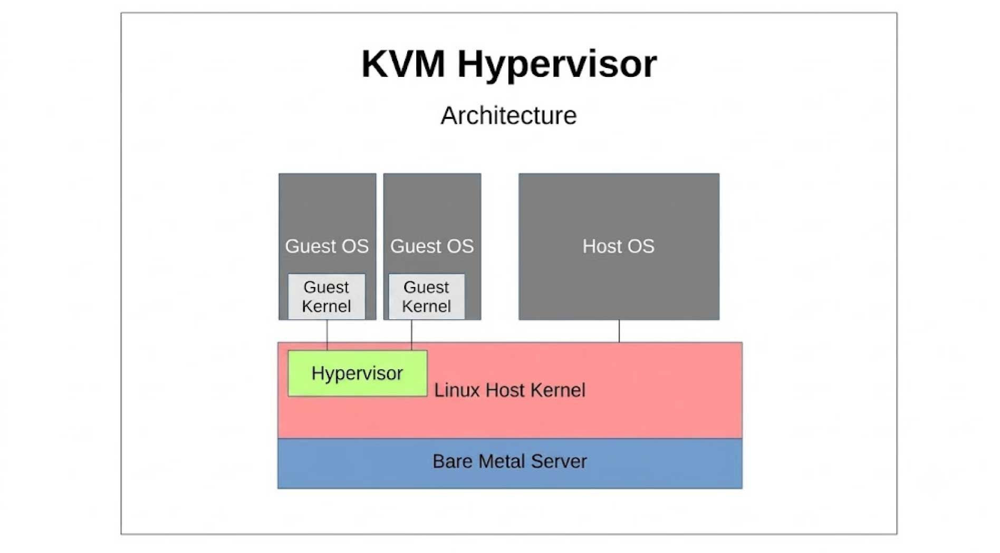
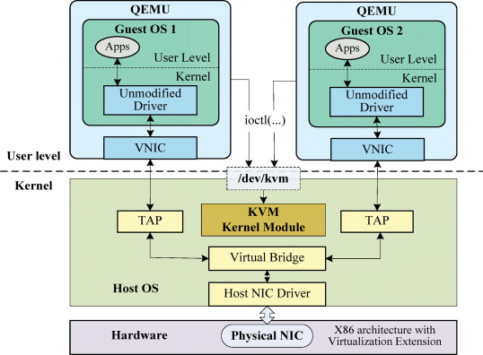
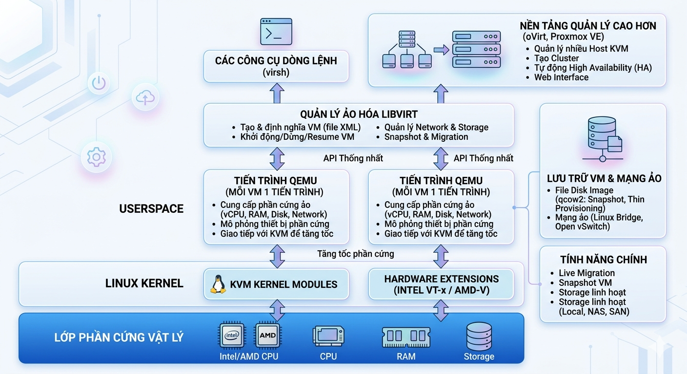
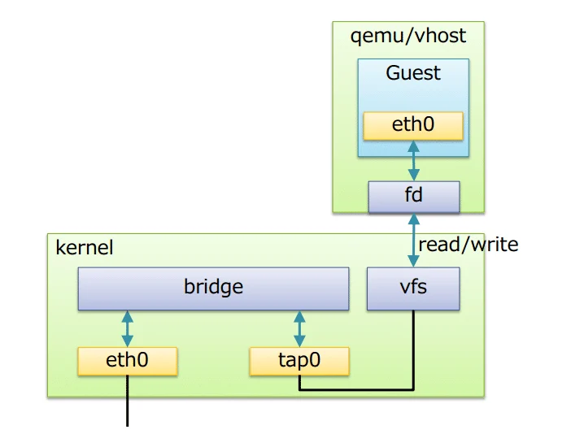

# TÌM HIỂU VỀ KVM
## KVM LÀ GÌ
- KVM (Kernel-based Virtual Machine) là công nghệ ảo hóa mã nguồn mở được tích hợp trực tiếp trong nhân Linux, cho phép máy chủ vật lý chạy đồng thời nhiều máy ảo độc lập. KVM hoạt động trên phần cứng x86 có hỗ trợ công nghệ ảo hóa Intel VT-x hoặc AMD-V.
- Nhờ nằm ngay trong Kernel, KVM tận dụng toàn bộ các tính năng cốt lõi của Linux như trình lập lịch CPU (Scheduler), trình quản lý bộ nhớ (Memory Management), các driver thiết bị và cơ chế bảo mật (SELinux, AppArmor).
- Mỗi máy ảo KVM được cấp các tài nguyên phần cứng ảo riêng như CPU, RAM, ổ đĩa, card mạng và bộ điều hợp đồ họa. Nhờ đó, người dùng có thể cài đặt và vận hành nhiều hệ điều hành khác nhau, chẳng hạn Linux hoặc Windows, mà không cần chỉnh sửa hệ điều hành gốc.
- Về cấu trúc, KVM gồm mô-đun nhân kvm.ko cung cấp hạ tầng ảo hóa cốt lõi và mô-đun riêng cho từng loại bộ xử lý là kvm-intel.ko hoặc kvm-amd.ko. KVM thường kết hợp với QEMU để mô phỏng phần cứng và quản lý hoạt động của máy ảo.

## ĐẶC ĐIỂM CỦA KVM
- *Hỗ trợ đa kiến trúc phần cứng*: KVM không chỉ chạy trên x86 mà còn nhiều kiến trúc CPU khác như AMD64, Intel 64-bit (x86_64), ARM64 (AArch64) và IBM Z systems.
- *Mô-đun nhân*: KVM là mô-đun của Linux kernel, biến Linux kernel thành một hypervisor. KVM kết hợp với QEMU để cung cấp phần cứng ảo (CPU, network, disk, v.v.) cho máy ảo.
- *Driver VirtIO*: VirtIO là bộ para-virtualized drivers hiệu suất cao cho I/O của VM (network, disk, memory, ballooning…), giúp giảm overhead so với việc giả lập thiết bị hoàn toàn.
- *Bảo mật*: KVM sử dụng kết hợp Security-Enhanced Linux và sVirt để bảo mật và cô lập các VM. SELinux sử dụng cơ chế Mandatory Access Control (MAC), nghĩa là quyền truy cập không chỉ dựa vào user mà còn dựa vào policy bảo mật. Mỗi VM chạy như một process của Linux, SELinux tạo security boundary quanh process đó nên VM1 không thể truy cập memory, disk hoặc resource của VM2. sVirt mở rộng SELinux bằng cách tự động gán security label cho VM, giúp tránh lỗi gán nhãn thủ công.
- *Storage flexibility*: KVM có thể sử dụng hầu hết các hệ thống lưu trữ mà Linux hỗ trợ. Vì KVM chạy trong kernel nên nó kế thừa toàn bộ storage stack của Linux. Ví dụ: Local disk (/dev/sda, LVM), Network storage (NFS, iSCSI, Ceph), hoặc shared storage để nhiều host cùng truy cập VM image.
- *Live migration*: KVM hỗ trợ live migration, cho phép di chuyển VM đang chạy từ host A sang host B gần như không gián đoạn dịch vụ (VM vẫn chạy, network connection vẫn giữ).
- *Lưu và tiếp tục trạng thái máy ảo*: KVM có thể save và restore trạng thái VM, bao gồm CPU state, memory state và device state, cho phép pause VM rồi resume sau (tương tự cơ chế hibernate).
- *Hiệu năng gần native*: KVM tận dụng hardware virtualization extensions (Intel VT-x / AMD-V) nên VM có hiệu năng gần với máy vật lý, đặc biệt khi kết hợp với VirtIO drivers.

## CHỨC NĂNG CỦA KVM
- *Tạo và quản lý máy ảo*: Chạy nhiều máy ảo (Linux, Windows,v.v) trên một máy chủ vật lý, chia và tối ưu tài nguyên phần cứng.
- *Tối ưu hiệu suất*: Sử dụng ảo hóa hỗ trợ phần cứng(Intel VT-x, AMD-V) và VirtlO để đạt hiệu suất gần với máy vật lý.
- *Hỗ trợ Cloud*: Cung cấp nền tảng cho các dịch vụ đám mây( VD: OpenStack, Proxmox) để triển khai máy ảo linh hoạt
- *Kiểm thử và phát triển*: Tạo môi trường ảo để thử nghiệm phần mềm, hệ điều hành, hoặc cấu hình mà không ảnh hưởng hệ thống chính. Thậm chí là launch một hệ điều hành đã lỗi thời hay không còn hỗ trợ, chúng ta vx có thể giữ nó tồn tại trên hệ thống phần cứng hiện đại.
- *Quản lý tập trung*: Dùng công cụ như libvirt, virt-manager để cấu hình, giám sát, và sao lưu máy ảo dễ dàng.
- *Tiết kiệm chi phí*: Giảm số lượng máy chủ vật lý, tiết kiệm điện, không gian và chi phí bảo trì.
- *Bảo mật*: Các máy ảo đều cô lập, giảm rủi ro lây lan mã độc, tận dụng tính năng bảo mật của Linux.

## CẤU TRÚC CỦA KVM
- KVM (Kernel-based Virtual Machine) biến hệ điều hành Linux thành một Hypervisor Type-1/1.5. Cấu trúc của KVM được thiết kế theo mô hình chia tách vai trò rõ ràng giữa Kernel Space (Không gian nhân) và User Space (Không gian người dùng):

- Trong kiến trúc KVM, máy ảo là 1 tiến trình Linux, được lập lịch bởi chuẩn Linux schduler. Trong thực tế mỗi CPU ảo xuất hiện như là 1 tiến trình Linux. Điều này cho phép KVM sử dụng tất cả tính năng của Linux kernel
- Linux có tất cả các cơ chế của một VMM cần thiết để vận hành các máy ảo. Chính vì vậy, các nhà phát triển không xây dựng lại mà chỉ thêm vào đó 1 vài thành phần hỗ trợ ảo hóa. KVM được triển khai như 1 module hạt nhân có thể được nạp vào để mở rộng Linux bởi những khả năng này
- Trong 1 môi trường Linux thông thường, mỗi process chạy hoặc sử dụng user-mode hoặc kernel-mode. KVM đưa ra một chế độ thứ 3 đó là guest-mode. Nó dựa trên CPU có khả năng ảo hóa với kiến trúc Intel VT hoặc AMD SVM, một process trong guest-mode bao gồm cả kernel-mode và user-mode
- Kiến trúc của KVM bao gồm 3 thành phần chính:
+ KVM kernel module:
    * Là 1 phần trong dòng chính của Linux Kernel
    * Cung cấp giao diện chung cho Intel VMX và AMD SVM (thành phần hỗ trợ ảo hóa phần cứng)
    * Chứa những mô phỏng cho các instruction và CPU modes không được hỗ trợ bởi Intel VMX và AMD SVM
+ Qemu-kvm: là chương trình dòng lệnh để tạo ra các máy ảo, thường được vận chuyển dưới dạng các package kvm hoặc qemu-kvm. Có 3 chức năng chính:
    * Thiết lập VM và các thiết bị vào/ra (Input/Output)
    * Thực thi mã khách thông qua KVM kernel module
    * Mô phỏng các thiết bị vào/ra và di chuyển các Guest từ Host này sang Host khác
+ Libvirt management stack:
    + Cung cấp API để các tool như virsh có thể giao tiếp và quản lý các VM
    + Cung cấp chế độ quản lý từ xa an toàn

# KVM HOẠT ĐỘNG NHƯ THẾ NÀO

- Để các máy ảo giao tiếp được với nhau, KVM sử dụng Linux Bridge và OpenVSwitch, đây là 2 phần mềm cung cấp các giải pháp ảo hóa network
- Linux Bridge là 1 phần mềm được tích hợp vào trong nhân của Linux để giải quyết các vấn đề ảo hóa phần network trong máy vật lý. Về mặt logic Linux bridge sẽ tạo ra 1 con switch ảo để cho các VM kết nối được vào và có thể nói chuyện được với nhau cũng như sử dụng để kết nối ra bên ngoài
- Cấu trúc của Linux Bridge khi kết hợp với KVM-QEMU:

- Trong đó:
    + Bridge: tương đương với switch layer 2
    + Port: tương đương với port của switch thật
    + Tap (tap interface): có thể hiểu là giao diện mạng để các VM kết nối với bridge do linux bridge tạo ra
    + fd (forward data): vận chuyển dữ liệu
- Các tính năng chính:
    + STP: Spanning Tree Protocol – giao thức chống lặp gói tin trong mạng
    + VLAN: chia switch (do Linux Bridge tạo ra) thành các mạng LAN ảo, cô lập traffic giữa các VM trên các VLAN khác nhau của cùng 1 switch
    + FDB (forwarding database): chuyển tiếp các gói tin theo database để nâng cao hiệu năng switch. Database lưu các địa chỉ MAC mà nó học được. Khi gói tin Ethernet đến, bridge sẽ tìm kiếm trong database có chứa MAC address không. Nếu không, nó sẽ gửi gói tin đến tất cả các cổng (broadcast)

## CÁC THÀNH PHẦN TRONG KVM
Hệ thống KVM (Kernel-based Virtual Machine) được cấu thành từ 4 nhóm thành phần chính, hoạt động phối hợp giữa tầng Kernel Space (nhân Linux), tầng User Space (ứng dụng người dùng) và tầng Phân quyền/Quản trị:

### Nhóm Module trong Nhân (Kernel Space Modules)
Đây là các thành phần lõi nằm trực tiếp bên trong Linux Kernel, chịu trách nhiệm gia tốc phần cứng cho CPU và bộ nhớ RAM:
- Module KVM chính (kvm.ko):
    + Nằm trực tiếp trong Kernel Linux.
    + Cung cấp cơ sở hạ tầng ảo hóa cốt lõi, quản lý bộ nhớ ảo, lập lịch vCPU.
    + Tạo ra file thiết bị /dev/kvm làm cổng giao tiếp API cho các ứng dụng tầng User Space.
- Module phần cứng CPU (kvm_intel.ko / kvm_amd.ko):
    + Module phụ thuộc trực tiếp vào dòng CPU vật lý của máy chủ.
    + Thao tác trực tiếp với các tập lệnh ảo hóa phần cứng (Intel VT-x hoặc AMD-V / SVM) để đưa vCPU của máy ảo chạy ở chế độ VMX Non-Root Mode, giúp câu lệnh máy ảo thực thi thẳng trên CPU thật.

### Trình giả lập thiết bị (User Space Emulator)
KVM không tự giả lập thiết bị ngoại vi, mà giao việc này cho QEMU:
- QEMU (qemu-kvm):
    + Chạy như một tiến trình (Linux Process) thông thường ở tầng User Space.
    + Giả lập toàn bộ các thiết bị phần cứng phụ trợ mà CPU không tự xử lý được: BIOS/UEFI, cạc màn hình VGA, controller đĩa (SATA/IDE/NVMe), bàn phím, chuột, và chipset bus PCI.
    + Giao tiếp với Kernel qua file /dev/kvm (bằng hàm ioctl()) để chuyển giao việc tính toán CPU/RAM cho KVM Kernel module xử lý.

### Bộ trình điều khiển bán ảo hóa (Virtio Drivers)
Bộ driver tối ưu hóa giao tiếp I/O giữa Máy ảo (Guest OS) và Máy chủ (Host OS):
- virtio:
    + Gồm các driver chạy trên cả Guest OS lẫn Host OS như virtio-net (mạng), virtio-blk / virtio-scsi (ổ đĩa), virtio-balloon (quản lý RAM động).
    + Cho phép máy ảo bỏ qua bước giả lập phần cứng cũ kỹ của QEMU, trao đổi dữ liệu I/O qua một vùng nhớ chia sẻ (Shared Memory) trực tiếp với Host, giúp tốc độ mạng và đọc/ghi đĩa tiệm cận máy thật.

### Tầng Thư viện và Công cụ Quản lý (Management Tools)
Các công cụ giúp người dùng thao tác với KVM một cách dễ dàng thay vì gõ các dòng lệnh QEMU phức tạp:
- libvirt (libvirtd):
    + Cung cấp bộ API C chuẩn hóa và một dịch vụ daemon chạy ngầm (libvirtd) để quản lý vòng đời máy ảo (tạo, bật, tắt, snapshot, cấu hình mạng/ổ đĩa).

- Công cụ dòng lệnh (CLI):
    + virsh: Trình quản lý máy ảo qua dòng lệnh chính (giao tiếp trực tiếp với libvirt).
    + virt-install: Công cụ khởi tạo và định cấu hình máy ảo mới bằng lệnh.

- Giao diện quản trị (GUI / Web Console):
    + Proxmox VE / OpenStack: Các hệ điều hành/nền tảng quản trị Cloud doanh nghiệp lấy KVM làm lõi.
    + Cockpit / virt-manager: Giao diện đồ họa/web giúp quản trị KVM trực quan.

|       Thành phần       |      Vị trí      |                     Nhiệm vụ chính                    |
|:----------------------:|:----------------:|:-----------------------------------------------------:|
| kvm.ko & kvm_intel/amd | Kernel Space     | Điều phối vCPU, quản lý RAM ảo, gia tốc phần cứng     |
| /dev/kvm               | System Device    | File cổng giao tiếp giữa User Space (QEMU) và Kernel  |
| QEMU                   | User Space       | Giả lập phần cứng ngoại vi (Mạng, Đĩa, Graphics, Bus) |
| Virtio                 | Guest & Host     | Tối ưu hóa tốc độ I/O qua cơ chế Paravirtualization   |
| libvirt / virsh        | Management Layer | Thư viện API & Công cụ quản lý máy ảo                 |

## ƯU NHƯỢC ĐIỂM CỦA KVM
### ƯU ĐIỂM
- *Khả năng linh hoạt*: Mặc dù máy chủ gốc được cài đặt Linux, KVM hỗ trợ tạo máy chủ ảo có thể chạy cả Linux và Windows. Bằng việc kết hợp với QEMU, KVM cũng có khả năng chạy Mac OS X. Hơn nữa, KVM cũng hỗ trợ cả hệ thống x86 và x86-64.
- *Tính độc quyền cao*: Mỗi cấu hình gói VPS KVM chỉ thuộc sở hữu của một người dùng duy nhất và có toàn quyền sử dụng tài nguyên (bao gồm CPU, RAM, DISK SPACE…) mà không bị chia sẻ hoặc ảnh hưởng bởi các VPS khác hoạt động trên cùng hệ thống.
- *Bảo mật đáng tin cậy*: KVM tích hợp các đặc điểm bảo mật của Linux như SELinux và cơ chế bảo mật nhiều lớp, bảo vệ máy ảo một cách tối đa và cách ly hoàn toàn, ngăn chặn khả năng xâm nhập.
- *Tiết kiệm chi phí và mở rộng*: Do được phát triển trên nền tảng mã nguồn mở hoàn toàn miễn phí và nhận được sự hỗ trợ từ cộng đồng và các nhà sản xuất thiết bị, KVM ngày càng mạnh mẽ và trở thành lựa chọn hàng đầu cho các doanh nghiệp có chi phí thấp nhưng vẫn mang lại hiệu quả sử dụng cao.

### NHƯỢC ĐIỂM
- Yêu cầu cấu hình cao về máy chủ: KVM, là công nghệ ảo hóa hoàn toàn phần cứng, đòi hỏi cấu hình server vật lý có mức độ cao. Đôi khi, việc sử dụng các server từ các nhãn hiệu lớn được xem là cần thiết để đảm bảo hoạt động ổn định.
- Công nghệ ảo hóa KVM chỉ có sẵn trên hệ điều hành Linux.
- Yêu cầu máy chủ phải được trang bị phần cứng mạnh mẽ.
- Để triển khai KVM, việc tìm hiểu và học hỏi có thể mất một khoảng thời gian đáng kể.
- Do tập trung hóa phần cứng, rủi ro về sự cố tăng cao trong trường hợp hệ thống gặp lỗi.

## CÁC THÀNH PHẦN QUAN TRỌNG TRONG KVM VÀ CHỨC NĂNG CỦA CHÚNG
### KVM
- Nó là gì: KVM là một mô-đun mã nguồn mở được tích hợp trực tiếp vào bên trong Linux Kernel (nhân hệ điều hành). Khi bật KVM, nó biến nhân Linux trở thành một Type-1 Hypervisor (Hypervisor chạy trực tiếp trên phần cứng).
- Tác dụng & Vai trò:
    + Chịu trách nhiệm ảo hóa phần cứng cốt lõi của máy chủ (CPU và RAM).
    + Tận dụng các công nghệ phần cứng chuyên dụng (Intel VT-x hoặc AMD-V) để phân tách rõ ràng giữa phân vùng của Host (máy chủ vật lý) và Guest (máy ảo).
    + Thông qua tệp thiết bị /dev/kvm, nó trực tiếp quản lý việc lập lịch và cấp phát chu kỳ CPU cho các máy ảo chạy với tốc độ gần như phần cứng thật (Bare-metal).

### QEMU
- Nó là gì: Một phần mềm giả lập và ảo hóa phần cứng mã nguồn mở chạy ở không gian người dùng (userspace).
- Tác dụng & Vai trò:
    + KVM chỉ lo phần CPU và RAM, còn QEMU đảm nhận phần việc còn lại: giả lập toàn bộ các thiết bị ngoại vi mà máy ảo nhìn thấy (như ổ đĩa cứng, card mạng, bàn phím, chuột, card màn hình, bo mạch chủ, v.v.).
    + Mỗi máy ảo khi khởi động thực chất là một tiến trình Linux tiêu chuẩn được vận hành thông qua sự kết hợp nhịp nhàng giữa KVM (xử lý CPU/RAM) và QEMU (xử lý thiết bị).

### LIBVIRT
- Nó là gì: Là một bộ công cụ lập trình (C/C++ API, Python bindings, v.v.) và các công cụ dòng lệnh (như virsh, virt-install) dùng để quản lý các công nghệ ảo hóa (chủ yếu là KVM/QEMU).
- Tác dụng & Vai trò:
    + Đóng vai trò là lớp trung gian (Abstraction Layer) giúp đơn giản hóa việc quản lý. Thay vì bắt buộc người dùng phải gõ những câu lệnh tham số QEMU thô cực kỳ phức tạp và dài dòng, Libvirt chuẩn hóa mọi thứ thông qua các tệp cấu hình XML và các câu lệnh trực quan (virsh start, virsh define, virsh migrate).
    + Cung cấp các API mạnh mẽ để các nền tảng đám mây lớn (như OpenStack) hoặc các công cụ tự động hóa tự động điều phối hàng loạt máy ảo.

### LIBVIRTD
- Nó là gì: Là một tiến trình dịch vụ ngầm (system service) chạy xuyên suốt trên hệ điều hành Host (ví dụ: libvirtd.service).
- Tác dụng & Vai trò:
    + Lắng nghe liên tục các yêu cầu từ người quản trị (thông qua lệnh virsh hoặc các giao diện quản lý như Virt-Manager).
    + Nhận lệnh, biên dịch các tệp cấu hình XML, sau đó trực tiếp ra lệnh và điều khiển các tiến trình QEMU/KVM ở bên dưới tầng hệ thống để thực hiện các thao tác như tạo, tắt, bật, cấu hình hoặc di chuyển máy ảo.