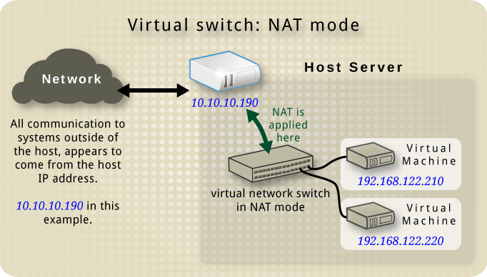
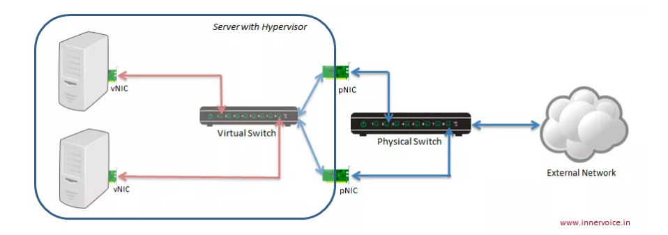
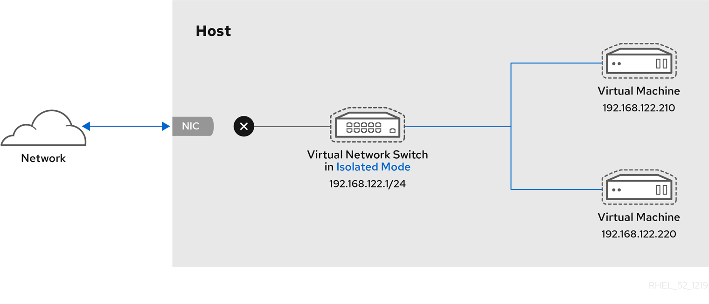

# TÌM HIỂU CÁC CHẾ ĐỘ CARD MẠNG TRONG KVM
Trong KVM/libvirt, cấu hình card mạng của máy ảo (Guest OS) quyết định cách nó giao tiếp với Hệ điều hành mẹ (Host OS) và mạng bên ngoài. Có 4 chế độ card mạng chính:

## NAT Mode (Network Address Translation) - Mặc định

- Cơ chế: KVM tạo một interface mạng ảo (virbr0) và một DHCP Server nội bộ (thường qua dnsmasq). Máy ảo nằm trong một lớp mạng nội bộ riêng (ví dụ: 192.168.122.x) cách ly hoàn toàn với LAN vật lý. Khi máy ảo đi ra Internet, Host OS thực hiện NAT IP của máy ảo thành IP của Host.
- Đặc điểm:
    + Máy ảo có thể truy cập Internet và giao tiếp với Host OS.
    + Các máy tính khác trong mạng LAN vật lý không thể truy cập trực tiếp vào máy ảo (trừ khi cấu hình Port Forwarding trên Host).
- Trường hợp sử dụng: Môi trường Test/Dev, máy ảo cá nhân chỉ cần ra Internet mà không làm dịch vụ Server cho mạng ngoài.

## Bridged Mode

- Cơ chế: Tạo một cầu nối ảo (Network Bridge - ví dụ br0) gắn trực tiếp vào card mạng vật lý của Host OS (như eth0 hoặc eno1).
- Đặc điểm:
    + Máy ảo hoạt động như một thiết bị độc lập cắm chung switch với máy mẹ.
    + Máy ảo sẽ nhận IP từ DHCP Server của mạng LAN thật (cùng dải IP với Host, ví dụ: 192.168.1.x).
    + Các máy khác trong LAN thật có thể truy cập thẳng vào máy ảo bằng IP riêng.
- Trường hợp sử dụng: Cấu hình máy ảo làm Server cung cấp dịch vụ (Web Server, Database, DNS) trong mạng nội bộ hoặc Production.

## Isolated (Host-Only Mode)

- Cơ chế: Tương tự như NAT nhưng không bật tính năng NAT ra card mạng thật của Host.
- Đặc điểm:
    + Các máy ảo kết nối với nhau và giao tiếp được với Host OS.
    + Máy ảo hoàn toàn không thể kết nối ra Internet hoặc mạng LAN bên ngoài.
- Trường hợp sử dụng: Môi trường thử nghiệm malware, lab bảo mật, hoặc cụm máy ảo nội bộ chỉ giao tiếp với nhau mà không cho phép truy cập từ/ra bên ngoài.

## Direct / Macvtap / Passthrough Mode
- Cơ chế: Gắn card mạng ảo của VM trực tiếp vào card mạng vật lý của Host thông qua driver macvtap hoặc gán cứng PCI card mạng vật lý cho VM (SR-IOV / PCI Passthrough).
- Đặc điểm:
    + Bỏ qua hoàn toàn lớp Bridge phần mềm của Linux Kernel, giúp đạt tốc độ truyền tải cao nhất và độ trễ thấp nhất.
    + Lưu ý của Macvtap: Mặc định máy ảo và Host OS không thể giao tiếp trực tiếp với nhau (mặc dù máy ảo vẫn ra Internet và nhận IP LAN bình thường).
- Trường hợp sử dụng: Các hệ thống đòi hỏi băng thông mạng cực cao (High-performance Networking, NFV, Firewall VM).

## Open vSwitch (OVS)

Open vSwitch (OVS) là một phần mềm chuyển mạch ảo (virtual switch) mã nguồn mở, được thiết kế để hỗ trợ quản lý mạng trong các môi trường ảo hóa quy mô lớn và các hệ thống mạng được định nghĩa bằng phần mềm (SDN).

### Kiến trúc của OVS
- OVS được chia thành các thành phần chính đảm bảo hiệu năng và khả năng quản lý:
    + ovs-vswitchd: Đây là "bộ não" của switch, thực hiện các chức năng chuyển tiếp gói tin (flow-based switching). Nó kết hợp với module trong nhân Linux để xử lý lưu lượng với tốc độ cao.
    + ovsdb-server: Một cơ sở dữ liệu nhẹ dùng để lưu trữ cấu hình của switch. Khi bạn thay đổi cấu hình (như thêm cổng, đổi VLAN), ovs-vswitchd sẽ truy vấn vào đây.
    + Kernel Module: Phần chạy trong nhân Linux giúp chuyển tiếp gói tin nhanh chóng mà không cần đẩy mọi thứ lên không gian người dùng (userspace), giúp giảm độ trễ.

- Các công cụ dòng lệnh:
    + ovs-vsctl: Cấu hình chính (thêm/xóa bridge, port, interface).
    + ovs-ofctl: Quản lý các luồng (flow) theo chuẩn OpenFlow.
    + ovs-dpctl: Cấu hình datapath trong nhân.

### Các tính năng nổi bật
- So với Linux Bridge, OVS mạnh mẽ hơn nhờ các khả năng:
    + Hỗ trợ SDN (OpenFlow): Cho phép kết nối với một SDN Controller tập trung để điều khiển luồng dữ liệu toàn mạng thay vì cấu hình từng switch riêng lẻ.
    + Giao thức Tunneling (Đường ống ảo): Hỗ trợ mạnh mẽ các giao thức như VXLAN, GRE, Geneve. Điều này cực kỳ quan trọng trong điện toán đám mây để tạo ra các mạng Layer 2 ảo chạy trên nền tảng Layer 3 vật lý.
    + Khả năng giám sát (Visibility): Tích hợp sẵn các công cụ như NetFlow, sFlow, và Mirroring giúp quản trị viên phân tích lưu lượng mạng rất chi tiết.
    + QoS (Quality of Service): Cho phép giới hạn băng thông hoặc ưu tiên lưu lượng cho từng máy ảo (VM) hoặc từng cổng cụ thể.
    + Tương thích cao: Hỗ trợ NIC bonding (LACP), VLAN tagging (802.1Q) và làm việc tốt với nhiều loại hypervisor (KVM, Xen, VirtualBox).

### Tại sao nên dùng OVS
- Tính linh hoạt: OVS không chỉ là switch, nó là một nền tảng lập trình được. Bạn có thể định nghĩa các quy tắc (flow rules) phức tạp cho từng gói tin dựa trên địa chỉ IP, cổng TCP, MAC...
- Hỗ trợ môi trường đa node: OVS thường được sử dụng trong các kiến trúc phức tạp như OpenStack hoặc các hệ thống Cloud lớn, nơi cần di chuyển máy ảo giữa các server vật lý mà không làm gián đoạn kết nối mạng (Network Mobility).
- Tối ưu hiệu năng: Hỗ trợ các công nghệ như DPDK (Data Plane Development Kit) để bypass kernel, giúp tăng tốc xử lý gói tin cho các ứng dụng mạng yêu cầu băng thông cực lớn.

### Bảng so sánh Linux Bridge và OVS
| Đặc điểm       | Linux Bridge                                  | Open vSwitch                                    |
|----------------|-----------------------------------------------|-------------------------------------------------|
| Mục tiêu       | Đơn giản, hiệu năng cao, ít cấu hình.         | Phức tạp, khả năng tùy biến cao, hỗ trợ SDN.    |
| Kiểm soát      | Cấu hình thủ công trên từng máy.              | Có thể điều khiển tập trung qua SDN Controller. |
| Tính năng mạng | Cơ bản (L2, VLAN).                            | Đa dạng (VXLAN, LACP, QoS, Flow-based).         |
| Cấu hình       | brctl, ip link, file /etc/network/interfaces. | ovs-vsctl, ovs-ofctl.                           |

## BẢNG SO SÁNH CÁC MODE
|        Tiêu chí        |           NAT Mode           |        Bridged Mode        | Isolated / Host-Only |      Direct / Macvtap      |
|:----------------------:|:----------------------------:|:--------------------------:|:--------------------:|:--------------------------:|
| Dải IP máy ảo          | Dải ảo riêng (192.168.122.x) | Dải LAN thật (192.168.1.x) | Dải ảo nội bộ riêng  | Dải LAN thật (192.168.1.x) |
| Truy cập Internet?     | Có                           | Có                         | Không                | Có                         |
| LAN ngoài vào được VM? | Không (Cần Port Forward)     | Có (Trực tiếp)             | Không                | Có (Trực tiếp)             |
| Giao tiếp VM <-> Host? | Có                           | Có                         | Có                   | Không (trừ khi chỉnh sửa)  |
| Hiệu năng I/O Mạng     | Trung bình                   | Tốt                        | Tốt                  | Cao nhất                   |

