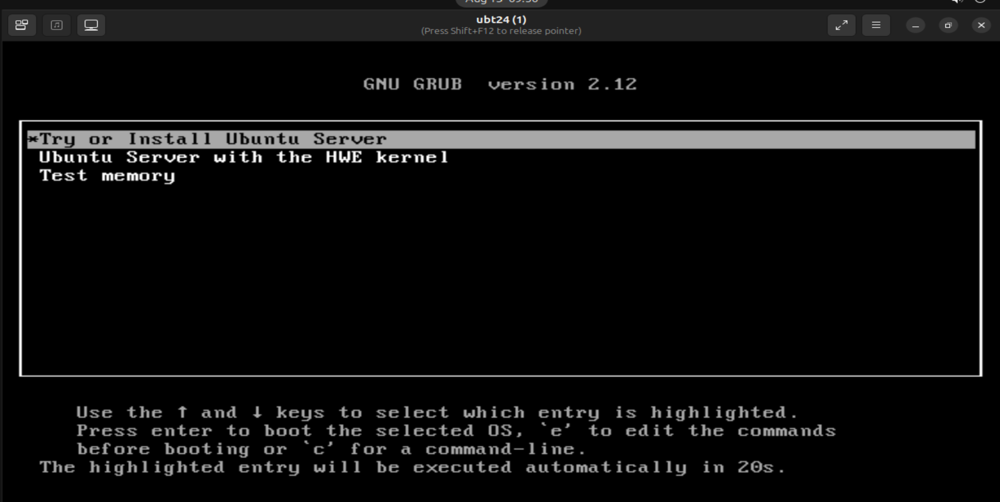
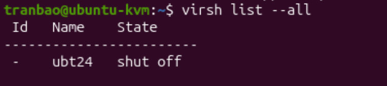
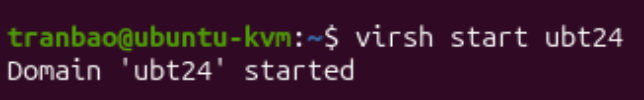
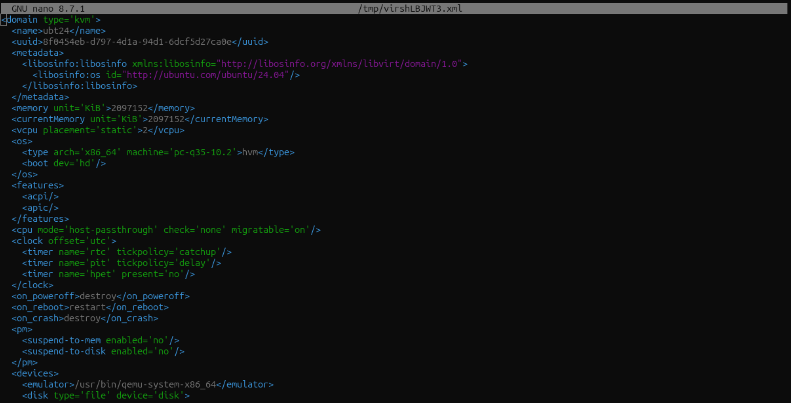
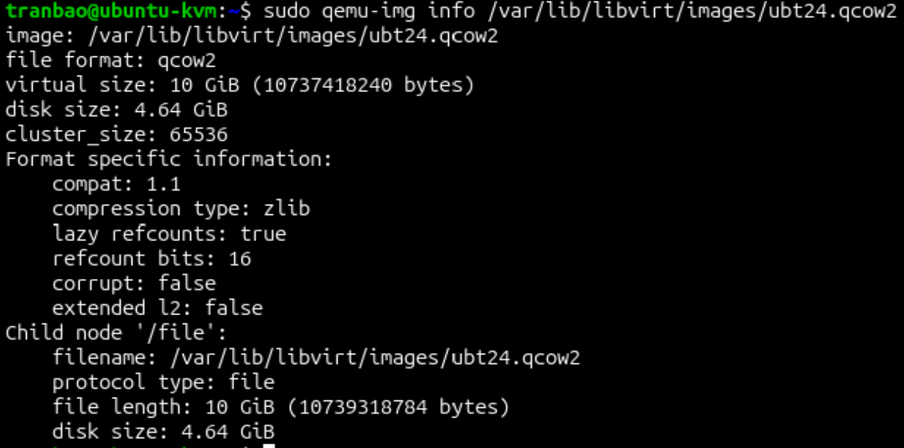
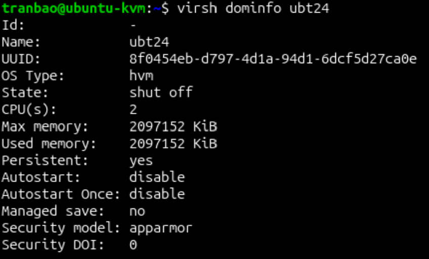
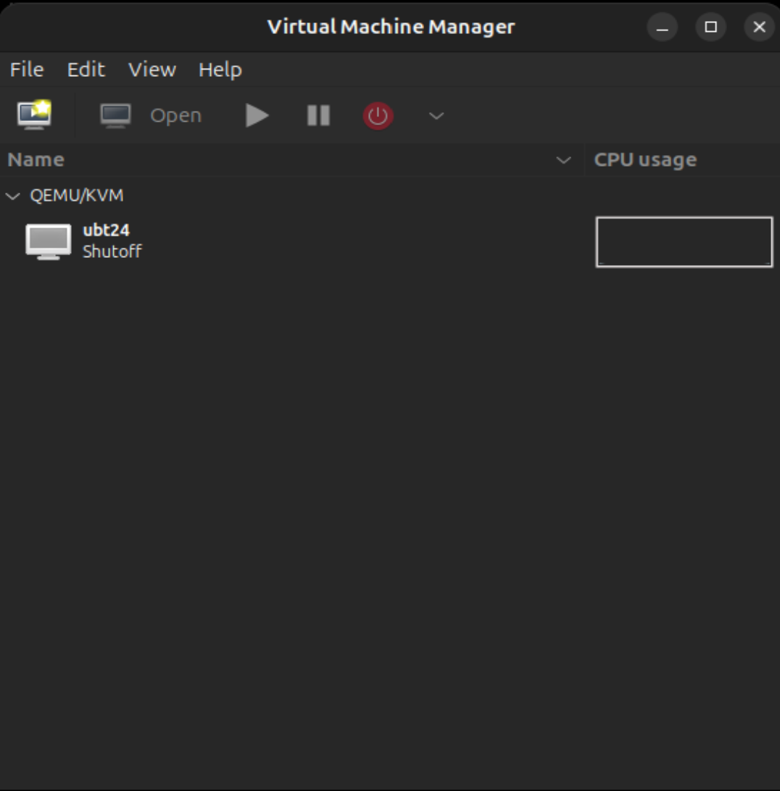

# TẠO MỘT MÁY ẢO
## MÔ TẢ
- Tạo một máy ảo Ubuntu 24.04 bằng KVM và tìm hiểu chi tiết về máy ảo được tạo

## THỰC HÀNH
### Bước 1: Tải file ISO Ubuntu Server 24.04 trên trang chủ của Ubuntu, dùng lệnh wget để tải trực tiếp vào thư mục lưu trữ ISO (ví dụ /var/lib/libvirt/images/):
``` bash
cd /var/lib/libvirt/images/
sudo wget https://releases.ubuntu.com/24.04/ubuntu-24.04.4-live-server-amd64.iso
```

### Bước 2: Tiến hành cài đặt máy ảo
- Nếu thao tác qua giao diện dòng lệnh SSH (không có màn hình đồ họa GUI), hãy dùng tham số --graphics none kết hợp --extra-args 'console=ttyS0,115200n8 serial' để cài đặt qua giao diện dòng lệnh (Text installer).

```bash
sudo virt-install \
  --name ubt24 \
  --ram 2048 \
  --vcpus 2 \
  --disk path=/var/lib/libvirt/images/ubt24.qcow2,size=5,format=qcow2 \
  --os-variant ubuntu24.04 \
  --network network=default,model=virtio \
  --graphics vnc \
  --cdrom /var/lib/libvirt/file-iso/ubuntu-24.04.4-live-server-amd64.iso \
  --check disk_size=off
```


- *Giải thích các thông số*
    + `--name`: Tên của máy ảo (ở đây đặt là ubt24).
    + `--ram`: Dung lượng RAM cấp cho máy ảo (tính bằng MB, ví dụ 2048 là 2GB).
    + `--vcpus`: Số lượng nhân CPU ảo cấp cho máy ảo (2 core).
    + `--disk`: Đường dẫn tạo file đĩa ảo dung lượng 5GB định dạng qcow2.
    + `--os-variant`: Khai báo hệ điều hành để KVM tối ưu (ubuntu24.04).
    + `--network`: Cấu hình mạng dùng chế độ NAT mặc định và tối ưu card virtio.
    + `--cdrom`: Đường dẫn tới file ISO Ubuntu 24.04 vừa tải.

### Bước 3: Tiến hành cài đặt bên trong máy ảo
- Ngay sau khi chạy lệnh trên, màn hình console sẽ chuyển trực tiếp sang giao diện cài đặt Ubuntu Server 24.04 (Subiquity installer).
    + Bạn thực hiện các bước chọn ngôn ngữ, cấu hình bàn phím, kết nối mạng và phân vùng ổ đĩa giống như khi cài đặt trên máy tính thật.
    + Sau khi quá trình cài đặt hoàn tất và máy ảo yêu cầu Reboot, máy ảo sẽ tự động khởi động lại vào hệ điều hành mới.

### Bước 4: Quản lý và thao tác máy ảo sau khi cài xong
- Xem danh sách máy ảo đang chạy hoặc đã tắt:
```bash
virsh list --all
```


- Khởi động máy ảo:
```bash
virsh start tên_máy_ảo
```


- Khởi động lại máy ảo
```bash
virsh reboot ten-may-ao
```

- Truy cập vào màn hình console của máy ảo
```bash
virsh console tên_máy_ảo
```
Để thoát khỏi màn hình console và quay về máy chủ host, sử dụng tổ hợp `Ctrl + ]`

- Tắt máy ảo
```bash
virsh destroy tên_máy_ảo
```
hoặc nếu đang SSH vào máy ảo thì sử dụng câu lệnh `sudo shutdown now`

- Xóa hoàn toàn máy ảo nếu không sử dụng nữa
```bash
virsh destroy tên_máy_ảo
virsh undefine tên_máy_ảo --remove-all-storage
```

- Chỉnh sửa thông tin của 1 VM
```bash
virsh edit tên_máy_ảo
```


- Để xem thông tin về 1 file disk của VM, sử dụng câu lệnh
```bash
qemu-img info duong_dan_disk
```


- Xem thông tin cơ bản của 1 VM
```bash
virsh dominfo tên_máy_ảo
```


**Snapshot**
- Để tạo một snapshot của một máy ảo thì ta sử dụng câu lệnh 
```bash
virsh snapshot-create-as --domain tên_máy_ảo --name tên_snapshot --description "mô_tả"
```
- Liệt kê danh sách snapshot của 1 VM
```bash
virsh snapshot-list tên_máy_ảo
```
- Khôi phục 1 VM về 1 snapshot cụ thể
```bash
virsh snapshot-revert tên_máy_ảo tên-bản-snapshot
```

- Xóa 1 snapshot
```bash
virsh snapshot-delete tên_máy_ảo --snapshotname "tên_snapshot"
```

- Xem thông tin của 1 snapshot
```bash
virsh snapshot-info --domain tên_máy_ảo --snapshotname tên_snapshot
```
*Lưu ý quan trọng khi dùng Snapshot*:
- Trạng thái máy ảo: Khi dùng virsh snapshot-create-as, nếu bạn không thêm tùy chọn --live, snapshot sẽ được tạo khi máy ảo tắt (đảm bảo dữ liệu toàn vẹn nhất). Nếu tạo snapshot khi máy đang chạy, nó sẽ lưu luôn cả trạng thái RAM (Internal Snapshot), file snapshot sẽ nặng hơn.
- Không gian đĩa: Mặc dù Snapshot QCOW2 rất hiệu quả, nhưng nếu bạn tạo quá nhiều snapshot và để lâu, file đĩa chính sẽ phình to ra. Hãy xóa bớt những snapshot cũ không còn cần thiết.
- Cảnh báo: Luôn ưu tiên dùng lệnh virsh vì nó hiểu được cấu trúc máy ảo của libvirt. Chỉ dùng qemu-img nếu bạn hiểu rõ mình đang can thiệp trực tiếp vào file dữ liệu thô.

**Virt-Manager**
- Ngoài ra ta có thể sử dụng `virt-manager` để tạo một máy ảo bằng GUI
