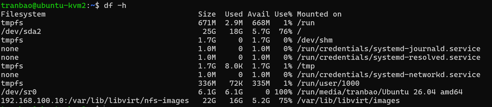

# LIVE MIGRATE TRÊN KVM
## MÔ TẢ
- Thực hiện live migration một máy ảo Ubuntu Server 24.04 từ VM1 -> VM2
- Mô hình sẽ bao gồm 1 NFS Server chạy trên Ubuntu Server 24.04 (192.168.100.10) - dùng để lưu trữ các disk, VM1 (192.168.100.50), VM2 (192.168.100.60). Thực hiện chuyển 1 máy ảo ubt24 từ VM1 sang VM2
## THỰC HÀNH
**Trên máy ảo NFS Server**
- Cài đặt dịch vụ NFS Server 
`sudo apt update && sudo apt install -y nfs-kernel-server`

- Tiến hành tạo một thư mục chia sẻ máy ảo
```bash
sudo mkdir -p /var/lib/libvirt/nfs-images
sudo chown -R libvirt-qemu:kvm /var/lib/libvirt/nfs-images
```

Trong trường hợp chạy đến câu lệnh thứ 2 bị lỗi thì chạy 2 câu lệnh sau đây sau đó thì chạy lại câu lệnh `sudo chown -R libvirt-qemu:kvm /var/lib/libvirt/nfs-images`
```bash
sudo groupadd -f kvm
sudo useradd -r -g kvm -d /nonexistent -s /usr/sbin/nologin libvirt-qemu
```

```bash
sudo chmod 775 /var/lib/libvirt/nfs-images
```

- Cấp quyền cho VM1 và VM2 truy cập vào thư mục này
`sudo nano /etc/exports`
sau đó thêm dòng này vào cuối file
`/var/lib/libvirt/nfs-images 192.168.100.0/24(rw,sync,no_subtree_check,no_root_squash)`
- Kích hoạt cấu hình NFS
```bash
sudo exportfs -a
sudo systemctl restart nfs-kernel-server
```

**VM1 & VM2**
*Mount thư mục NFS trên VM1 và VM2*
- Cài đặt NFS Client
```bash
sudo apt update && sudo apt install -y nfs-common
```
- Thực hiện mount
`sudo mount -t nfs 192.168.100.10:/var/lib/libvirt/nfs-images /var/lib/libvirt/images`
**Lưu ý**
- Trong trường hợp bị báo lỗi `Connection timed out` khi mount thì thử chạy lệnh sau trên NFS Server
```bash
sudo ufw allow from 192.168.100.0/24 to any port nfs
sudo ufw allow 2049/tcp
sudo ufw allow 2049/udp
sudo ufw reload
sudo systemctl daemon-reload
```
- Sau đó dùng lệnh `df -h` để kiểm tra, nếu báo như ảnh thì là thành công

*Cấu hình SSH không cần mật khẩu từ VM1 sang VM2*
- Trên VM1, tạo và copy key ssh sang VM2
```bash
ssh-keygen -t rsa -b 4096
ssh-copy-id tranbao@192.168.100.60
```
- Kiểm tra bằng cách gõ `ssh tranbao@192.168.100.60`

*Cấu hình libvirtd để chấp nhận kết nối từ xa*
- Trên cả VM1 và VM2, chỉnh sửa file cấu hình libvirt
`sudo nano /etc/libvirt/libvirtd.conf`
- Thêm dòng sau vào trong file
```bash
listen_tls = 0
listen_tcp = 1
auth_tcp = "none"
```
- Mở file cấu hình service để thêm cờ lắng nghe mạng
`sudo systemctl edit libvirtd`

Thêm các dòng sau vào file
```bash
[Service]
ExecStart=
ExecStart=/usr/sbin/libvirtd --listen
```
- Khởi động lại dịch vụ libvirt trên cả 2 VM
```bash
sudo systemctl daemon-reload
sudo systemctl restart libvirtd
```

*Tiến hành live migration máy ảo*
- Đầu tiên ta sẽ khởi chạy máy ảo cần live migration bằng câu lệnh `virsh start tên_máy_ảo`
- Từ VM1 sử dụng câu lệnh để thực hiện live migration từ VM1 sang VM2
`virsh migrate --live --persistent --undefinesource --verbose ubt24 qemu+ssh://tranbao@192.168.100.60/system`

**Lưu ý**
- Trong trường hợp máy ảo đã được tạo trước khi mount thư mục chứa disk image của VM1 2 vào thư mục trên NFS Server thì ta thực hiện theo thứ tự sau
+ Tạm thời unmount thư mục NFS trên VM1 để lấy lại file `ubt24.qcow2` cũ
`sudo umount /var/lib/libvirt/images`
- Sau đó tiến hành di chuyển file ubt24.qcow2 sang máy NFS Server
`scp /var/lib/libvirt/images/ubt24.qcow2 tranbao@192.168.100.10:/var/lib/libvirt/nfs-images/`

- Sau đó mount lại
`sudo mount -t nfs 192.168.100.10:/var/lib/libvirt/nfs-images /var/lib/libvirt/images`
- Trong trường hợp bị lỗi phân giải tên miền, hãy truy cập vào file /etc/hosts và thêm vào dòng sau vào cuối file rồi tiến hành migrate
`192.168.100.60 ubuntu-kvm2`
