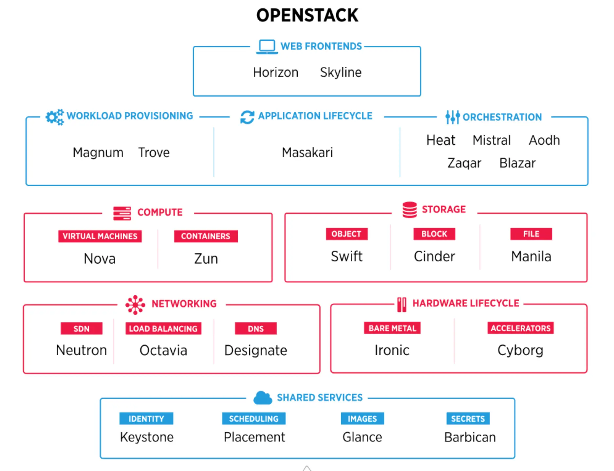
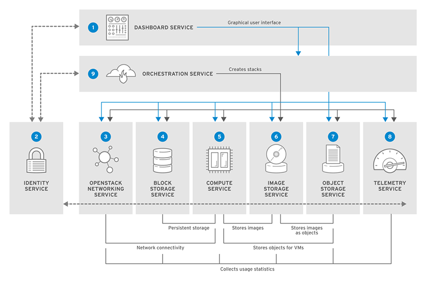
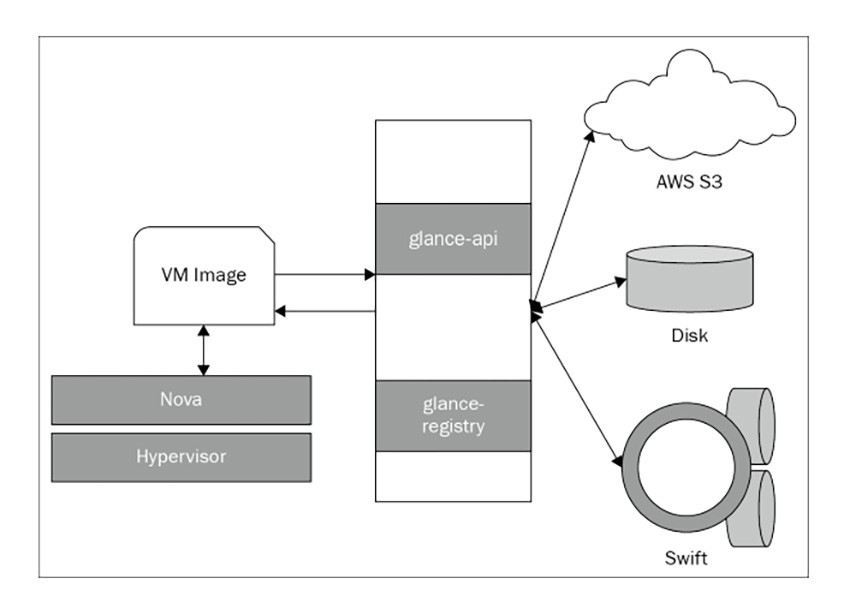
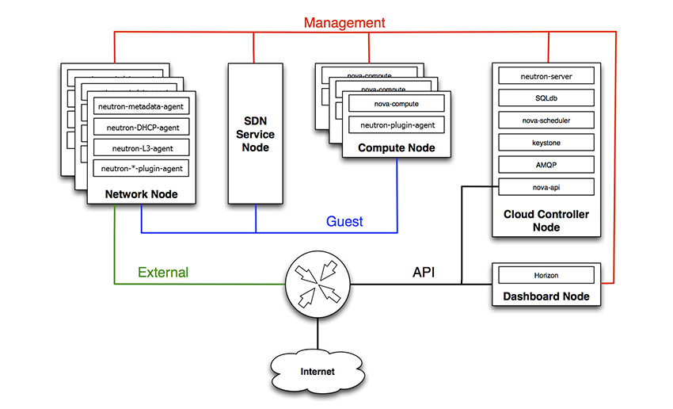
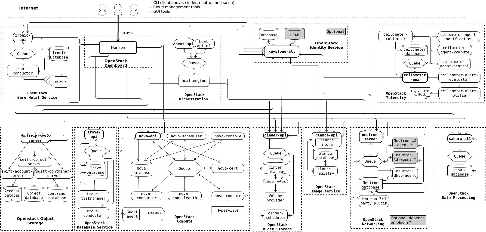
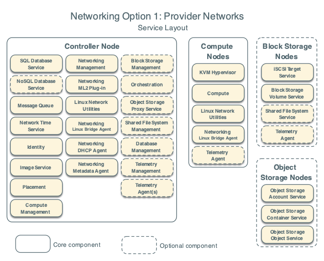
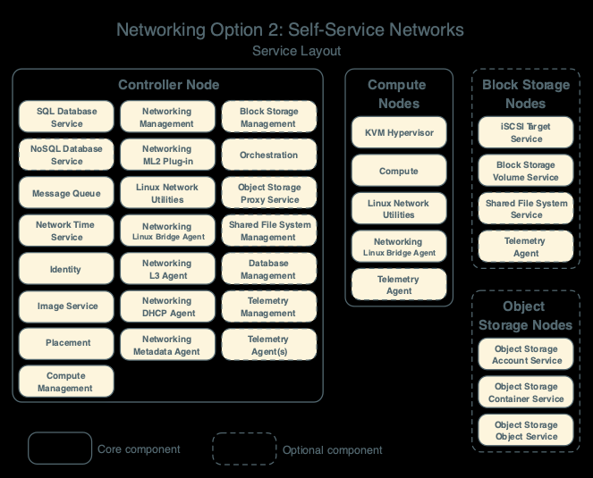

# TÌM HIỂU VỀ OPENSTACK
## OPENSTACK LÀ GÌ ?
- OpenStack là một platform điện toán đám mây nguồn mở hỗ trợ cả public clouds và private clouds. Nó cung cấp giải pháp xây dựng hạ tầng điện toán đám mây đơn giản, có khả năng mở rộng và nhiều tính năng phong phú. Được bắt đầu bởi NASA và Rackspace, Openstack sẽ cung cấp và phân phối nền tảng lưu trữ và điện toán đám mây.

- Tóm lại, để trả lời câu hỏi Openstack là gì. Hiểu đơn giản, thì OpenStack chính là một hệ thống mã nguồn mở ảo hay còn gọi là một hệ điều hành ảo cho phép người dùng có thể nghiên cứu, chỉnh sửa, quản lý thông tin của mình một cách phù hợp, hiệu quả theo nhu cầu của họ.

## CÁC TÍNH NĂNG CỦA OPENSTACK
OpenStack sở hữu một bộ tính năng nổi bật, giúp doanh nghiệp vận hành hạ tầng cloud theo mô hình tự động và linh hoạt. Cụ thể:
**Kiến trúc module linh hoạt**
- OpenStack được xây dựng theo kiến trúc module với nhiều project độc lập như Nova, Neutron, Swift, Cinder, Keystone và Glance. Doanh nghiệp có thể triển khai toàn bộ hệ thống hoặc chỉ lựa chọn những thành phần phù hợp với nhu cầu sử dụng.
- Nhờ cách thiết kế này, OpenStack có thể đáp ứng nhiều quy mô triển khai khác nhau, từ môi trường thử nghiệm nhỏ cho đến hệ thống cloud lớn trong doanh nghiệp.
**Hỗ trợ đa người thuê**
- OpenStack hỗ trợ mô hình multi-tenancy, cho phép nhiều nhóm người dùng cùng sử dụng chung một hạ tầng vật lý nhưng vẫn được tách biệt về tài nguyên, mạng, máy ảo và lưu trữ.
- Tính năng này đặc biệt phù hợp với doanh nghiệp có nhiều phòng ban, nhiều nhóm kỹ thuật hoặc nhiều dự án cần vận hành song song trên cùng một nền tảng cloud.
**Mã nguồn mở và dễ tùy chỉnh**
- Là nền tảng mã nguồn mở, OpenStack cho phép doanh nghiệp sử dụng, tùy chỉnh và mở rộng theo nhu cầu riêng. Đây là lợi thế lớn đối với các tổ chức muốn chủ động về công nghệ và hạn chế phụ thuộc vào một nhà cung cấp cloud duy nhất.
- Bên cạnh đó, OpenStack cũng có thể tích hợp với nhiều công cụ trong hệ sinh thái DevOps, giám sát, bảo mật và tự động hóa hạ tầng.
**Kiến trúc phân tán**
- Các dịch vụ trong OpenStack có thể được triển khai trên nhiều máy chủ khác nhau. Nhờ đó, hệ thống có thể mở rộng theo chiều ngang, tăng khả năng sẵn sàng và giảm ảnh hưởng khi một node gặp sự cố.
- Đây là yếu tố quan trọng đối với các hệ thống cloud cần phục vụ nhiều người dùng, xử lý khối lượng tài nguyên lớn hoặc yêu cầu tính ổn định cao.
**Điều khiển thông qua API**
- Hầu hết thao tác trong OpenStack đều có thể được thực hiện thông qua API. Điều này giúp quản trị viên dễ dàng tích hợp OpenStack với các công cụ tự động hóa như Ansible, Terraform hoặc các quy trình Infrastructure as Code.
- Thay vì xử lý thủ công từng tác vụ, đội ngũ kỹ thuật có thể tự động hóa việc tạo máy ảo, cấp phát mạng, cấu hình lưu trữ và quản lý tài nguyên theo các kịch bản đã định sẵn.
**Dashboard quản trị trực quan**
- OpenStack cung cấp Horizon, một dashboard quản trị dựa trên giao diện web. Thông qua Horizon, người dùng có thể tạo máy ảo, quản lý volume, cấu hình mạng, theo dõi tài nguyên và thực hiện nhiều tác vụ quản trị cơ bản.
- Nhờ có giao diện trực quan, việc sử dụng OpenStack trở nên dễ tiếp cận hơn, đặc biệt với những người dùng không muốn phụ thuộc hoàn toàn vào dòng lệnh.
**Gom tài nguyên thành pool chung**
- OpenStack có khả năng gom các tài nguyên rời rạc trong trung tâm dữ liệu thành một pool tài nguyên chung. Khi người dùng yêu cầu tạo máy ảo hoặc cấp phát lưu trữ, hệ thống sẽ tự động điều phối tài nguyên phù hợp.
- Cơ chế này giúp doanh nghiệp sử dụng tài nguyên hiệu quả hơn, đồng thời hạn chế tình trạng lãng phí phần cứng trong quá trình vận hành.

## ƯU NHƯỢC ĐIỂM CỦA OPENSTACK
### Ưu Điểm:
- Tiết kiệm chi phí: OpensTack mà phần mềm mã nguồn mở được phát hành miễn phí theo giấy phép Apache 2.0.
- Độ tin cậy cao: OpenStack gồm có nhiều mô đun cho phép các doanh nghiệp xây dựng và vận hành đám mây riêng hoặc công cộng 
với nhiều khả năng như mở rộng lưu trữ, nâng cao hiệu suất, bảo mật dữ liệu và quy mô sử dụng lớn.
- Nhà cung cấp trung lập: không có bất kỳ hạn chế nào bởi OpenStack là một phần mềm mã nguồn mở.
### Nhược Điểm:
- Việc triển khai OpenStack đòi hỏi nhiều kỹ năng gây tốn thời gian và chi phí.
- Gây khó khăn trong việc hỗ trợ quản lý chất lượng các dự án ngoài cộng đồng mã nguồn mở.
- Ngừng hỗ trợ các phiên bản thành phần cũ khi có phiên bản mới thay thế.

## CÁC THÀNH PHẦN CỦA OPENSTACK
- OpenStack hoạt động theo kiến trúc module, bao gồm 6 thành phần chính đảm nhiệm mọi chức năng, từ tính toán, kết nối mạng và lưu trữ để phục vụ các yêu cầu VM theo nhu cầu sử dụng của người dùng. Ngoài ra, trong OpenStack sẽ có rất nhiều thành phần phụ khác hỗ trợ các tính năng bổ sung, bao gồm bảng điều khiển, Containers, quản lý bảo mật, đo từ xa và Bare Metal Provisioning. 
- Để đơn giản hóa việc sử dụng tất cả các thành phần này, nhiều doanh nghiệp thường sử dụng OpenStack Charms để việc thiết lập và vận hành OpenStack được diễn ra hoàn toàn tự động. Dưới đây, cùng tìm hiểu kỹ hơn về từng thành phần trong OpenStack:

### Nova
- Nova là phần khá quan trọng trong hệ thống OpenStack, là nơi cung cấp nguồn lực về tính toán, thực hiện quản lý máy ảo và tự động hóa việc triển khai các chu kỳ lưu trữ trong môi trường đám mây.
- Trong cấu trúc Nova được phân làm nhiều phân nhánh khác nhau để hỗ trợ thực hiện các công việc chung: Nova API cung cấp giao diện lập trình tính toán, Nova Scheduler quyết định nơi triển khai máy ảo, Nova Database là nơi lưu trữ thông tin.

### Glance
- Chịu trách nhiệm quản lý và cung cấp các hình ảnh (images) cho máy ảo (instances) trong môi trường đám mây, Glance là nơi cho phép thực hiện các thao tác tạo, đọc, cập nhật và xóa hình ảnh trên Openstack.
- Các chức năng này làm việc dưới sự hỗ trợ của các thành phần Glance API, Glance Registry, Glance Store và Glance Database.
- Khi người dùng tiến hành thực hiện thao tác chỉnh sửa hình ảnh từ máy chủ, Glance API sẽ nhận diện thông tin và xử lý, API kiểm tra tên, định dạng và kích thước trong Glance Registry thông qua việc theo dõi quản lý thông tin từ Glance Database và cuối cùng sẽ được lưu trữ tại Glance Store.

### Neutron
- Cũng như các thành phần khác trong Openstack Neutron đảm bảo việc kết nối giữa máy ảo và mạng vật lý linh hoạt hơn, bằng việc quản lý cấu hình mạng và các dịch vụ mạng khác nhau trong hệ thống OpenStack.
- Hệ thống API Neutron tiếp nhận các hoạt động cập nhật hay xóa tài nguyên mạng, Neutron Plugin tương tác với các tài nguyên mạng như Virtual Network, Load Balancer, VPN, và các plugin khác, trong khi đó Neutron Database sẽ theo dõi tiến trình này và Neutron Agent là bộ phận trung tâm quản lý kết nối mạng cho máy ảo, xử lý thông tin mạng từ Compute Nodes hoặc Network Nodes.

### Cinder
Cinder là nơi lưu trữ, chịu trách nhiệm chính về việc cung cấp, quản lý và kết thúc các thiết bị khối liên tục (Persistent Block Devices - PBD). Chúng có thể được tích hợp vào các phiên bản khởi chạy của OpenStack để hỗ trợ việc lưu trữ các PBD.

### Swift
- Swift trong Openstack là nơi lưu trữ và quản lý dữ liệu metadata khối lượng lớn, được chia nhỏ ra thành Swift Proxy Server, Swift Storage Nodes và Swift Rings.
- Tại đây Swift Proxy Server xác thực yêu cầu từ người dùng, sau đó chuyển tiếp thông tin đến các Storage Nodes, còn Swift Rings xác định vị trí của đối tượng (Object) trên các Storage Nodes, giúp xác định nơi dữ liệu được lưu trữ (Container).

### Keystone
Keystone là thành phần giúp nhận dạng, cung cấp các tính năng về xác thực và ủy quyền cho người dùng để nhiều người thuê dịch vụ. Doanh nghiệp có thể dễ dàng tích hợp Keystone với các hệ thống nhận dạng của bên thứ ba, ví dụ như Active Directory hoặc là các giao thức truy cập gọn nhẹ (Lightweight Directory Access Protocol - LDAP).

## PHÂN BIỆT OPENSTACK, VMWARE VÀ KVM
- OpenStack, VMware và KVM đều liên quan đến điện toán đám mây và ảo hóa, nhưng mỗi công nghệ đảm nhiệm một vai trò khác nhau trong kiến trúc hạ tầng. Bảng dưới đây sẽ giúp làm rõ sự khác biệt giữa ba nền tảng này.

|      Tiêu chí     |                                  OpenStack                                  |                            VMware                            |                            KVM                           |
|:-----------------:|:---------------------------------------------------------------------------:|:------------------------------------------------------------:|:--------------------------------------------------------:|
| Bản chất          | Nền tảng quản lý cloud mã nguồn mở                                          | Hệ sinh thái ảo hóa và cloud thương mại                      | Công nghệ ảo hóa cấp hypervisor                          |
| Vai trò chính     | Quản lý compute, storage, networking, identity và API                       | Quản lý ảo hóa, hạ tầng doanh nghiệp và cloud                | Chạy máy ảo trên nền Linux                               |
| Mã nguồn          | Mã nguồn mở                                                                 | Độc quyền thương mại                                         | Mã nguồn mở                                              |
| Phạm vi sử dụng   | Private cloud, public cloud, hạ tầng IaaS                                   | Ảo hóa doanh nghiệp, data center, cloud hybrid               | Lớp ảo hóa cho máy chủ Linux                             |
| Mức độ quản lý    | Quản lý hạ tầng cloud nhiều thành phần                                      | Quản lý ảo hóa và hạ tầng theo hệ sinh thái VMware           | Không phải nền tảng quản lý cloud hoàn chỉnh             |
| Chi phí bản quyền | Không tốn phí bản quyền phần mềm gốc, nhưng tốn chi phí triển khai/vận hành | Thường có chi phí bản quyền cao                              | Không tốn phí bản quyền                                  |
| Đối tượng phù hợp | Doanh nghiệp có đội ngũ kỹ thuật mạnh, cần cloud tùy biến                   | Doanh nghiệp cần nền tảng ổn định, hỗ trợ thương mại rõ ràng | Admin/Linux engineer cần hypervisor mạnh, gọn, linh hoạt |

- Tóm lại, KVM, VMware và OpenStack nằm ở ba lớp khác nhau trong hệ sinh thái cloud. Việc lựa chọn OpenStack, VMware hay KVM phụ thuộc vào mục tiêu triển khai và năng lực vận hành của từng hệ thống. 

- OpenStack phù hợp với các tổ chức muốn tự chủ về hạ tầng cloud, cần khả năng tùy chỉnh sâu và hạn chế phụ thuộc vào một nhà cung cấp duy nhất. VMware là lựa chọn đáng cân nhắc khi ưu tiên sự ổn định, hệ sinh thái hoàn thiện và hỗ trợ thương mại rõ ràng. Trong khi đó, KVM phù hợp với những hệ thống cần một lớp ảo hóa nhẹ, hiệu quả và tối ưu chi phí trên nền tảng Linux.

## CÁCH OPENSTACK HOẠT ĐỘNG

OpenStack hoạt động dựa trên kiến trúc module, bao gồm nhiều dịch vụ độc lập nhưng phối hợp chặt chẽ với nhau để thực hiện các yêu cầu.
- *Bước 1*: Gửi yêu cầu tạo máy chủ ảo: Người dùng thao tác thông qua giao diện web Horizon hoặc gửi lệnh qua API để yêu cầu tạo máy chủ ảo. Tại đây, người dùng lựa chọn các thông số như loại máy chủ, hệ điều hành, cấu hình phần cứng, dung lượng lưu trữ và các thiết lập mạng.
- *Bước 2*: Xác thực quyền truy cập với Keystone: Trước khi xử lý yêu cầu, OpenStack sử dụng dịch vụ Keystone để xác minh danh tính và quyền hạn của người dùng. Nhờ đó, hệ thống đảm bảo chỉ những đối tượng được cấp phép mới có thể tiến hành khởi tạo hoặc quản lý tài nguyên cloud.
- *Bước 3*: Phối hợp các dịch vụ để chuẩn bị tài nguyên: Sau khi xác thực thành công, dịch vụ Nova sẽ tiếp nhận và xử lý yêu cầu tạo máy chủ ảo. Nova sẽ phối hợp với Glance để lấy bản image hệ điều hành cần thiết, sử dụng Neutron để cấp phát địa chỉ IP và cấu hình mạng, đồng thời kết nối với Cinder để cung cấp ổ cứng ảo phù hợp cho máy chủ ảo sắp khởi tạo.
- *Bước 4*: Khởi tạo máy chủ ảo trên máy vật lý: Sau khi các tài nguyên (image, ổ cứng, mạng…) đã sẵn sàng, Nova sẽ gửi lệnh đến hypervisor cài đặt trên máy chủ vật lý để thực hiện quá trình khởi tạo máy chủ ảo. Toàn bộ các thao tác đều được tự động hóa, minh bạch và có thể kiểm soát, giám sát qua dashboard hoặc API của OpenStack.

## MÔ HÌNH TRIỂN KHAI TRONG OPENSTACK
### Provider Network

#### Controller Node (Node điều khiển)
- Đây là trung tâm quản lý và điều phối chính của toàn bộ cụm OpenStack, chứa các thành phần:
+ SQL Database Service (Cơ sở dữ liệu chính, ví dụ: MariaDB/MySQL).
+ NoSQL Database Service (Tùy chọn).
+ Message Queue (Hàng đợi thông điệp, ví dụ: RabbitMQ).
+ Network Time Service (Đồng bộ thời gian, ví dụ: Chrony).
+ Identity (Dịch vụ định danh Keystone).
+ Image Service (Dịch vụ ảnh đĩa Glance).
+ Placement (Dịch vụ quản lý tài nguyên Placement của Nova).
+ Compute Management (Các tiến trình điều phối tính toán như Nova API, Scheduler, Conductor).
+ Networking Management & ML2 Plug-in (Dịch vụ máy chủ Neutron).
+ Linux Network Utilities & các agent mạng cơ bản.
+ Networking Linux Bridge Agent / DHCP Agent / Metadata Agent (Các tiến trình mạng phục vụ định tuyến và cấp phát).
+ Block Storage Management (Tùy chọn) (Cinder API/Scheduler).
+ Orchestration (Tùy chọn) (Heat).
+ Object Storage Proxy Service (Tùy chọn) (Swift Proxy).
+ Shared File System Management (Tùy chọn) (Manila).
+ Database Management & Telemetry Management / Agent(s) (Tùy chọn) (Trove và Ceilometer/Aodh).

#### Compute Nodes (Các Node tính toán)
- Đây là các máy chủ chịu trách nhiệm trực tiếp chạy máy ảo của người dùng, bao gồm các thành phần:
+ KVM Hypervisor (Tầng ảo hóa phần cứng).
+ Compute (Tiến trình thi hành máy ảo nova-compute).
+ Linux Network Utilities (Các công cụ mạng trên hệ điều hành).
+ Networking Linux Bridge Agent (Agent quản lý kết nối mạng ở tầng 2 trên node tính toán).
+ Telemetry Agent (Tùy chọn) (Agent thu thập thông tin giám sát).

#### Block Storage Nodes (Các Node lưu trữ khối)
- Node chuyên dụng để cung cấp ổ đĩa gắn ngoài (Cinder) cho máy ảo:
+ iSCSI Target Service (Dịch vụ cung cấp giao thức lưu trữ iSCSI).
+ Block Storage Volume Service (Tiến trình cinder-volume thực thi tạo/xóa ổ đĩa).
+ Shared File System Service (Tùy chọn).
+ Telemetry Agent (Tùy chọn).

#### Object Storage Nodes (Các Node lưu trữ đối tượng)
- Node chuyên dụng để lưu trữ dữ liệu dạng đối tượng (Swift) tương tự như S3:
+ Object Storage Account Service (Dịch vụ quản lý tài khoản người dùng lưu trữ đối tượng).
+ Object Storage Container Service (Dịch vụ quản lý các container/thư mục chứa dữ liệu).
+ Object Storage Object Service (Dịch vụ lưu trữ và quản lý các tệp tin đối tượng thực tế).

### Self-service Network

#### Controller Node (Node điều khiển)
- Đây là trung tâm quản lý và điều phối chính của toàn bộ cụm OpenStack, chứa các thành phần:
+ SQL Database Service (Cơ sở dữ liệu chính, ví dụ: MariaDB/MySQL).
+ NoSQL Database Service (Tùy chọn).
+ Message Queue (Hàng đợi thông điệp, ví dụ: RabbitMQ).
+ Network Time Service (Đồng bộ thời gian, ví dụ: Chrony).
+ Identity (Dịch vụ định danh Keystone).
+ Image Service (Dịch vụ ảnh đĩa Glance).
+ Placement (Dịch vụ quản lý tài nguyên Placement của Nova).
+ Compute Management (Các tiến trình điều phối tính toán như Nova API, Scheduler, Conductor).
+ Networking Management & ML2 Plug-in (Dịch vụ máy chủ Neutron).
+ Linux Network Utilities & các agent mạng cơ bản.
+ Networking Linux Bridge Agent / L3 Agent / DHCP Agent / Metadata Agent (Các tiến trình mạng phục vụ định tuyến và cấp phát).
+ Block Storage Management (Tùy chọn) (Cinder API/Scheduler).
+ Orchestration (Tùy chọn) (Heat).
+ Object Storage Proxy Service (Tùy chọn) (Swift Proxy).
+ Shared File System Management (Tùy chọn) (Manila).
+ Database Management & Telemetry Management / Agent(s) (Tùy chọn) (Trove và Ceilometer/Aodh).

#### Compute Nodes (Các Node tính toán)
- Đây là các máy chủ chịu trách nhiệm trực tiếp chạy máy ảo của người dùng, bao gồm các thành phần:
+ KVM Hypervisor (Tầng ảo hóa phần cứng).
+ Compute (Tiến trình thi hành máy ảo nova-compute).
+ Linux Network Utilities (Các công cụ mạng trên hệ điều hành).
+ Networking Linux Bridge Agent (Agent quản lý kết nối mạng ở tầng 2 trên node tính toán).
+ Telemetry Agent (Tùy chọn) (Agent thu thập thông tin giám sát).

#### Block Storage Nodes (Các Node lưu trữ khối)
- Node chuyên dụng để cung cấp ổ đĩa gắn ngoài (Cinder) cho máy ảo:
+ iSCSI Target Service (Dịch vụ cung cấp giao thức lưu trữ iSCSI).
+ Block Storage Volume Service (Tiến trình cinder-volume thực thi tạo/xóa ổ đĩa).
+ Shared File System Service (Tùy chọn).
+ Telemetry Agent (Tùy chọn).

#### Object Storage Nodes (Các Node lưu trữ đối tượng)
- Node chuyên dụng để lưu trữ dữ liệu dạng đối tượng (Swift) tương tự như S3:
+ Object Storage Account Service (Dịch vụ quản lý tài khoản người dùng lưu trữ đối tượng).
+ Object Storage Container Service (Dịch vụ quản lý các container/thư mục chứa dữ liệu).
+ Object Storage Object Service (Dịch vụ lưu trữ và quản lý các tệp tin đối tượng thực tế).

### Sự khác biệt về các thành phần giữa 2 mô hình triển khai
- Điểm khác biệt cốt lõi:
+ Mô hình Provider Networks (Hình hiện tại): Thành phần Networking L3 Agent không xuất hiện trên Controller Node.
+ Mô hình Self-Service Networks (Hình trước): Có sự góp mặt đầy đủ của Networking L3 Agent.

- Nguyên nhân của sự khác biệt này:
+ Trong Provider Networks: Các máy ảo của người dùng kết nối trực tiếp lên hạ tầng mạng vật lý sẵn có của trung tâm dữ liệu (kiểu mạng Flat hoặc VLAN). Việc định tuyến gói tin (routing), cơ chế NAT và cổng Gateway ra Internet đều do các thiết bị mạng vật lý bên ngoài (router, switch vật lý của hệ thống mạng doanh nghiệp) đảm nhận. Do đó, OpenStack không cần đến tiến trình neutron-l3-agent để tạo các bộ định tuyến ảo.
+ Trong Self-Service Networks: Người dùng tự tạo các mạng riêng ảo (private networks). Để các mạng riêng này có thể kết nối với nhau hoặc đi ra Internet thông qua Floating IP, OpenStack bắt buộc phải sử dụng Networking L3 Agent trên Controller Node để dựng lên các Virtual Routers ảo thực hiện nhiệm vụ định tuyến và biên dịch địa chỉ mạng (SNAT/DNAT).

## NODES
- Trong hệ sinh thái OpenStack, các máy chủ vật lý (hoặc máy ảo phần cứng dùng để chạy OpenStack) được phân chia thành các "vai trò" (nodes) khác nhau để tổ chức công việc một cách khoa học. Thay vì dồn mọi thứ lên một máy chủ, OpenStack phân chia thành Compute Node và Network Node (cùng với Controller Node) để tối ưu hóa hiệu năng và quản lý.

### Controller Node (Node điều khiển - "Bộ não" của hệ thống)
- Bản chất: Đây là trung tâm đầu não của toàn bộ cụm OpenStack. Nó không trực tiếp chạy máy ảo của người dùng, nhưng nó quản lý, điều phối mọi hoạt động, cấu hình và quyết định mọi thứ diễn ra trong đám mây.
- Các dịch vụ thường chạy trên Controller Node:
+ Keystone: Dịch vụ định danh, xác thực người dùng và cấp phát token.
+ Glance: Dịch vụ lưu trữ và quản lý các file ảnh đĩa hệ điều hành (.qcow2).
+ Nova API / Scheduler / Conductor: Các thành phần tiếp nhận yêu cầu, chọn lựa phần cứng và điều phối cơ sở dữ liệu của dịch vụ tính toán.
+ Neutron Server: Tiến trình trung tâm tiếp nhận API và quản lý logic cấu hình mạng.
+ Cinder API / Scheduler: Quản lý việc tạo lập và điều phối ổ cứng gắn ngoài.
+ Hệ thống cơ sở dữ liệu và thông điệp chung: Thường chứa MySQL/MariaDB (lưu dữ liệu hệ thống) và RabbitMQ (hàng đợi thông điệp bất đồng bộ cho các service).
+ Horizon: Cung cấp giao diện trang web quản trị (Dashboard).

### Compute Node (Node tính toán - "Nhà xưởng sản xuất")
- Bản chất: Đây là các máy chủ vật lý có cấu hình phần cứng mạnh mẽ (CPU nhiều nhân, RAM lớn) chuyên trách việc trực tiếp chạy các máy ảo (Virtual Instances) của người dùng.
- Các thành phần và chức năng chính:
+ Hypervisor (KVM/QEMU): Phần mềm ảo hóa chạy trực tiếp trên nhân hệ điều hành của node này để ảo hóa phần cứng vật lý thành các tài nguyên máy ảo.
+ nova-compute: Tiến trình cốt lõi nhận lệnh từ hàng đợi thông điệp để trực tiếp bật, tắt, tạo mới hoặc xóa bỏ các máy ảo.
+ OVS / LinuxBridge Agent: Chạy các tiến trình mạng cục bộ để kết nối máy ảo vào hệ thống mạng chung của cụm.
+ Tác động nếu gặp sự cố: Nếu một Compute Node bị sập, tất cả các máy ảo đang chạy trên node đó sẽ bị gián đoạn hoặc mất kết nối.

### Network Node (Node mạng - "Trạm trung chuyển giao thông")
- Bản chất: Trong các mô hình kiến trúc truyền thống hoặc một số thiết lập chuyên dụng, Network Node là máy chủ tập trung chuyên xử lý các tác vụ định tuyến mạng phức tạp, cấp phát IP và làm cổng kết nối đi ra mạng bên ngoài.
- Các dịch vụ chạy trên Network Node:
+ neutron-l3-agent: Quản lý các bộ định tuyến ảo (Virtual Routers), xử lý biên dịch địa chỉ mạng (SNAT/DNAT) và quản lý Floating IP (IP nổi) để máy ảo đi ra Internet.
+ neutron-dhcp-agent: Chạy tiến trình dnsmasq để cấp phát địa chỉ IP tự động cho các máy ảo trong mạng nội bộ.
+ neutron-metadata-agent: Cầu nối hỗ trợ máy ảo lấy thông tin cấu hình khởi tạo (cloud-init).
+ Lưu ý mô hình hiện đại: Trong các thiết kế dùng OVN/OpenFlow hiện đại, các chức năng định tuyến này có thể được phân tán trực tiếp lên các Compute Node mà không nhất thiết phải có một Network Node độc lập chuyên biệt.

### Storage Node (Node lưu trữ - "Kho chứa dữ liệu")
- Bản chất: Là các máy chủ chuyên dụng được trang bị các ổ cứng dung lượng lớn (HDD/SSD tốc độ cao) nhằm cung cấp không gian lưu trữ bền bỉ cho toàn bộ hệ thống đám mây.
- Các loại Storage Node trong OpenStack:
+ Block Storage Node (Cinder): Cung cấp các ổ đĩa khối gắn rời (như ổ cứng di động) cho máy ảo thông qua các công nghệ như LVM, iSCSI hoặc tích hợp với các cụm lưu trữ phần cứng ngoài. Thành phần chính chạy ở đây là cinder-volume.
+ Object Storage Node (Swift): Cung cấp kho chứa đối tượng quy mô lớn (tương tự như S3) để lưu trữ các file tĩnh, bản backup thông qua HTTP.