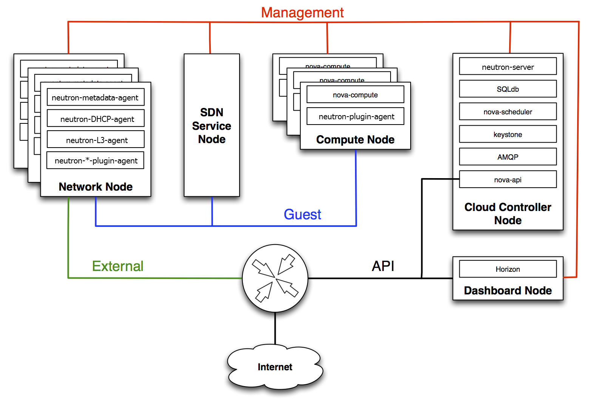
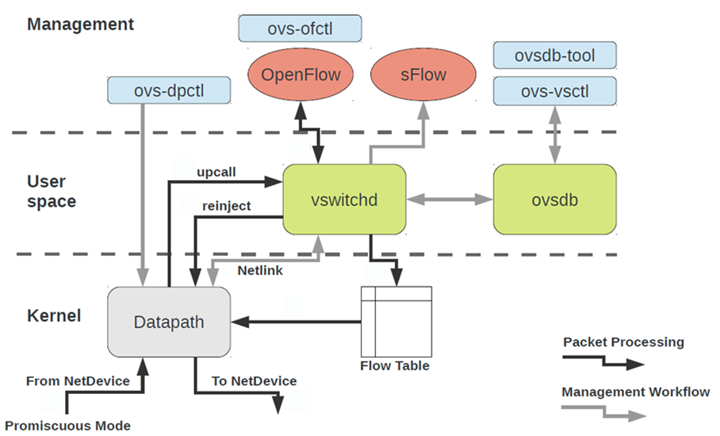
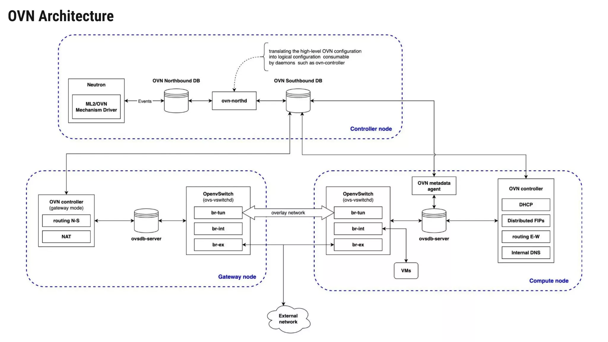

# TÌM HIỂU VỀ SERVICE NEUTRON TRONG OPENSTACK
## NEUTRON LÀ GÌ ?
- Neutron (trước đây gọi là Quantum) là dịch vụ cung cấp hệ thống mạng theo dạng phần mềm (SDN - Software-Defined Networking) cho OpenStack.
- Nó cho phép người dùng tự tạo và quản lý các tài nguyên mạng ảo một cách linh hoạt mà không cần đụng đến thiết bị mạng vật lý bên ngoài, bao gồm:
- Tạo các Network (mạng ảo), Subnet (dải mạng con) và Router (bộ định tuyến).
- Quản lý các cổng kết nối (Ports) cho máy ảo.
- Xây dựng hệ thống tường lửa ảo (Security Groups, Firewalls) và cân bằng tải (LBaaS).

## CÁC THÀNH PHẦN CÓ TRONG NEUTRON

Kiến trúc của Neutron hoạt động theo mô hình Client-Server kết hợp với các agent chạy phân tán trên các node. Các thành phần cốt lõi bao gồm:
*neutron-server (Control Plane)*
- Là gì: Đây là tiến trình trung tâm chạy trên Controller Node, tiếp nhận toàn bộ các yêu cầu REST API từ người dùng (qua CLI, Horizon Dashboard hoặc các dịch vụ khác như Nova).
- Tác dụng: Xử lý logic nghiệp vụ mạng, xác thực yêu cầu, và lưu trữ toàn bộ trạng thái cấu hình mạng (Networks, Subnets, Ports, Routers) vào cơ sở dữ liệu quan hệ (SQL Database).

*Neutron Plugins & Drivers (Phần mở rộng phần mềm)*
- Là gì: Các module phần mềm nằm bên trong neutron-server chịu trách nhiệm giao tiếp với các công nghệ mạng bên dưới (ví dụ: LinuxBridge, Open vSwitch - OVS, hoặc các thiết bị mạng phần cứng từ Cisco, VMware).
- Tác dụng: Dịch các yêu cầu API trừu tượng thành các lệnh cấu hình cụ thể phù hợp với công nghệ mạng mà hạ tầng của bạn đang sử dụng.

*Neutron Agents (Data Plane / Chạy trên Compute và Network Node)*
- Đây là các tiến trình chạy ngầm trên từng máy chủ vật lý để thi hành các cấu hình mạng xuống tầng hệ điều hành:
+ *neutron-l2-agent (hoặc openvswitch-agent / linuxbridge-agent)*: Chạy trên cả Compute Node và Network Node. Tác dụng quản lý các cầu nối mạng ảo (bridges/switches) tại chỗ, tạo các đường hầm (tunnel như VXLAN/GRE) hoặc VLAN để kết nối các máy ảo với nhau.
+ *neutron-l3-agent*: Thường chạy trên Network Node. Tác dụng cung cấp tính năng định tuyến (Routing) giữa các mạng riêng (Private Networks) và mạng ngoài (Public/External Network), đồng thời xử lý cơ chế Floating IP (địa chỉ IP nổi để truy cập Internet).
+ *neutron-dhcp-agent*: Chạy trên Network Node (hoặc phân tán), cung cấp dịch vụ cấp phát IP tự động (DHCP) cho các máy ảo trong các network nội bộ.
+ *neutron-metadata-agent*: Cầu nối trung gian giúp máy ảo bên trong có thể truy cập vào địa chỉ metadata đặc biệt (169.254.169.254) để nhận cấu hình khởi tạo (như cloud-init, SSH key).

## CÁCH CÁCH THÀNH PHẦN TRONG NEUTRON GIAO TIẾP NHƯ THẾ NÀO
- Quá trình giao tiếp trong Neutron diễn ra chủ yếu qua hai kênh chính: Kênh điều khiển (Control Plane) và Kênh thông điệp (Message Queue).
- Giao tiếp qua REST API (Client đến Server):
+ Khi bạn gõ lệnh (ví dụ tạo một mạng ảo mới: openstack network create my-net), yêu cầu HTTP/HTTPS được gửi từ giao diện hoặc CLI tới neutron-server trên Controller Node.
+ neutron-server kiểm tra quyền qua Keystone, lưu thông tin vào cơ sở dữ liệu SQL.
+ Giao tiếp qua Message Broker (RabbitMQ / RPC):
+ neutron-server không trực tiếp ra lệnh cấu hình cho các máy chủ tính toán hay mạng, mà nó đẩy các thông điệp (messages) thông qua hệ thống hàng đợi thông điệp trung tâm (RabbitMQ).
+ Các Neutron Agents (openvswitch-agent, l3-agent, dhcp-agent) đang lắng nghe trên các hàng đợi này sẽ nhận được thông điệp, sau đó tự động thực thi các thay đổi cấu hình tương ứng lên hệ thống mạng của máy chủ (ví dụ: tạo cổng tap trên OVS, cấu hình iptables, cấp phát namespace cho router).

- Giao tiếp giữa máy ảo và các dịch vụ mạng (Data Path):
+ Khi máy ảo muốn lấy địa chỉ IP, nó phát tín hiệu DHCP, gói tin đi qua cổng ảo (tap interface) vào Open vSwitch / LinuxBridge, chuyển tiếp qua đường hầm mạng ảo đến neutron-dhcp-agent nằm trên Network Node để nhận IP.
+ Khi máy ảo muốn đi ra Internet, gói tin được định tuyến qua neutron-l3-agent (thông qua cơ chế Network Namespace), thực hiện NAT (Network Address Translation) dựa trên Floating IP để đi ra ngoài mạng vật lý thực tế.

## Quy trình hoạt động của Neutron
Để hiểu cách Neutron vận hành, hãy xét quy trình khi một máy ảo muốn gửi dữ liệu sang máy ảo khác hoặc đi ra Internet:
- *Trường hợp 1*: Giao tiếp giữa 2 máy ảo cùng mạng nội bộ (East-West Traffic)
+ Gói tin từ máy ảo đi qua cổng ảo (tap interface) vào Open vSwitch trên máy chủ tính toán.
+ Nếu 2 máy ảo nằm chung một máy chủ, gói tin được switch ảo chuyển tiếp trực tiếp sang máy ảo đích.
+ Nếu 2 máy ảo nằm ở 2 máy chủ vật lý khác nhau, OVS sẽ đóng gói gói tin vào đường hầm overlay (như VXLAN), truyền qua mạng vật lý đến máy chủ đích, sau đó mở gói và chuyển vào máy ảo nhận.

- *Trường hợp 2*: Máy ảo đi ra ngoài Internet (North-South Traffic)
+ Máy ảo gửi gói tin ra ngoài mạng riêng, gặp Virtual Router do neutron-l3-agent quản lý trên Network Node.
+ Router thực hiện cơ chế SNAT (Source NAT) để chuyển đổi địa chỉ IP nội bộ của máy ảo thành địa chỉ IP Public/Floating IP.
+ Gói tin được định tuyến qua cổng External Bridge (br-ex) để đi thẳng ra mạng vật lý ngoài đời thực và truy cập Internet.

## SDN (Software-Defined Networking) là gì?
- Bối cảnh truyền thống: Trước đây, mỗi thiết bị mạng (switch, router vật lý) vừa làm nhiệm vụ xử lý gói tin (data plane), vừa tự quyết định đường đi cho gói tin (control plane). Khi cấu hình mạng trong các hệ thống cloud khổng lồ có hàng ngàn máy ảo, việc phải đi cấu hình thủ công từng thiết bị là bất khả thi.
- Định nghĩa SDN: SDN giải quyết vấn đề này bằng cách tách rời tầng điều khiển (control plane) và tầng dữ liệu (data plane).
- Bộ điều khiển trung tâm (controller) sẽ quyết định chính sách và đường đi của mạng.
- Các thiết bị chuyển mạch bên dưới chỉ việc tuân thủ và chuyển tiếp gói tin theo đúng chỉ đạo đó.
- Lợi ích: Mang lại khả năng quản lý tập trung, tính lập trình tự động hóa cao và linh hoạt thay đổi theo chu kỳ sống của máy ảo.

## OVS (Open vSwitch) LÀ GÌ ?

- Định nghĩa: OVS là một phần mềm chuyển mạch ảo (virtual switch) mã nguồn mở hiệu năng cao, hỗ trợ giao thức OpenFlow và các công nghệ đóng gói đường hầm (tunnel encapsulation như VXLAN, GRE, Geneve).
- Chức năng chính (Data Plane):
+ Đóng vai trò là "công nhân" thực hiện việc chuyển tiếp gói tin (packet forwarding) giữa các máy ảo bên trong hypervisor hoặc giữa các node qua hệ thống tunnel.
+ Cung cấp hiệu năng tốc độ cao ở tầng nhân (kernel datapath) và hỗ trợ giám sát, kiểm soát chất lượng dịch vụ (QoS).
- Hạn chế: Bản thân OVS thuần túy chỉ hiểu các luật OpenFlow cấp thấp, chứ không tự hiểu các khái niệm trừu tượng cao cấp của điện toán đám mây như "mạng ảo" (virtual network), "router ảo" hay "security group". Nếu dùng độc lập, việc cấu hình OVS ở quy mô lớn sẽ rất phức tạp.

## OVN LÀ GÌ

- Định nghĩa: OVN là một hệ thống mạng ảo phân tán được phát triển để nằm phía trên OVS, đóng vai trò cung cấp phần còn thiếu của OVS: Tầng điều khiển (Control Plane).
- Chức năng chính (Control Plane):
+ Cung cấp các mô hình mạng logic bậc cao như: Logical switches, logical routers, ports, ACLs, load balancers.
+ Tự động phiên dịch các yêu cầu trừu tượng đó thành các luật dòng chảy (OpenFlow rules) chi tiết rồi đẩy xuống cho OVS thực thi trên từng hypervisor.
- Các thành phần cốt lõi bên trong OVN:
+ Northbound DB (NB DB): Lưu trữ cấu hình mạng logic theo mong muốn của người dùng do OpenStack Neutron đẩy xuống.
+ ovn-northd: Tiến trình trung gian làm nhiệm vụ phiên dịch từ cấu hình logic ở Northbound DB sang trạng thái thực thi chi tiết ở Southbound DB.
+ Southbound DB (SB DB): Lưu trữ trạng thái hệ thống gần với hạ tầng vật lý và các bảng dòng chảy logic (logical flows).
+ ovn-controller: Chạy trên mỗi compute node, liên tục theo dõi Southbound DB để tự động lập trình và cấu hình OVS cục bộ.

## SO SÁNH SỰ KHÁC NHAU GIỮA OVS VÀ OVN
| Tiêu chí                            | OVS (Open vSwitch đơn thuần)                                                                                | OVN (Open Virtual Network)                                                                                          |
|-------------------------------------|-------------------------------------------------------------------------------------------------------------|---------------------------------------------------------------------------------------------------------------------|
| Vai trò trong kiến trúc SDN         | Là Data Plane (tầng dữ liệu) – chuyên làm nhiệm vụ chuyển tiếp gói tin.                                     | Là Control Plane (tầng điều khiển) phân tán – chuyên quản lý mô hình và cấu hình mạng.                              |
| Mức độ trừu tượng                   | Thấp. Chỉ làm việc trực tiếp với các bảng OpenFlow, port vật lý/ảo và đường hầm.                            | Cao. Cho phép làm việc với các khái niệm mạng chuẩn cloud: Logical switches, routers, ACLs, security groups.        |
| Khả năng mở rộng (Scalability)      | Dễ gặp hiện tượng bùng nổ bảng dòng chảy (flow table explosion) và quá tải khi quản lý thủ công quy mô lớn. | Thiết kế tối ưu cho cloud quy mô lớn nhờ cơ chế cơ sở dữ liệu phân tán (Northbound/Southbound DB).                  |
| Mối quan hệ tương hỗ                | OVS có thể hoạt động độc lập (nhưng khó tự động hóa mạng cloud phức tạp).                                   | OVN bắt buộc phải chạy dựa trên nền tảng OVS để thực thi việc chuyển gói tin.                                       |
| Tiêu chuẩn trong OpenStack hiện đại | Từng được dùng kèm các agent cũ (ML2/OVS), hiện nay đã lỗi thời cho các hệ thống lớn.                       | Trở thành tiêu chuẩn mặc định (ML2/OVN) trong các phiên bản OpenStack hiện đại nhờ tính tự động hóa và ổn định cao. |

- *Tóm lại*: OVS là "công nhân vận chuyển" (đóng gói và đẩy dữ liệu qua lại), còn OVN là "bộ quản lý" (lên kế hoạch định tuyến, phân quyền, cấu hình mạng logic và chỉ đạo OVS cách làm việc). Cả hai kết hợp chặt chẽ với nhau để tạo thành bộ khung mạng chuẩn mực cho OpenStack Neutron hiện nay.

## KIẾN TRÚC CỦA OVN

Dựa vào sơ đồ kiến trúc OVN Architecture (Open Virtual Network) tích hợp với OpenStack Neutron trong hình, hệ thống được phân chia rõ ràng thành 3 thành phần node chính: Controller node, Gateway node, và Compute node.

### Controller Node (Node điều khiển trung tâm)
- Khu vực này đóng vai trò là "bộ não" điều phối toàn bộ hệ thống mạng ảo:
+ Neutron & ML2/OVN Mechanism Driver: OpenStack Neutron tương tác với OVN thông qua Mechanism Driver. Khi người dùng tạo mạng, subnet hoặc port, các sự kiện (Events) này sẽ được đẩy thẳng xuống cơ sở dữ liệu Northbound.
+ OVN Northbound DB (NB): Nơi lưu trữ cấu hình mạng ở mức logic cao (ví dụ: cấu hình logical switches, logical routers) do OpenStack Neutron đẩy xuống.
+ ovn-northd (Daemon trung gian): Đảm nhiệm vai trò phiên dịch (translating). Nó chuyển đổi các cấu hình logic bậc cao từ Northbound DB thành dạng cấu hình logic chi tiết hơn mà các daemon cấp dưới (như ovn-controller) có thể hiểu và tiêu thụ được, sau đó lưu trữ vào Southbound DB.
+ OVN Southbound DB (SB): Lưu trữ trạng thái hệ thống ở mức gần với hạ tầng vật lý hơn (như liên kết giữa logical ports với các chassis/máy chủ vật lý, thông tin về tunnel, v.v.). Đây là trung tâm phân phối dữ liệu cho tất cả các OVN controller trên các node.

### Compute Node (Node tính toán - nơi chứa máy ảo)
- Đây là nơi chạy các máy ảo (VMs) và xử lý luồng dữ liệu cục bộ:
+ VMs (Máy ảo): Kết nối trực tiếp vào hệ thống chuyển mạch ảo bên trong node.
+ OpenvSwitch (ovs-vswitchd): Gồm các cầu nối (bridges) quan trọng:
    * br-int (Integration Bridge): Cầu nối tích hợp chính để xử lý traffic của máy ảo.
    * br-tun (Tunnel Bridge): Tạo các đường hầm overlay network (VXLAN/GRE) để thông dữ liệu giữa các Compute node và Gateway node.
    * br-ex (External Bridge): Cầu nối ra mạng bên ngoài.
- ovsdb-server: Quản lý cơ sở dữ liệu cấu hình cục bộ của Open vSwitch trên node.
- OVN Controller: Đóng vai trò là "tác nhân" thi hành các cấu hình từ Southbound DB xuống OVS cục bộ. Trên Compute node, nó đảm nhận các chức năng phân tán quan trọng như:
- DHCP: Cấp phát IP tự động cho máy ảo.
- Distributed FIPs (Floating IPs phân tán): Xử lý IP nổi ngay tại node tính toán để tối ưu đường đi dữ liệu.
- Routing E-W (East-West Routing): Định tuyến lưu lượng lưu thông giữa các máy ảo theo chiều ngang nội bộ.
- Internal DNS: Phân giải tên miền nội bộ.
- OVN Metadata Agent: Phối hợp với ovsdb-server để hỗ trợ máy ảo lấy thông tin cấu hình khởi tạo (như qua địa chỉ 169.254.169.254).

### Gateway Node (Node cổng ra ngoài)
- Node này chuyên trách việc kết nối từ hạ tầng mạng ảo bên trong đi ra mạng ngoại vi bên ngoài (External network):
+ Open vSwitch (ovs-vswitchd) & ovsdb-server: Tương tự như Compute node, cũng duy trì các bridge br-int, br-tun, br-ex để nhận dữ liệu qua đường hầm (overlay network) từ các Compute node chuyển đến.
+ External Network: Cổng giao tiếp chính để đưa traffic của toàn hệ thống đi ra Internet hoặc mạng doanh nghiệp bên ngoài.
+ OVN Controller (Gateway mode): Chạy ở chế độ cổng gateway, tập trung xử lý các tác vụ ở biên mạng:
+ Routing N-S (North-South Routing): Định tuyến lưu lượng theo chiều dọc đi ra hoặc đi vào mạng ngoài.
+ NAT (Network Address Translation): Thực hiện biên dịch địa chỉ mạng (SNAT/DNAT) cho các gói tin đi qua biên giới của hạ tầng cloud.