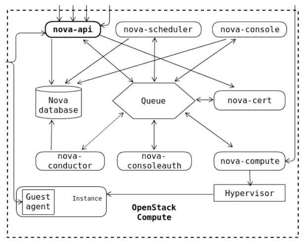
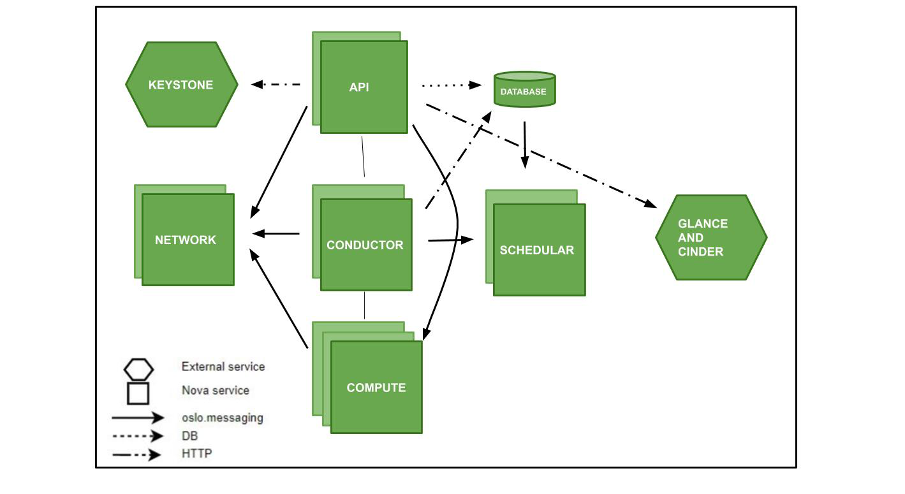

# TÌM HIỂU VỀ SERVICE NOVA TRONG OPENSTACK
## Khái niệm
Trong hệ sinh thái OpenStack, Nova là Dịch vụ Tính toán (Compute Service). Nếu ví OpenStack là một nhà máy điện toán đám mây, thì Nova chính là "bộ phận quản lý và vận hành máy chủ/máy ảo". Nó chịu trách nhiệm biến các máy chủ vật lý thành một đội ngũ máy ảo linh hoạt theo nhu cầu của người dùng.

## Chức năng của Nova
- Quản lý toàn bộ vòng đời máy ảo (Instance Lifecycle): Nova cho phép bạn tạo mới, khởi động (start), dừng (stop), tạm dừng (pause), khởi động lại (reboot) hoặc xóa bỏ các máy ảo.
- Tương tác với tầng ảo hóa (Hypervisor): Nova không trực tiếp tạo ra máy ảo mà nó đóng vai trò điều khiển các phần mềm ảo hóa bên dưới (như KVM, QEMU, VMware ESXi, hoặc Xen) thông qua thư viện trung gian libvirt.
- Quản lý tài nguyên và Lên lịch (Scheduling): Theo dõi sát sao dung lượng CPU, RAM, ổ cứng trên các máy chủ vật lý để quyết định xem máy ảo mới nên được đặt ở máy chủ nào cho hợp lý.

## Các thành phần trong NOVA

Nova là "trái tim" quản lý máy ảo, được cấu thành từ các thành phần chính sau:
- *nova-api*
+ Chức năng: Là cổng tiếp nhận mọi yêu cầu HTTP/REST API từ người dùng (qua CLI, Dashboard hoặc các service khác).
+ Hoạt động: Tiếp nhận yêu cầu tạo/xóa máy ảo, xác thực với Keystone, kiểm tra hạn mức (quota) và ghi nhận trạng thái ban đầu vào Database.

- *nova-conductor*
+ Chức năng: Đóng vai trò là cầu nối bảo mật và điều phối trung gian giữa nova-api/nova-compute với cơ sở dữ liệu (Database).
+ Hoạt động: Thay vì để các tiến trình compute ở dưới mạng nội bộ tự kết nối trực tiếp vào Database chung (gây rủi ro bảo mật và quá tải), mọi thao tác đọc/ghi DB đều phải thông qua nova-conductor. Nó cũng xử lý các tác vụ nặng như live-migration.

- *nova-scheduler*
+ Chức năng: Bộ não "chọn nhà" cho máy ảo.
+ Hoạt động: Khi có yêu cầu tạo máy ảo, Scheduler sẽ phân tích tài nguyên hiện tại của toàn bộ hệ thống (RAM, CPU, ổ cứng trên các compute node) và chọn ra máy chủ vật lý phù hợp nhất để đặt máy ảo lên đó.

- *nova-compute*
+ Chức năng: Tiến trình chạy trực tiếp trên mỗi Compute Node (máy chủ vật lý chứa máy ảo).
+ Hoạt động: Nhận lệnh từ hàng đợi thông điệp (RabbitMQ), sau đó trực tiếp gọi tới tầng ảo hóa bên dưới (thông qua thư viện libvirt để điều khiển KVM/QEMU) nhằm thực hiện việc bật, tắt, tạo mới hay xóa máy ảo.

- *nova-novncproxy*
+ Chức năng: Cung cấp giao diện màn hình điều khiển từ xa (Console) cho máy ảo thông qua trình duyệt web bằng công nghệ noVNC/WebSockets.

- Các thành phần quản lý Console & Xác thực (Console & Auth)
+ *nova-console*: Cung cấp giao diện console cho phép người dùng truy cập vào màn hình máy ảo.
+ *nova-consoleauth*: Chịu trách nhiệm xác thực token cho người dùng khi họ kết nối vào console của máy ảo.
+ *nova-cert*: Quản lý các chứng chỉ bảo mật (x509 certificates) được sử dụng bên trong hệ thống tính toán.

## Quy trình hoạt động của Nova

Khi bạn ra lệnh khởi tạo một máy ảo mới, quy trình diễn ra qua các bước cực kỳ chặt chẽ sau đây:
- *Tiếp nhận yêu cầu*:
+ Bạn gửi lệnh tạo máy ảo qua CLI/Dashboard. nova-api nhận yêu cầu, xác thực token qua Keystone, kiểm tra hạn mức tài nguyên (quota) rồi lưu thông tin ban đầu vào Database.
- *Lên lịch chọn máy chủ (Scheduling)*:
+ nova-api đẩy yêu cầu sang hàng đợi thông điệp (RabbitMQ). nova-scheduler nhận được thông điệp, phân tích cấu hình máy ảo bạn muốn rồi quét qua các Compute Node để chọn ra máy chủ vật lý phù hợp nhất.
- *Điều phối và Khởi tạo (Execution)*:
+ nova-scheduler chuyển tiếp nhiệm vụ cho tiến trình nova-compute đang chạy trên máy chủ vật lý đã được chọn.
+ nova-compute liên lạc với Glance để tải file ảnh hệ điều hành (.qcow2), liên lạc với Neutron để cắm mạng ảo cho máy ảo, và phối hợp với Cinder (nếu dùng ổ cứng rời).
- *Dựng máy ảo*:
+ Cuối cùng, nova-compute gọi trực tiếp xuống tầng nhân Linux thông qua KVM/libvirt để chính thức khởi chạy máy ảo. Trạng thái máy ảo chuyển thành ACTIVE và sẵn sàng phục vụ người dùng.

## Quá trình nova-compute giao tiếp và điều khiển KVM/libvirt
### Mô hình phân tầng giao tiếp
Thứ tự các lớp phần mềm diễn ra từ trên xuống dưới như sau:
$$\text{nova-compute} \longrightarrow \text{Libvirt Driver (Python)} \longrightarrow \text{Thư viện Libvirt API} \longrightarrow \text{Tiến trình Libvirtd} \longrightarrow \text{KVM / QEMU}$$

nova-compute: Chạy dưới dạng tiến trình dịch vụ trên nền Python, nhận các chỉ thị từ hàng đợi thông điệp (RabbitMQ).

Libvirt Driver: Là một module mã nguồn bên trong Nova, chuyên đóng gói các yêu cầu của OpenStack thành các đoạn mã lệnh mà thư viện libvirt hiểu được.
### Cơ chế và các bước giao tiếp thực tế
Khi bạn ra lệnh tạo một máy ảo mới, quá trình nova-compute gọi xuống KVM/libvirt diễn ra qua các bước chính:
- **Bước 1: Biên dịch cấu hình sang định dạng XML (XML Domain Definition)**
+ Khi nhận được thông tin về cấu hình máy ảo (số lượng vCPU, dung lượng RAM, ổ cứng, card mạng), Libvirt Driver sẽ tự động biên dịch và tạo ra một tệp cấu hình chuẩn dạng XML.
+ Tệp XML này mô tả chi tiết toàn bộ tài nguyên phần cứng ảo của máy ảo (ví dụ: máy ảo dùng bao nhiêu RAM, cấu hình đường dẫn ổ đĩa ở đâu, kết nối với card mạng nào).

- **Bước 2: Gọi các hàm API của Libvirt (libvirt-python)**
+ Nova sử dụng gói thư viện liên kết Python của libvirt (libvirt-python).
+ nova-compute sẽ gọi trực tiếp các hàm API (như virDomainCreateXML, virDomainDefineXML) để gửi tệp cấu hình XML nói trên tới tiến trình quản lý hệ thống ảo hóa là libvirtd đang chạy ngầm trên hệ điều hành Linux.

- **Bước 3: Tiến trình libvirtd xử lý và gọi KVM/QEMU**
+ libvirtd đóng vai trò là một tiến trình quản lý trung gian trên hệ thống. Khi nhận được yêu cầu từ Nova, nó sẽ dịch các câu lệnh đó thành các tham số dòng lệnh hoặc lời gọi hệ thống (system calls).
+ KVM (Kernel-based Virtual Machine): Được tích hợp trực tiếp sẵn trong nhân Linux (kernel), chịu trách nhiệm biến hệ điều hành thành một hypervisor để ảo hóa phần cứng CPU và bộ nhớ (giúp máy ảo chạy trực tiếp trên chip vật lý với hiệu năng cao).
+ QEMU: Phối hợp với KVM để giả lập các thiết bị phần cứng ngoại vi khác như ổ cứng, card màn hình, bàn phím, cổng USB.

- **Bước 4: Giám sát và quản lý vòng đời**
+ Sau khi máy ảo đã khởi động thành công, nova-compute liên tục sử dụng Libvirt API để thăm dò (poll) trạng thái của máy ảo (kiểm tra xem máy ảo đang chạy, bị tạm dừng hay đã tắt, mức độ tiêu thụ CPU/RAM ra sao) để cập nhật về cơ sở dữ liệu chung của hệ thống OpenStack.