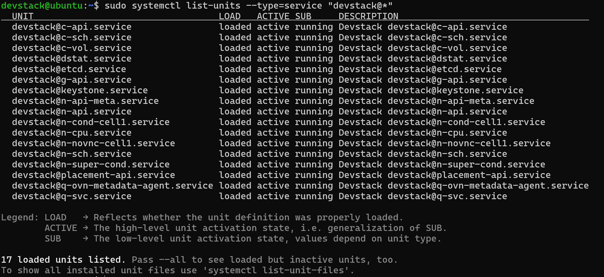

# CÀI ĐẶT OPENSTACK TRÊN MÁY ẢO UBUNTU SERVER 24.04
## MÔ TẢ
- Yêu cầu về hệ thống
## THỰC HÀNH


- Sau đó kiểm tra xem các dịch vụ đã chạy trên máy chưa bằng lệnh
```bash
sudo systemctl list-units --type=service "devstack@*"
```



- Khi màn hình hiển thị ra các dịch vụ như trên có nghĩa là đã cài đặt thành công OpenStack